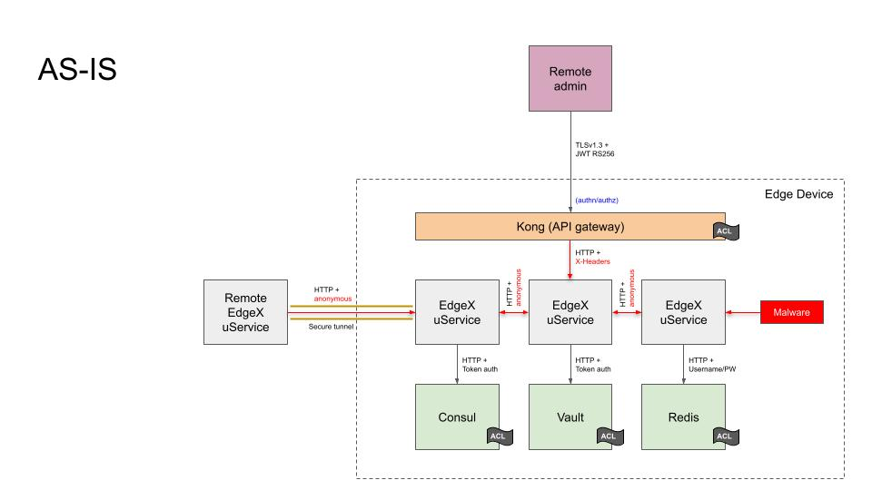
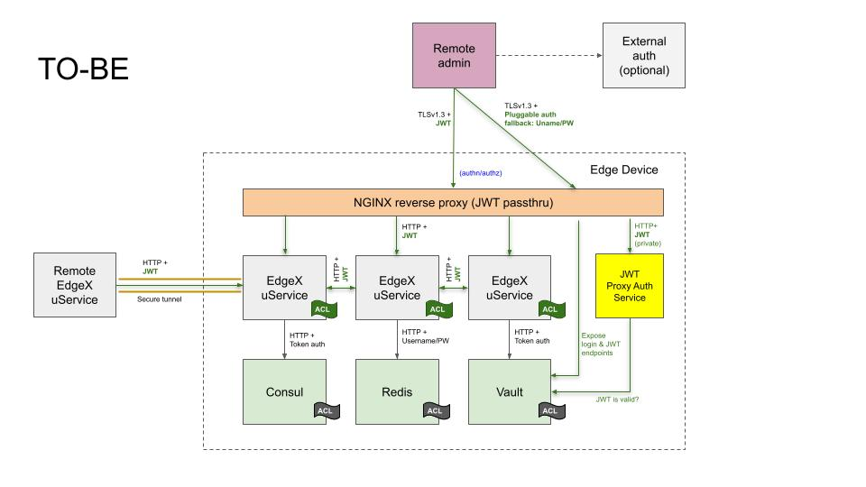

# EdgeX Microservice Authentication

## Status

DRAFT

## Context

The AS-IS Architecture figure below depicts the current state of
microservice communication security as of the EdgeX Jakarta release,
when security is enabled:

As shown in the diagram,
many of the foundational services used by EdgeX Foundry
have already been secured:

* Communication with EdgeX's secret store, as implemented by
  Hashicorp Vault, is secured over a local HTTP socket with
  token-based authentication.  An access control list limits access
  to the keyspace of the key value store.

* Communication with EdgeX's service registry and configuration provider,
  as implemented by Hashicorp Consul, is secured over a local HTTP
  socket with token-based authentication,
  with the token being issued by Hashicorp Vault.
  An access control list limits access to the keyspace of
  the configuration store.

* Communication with EdgeX's default database, Redis, is secured using
  username/password authentication, with the password stored
  in Hashicorp Vault.  An access control list limits the commands
  that clients are allowed to issue to the server.

External access to EdgeX microservices has also been secured.
EdgeX microservices only bind to local ports,
and are only exposed externally through a Kong API gateway.
This gateway is configured to use TLS 1.3,
using JWT authentication using public key cryptography.
All external requests are filtered at the API gateway.
URL rewriting is used to concentrate microservices
on a single HTTP-accessible port.

In bare-metal deployments, it is not possible to verify Kong
as the origin of local network traffic because mutual-auth TLS
is not supported in the open source version of Kong.
Although the Kong JWT plugin will set request headers
on the backend request that identify the caller,
there is no mechanism by which Kong can prove to a
backend service that it was the component that
performed the authentication step.
Even though the original JWT passes through the proxy,
the Kong authentication plugins do not expose
token introspection endpoints that the backend service
could use to check the token themselves.

The consequence of having an API gateway that performs
all microservice authentication is that communication
between EdgeX microservices running behind the API gateway
are not authenticated in any way.
EdgeX microservices are unable to distinguish
malicous traffic that has evaded the API gateway
from legitimate microservice traffic.

## Decision

Kamakura release recently introduced a technology called
SPIFFE/SPIRE as part of [ADR 0020 Delay start services](./0020-spiffe.md).
The ADR enabled remote EdgeX device services to obtain
secret store tokens, and by extension,
secure access to the EdgeX registry and configuration store.

This ADR broadens the use of SPIFFE/SPIRE,
requiring its use for both its original purpose of obtaining secret store tokens,
and for a new use of peer authentication of EdgeX microservices.
The API gateway will be replaced with a much simpler (and smaller)
HTTP reverse proxy that only requires URL rewriting functionality,
with TLS termination enabled by default so as to be consistent with
[ADR 0015 - Encryption between microservices](./0015-in-cluster-tls.md),
which states that encryption is not required for local communication.
The functionality of the HTTP reverse proxy is generic enough
that in a Kubernetes environment, a generic ingress controller
is more than capable of fulfilling this role via declarative configuration.

The new TO-BE architecture is diagrammed in the following figure:

In the TO-BE architecture, JWT token authentication flows from
the remote admin client, through the HTTP reverse proxy,
into the EdgeX microservices, where it is then validated
and checked against a service-specific access control list.
The access control list can be as broad as "allow any valid token"
to as narrow as "allow only calls from specified identity."
Authentication will be performed at the route level,
as some routes (such as a health-checking route)
may remain unauthenticated.
The JWT is available to application-level code,
so fine-grained authorization (e.g. database row filtering) is possible
for any microservice with exceptional security requirements.

Because not all routes require authentication
(intentionally or accidentally),
client-side (mutual-auth) TLS authentication is be required
of external callers.
Unlike backend TLS support,
many HTTP reverse proxies support client-side TLS verification.
Since TLS is terminated at the reverse proxy,
a JWT-SVID is present in each request that will be passed
along to the backend microservice.
The client-side certificate need not be a X.509 SVID,
but it is convenient to do so,
especially if the SPIFFE server is configured with a fixed CA.

The TO-BE architecture will effectively block local unprivileged
malware that does not have access to a valid JWT authentication token.
Each EdgeX microservice will have a semi-unique identity
with the same limitations as detailed in
[ADR 0020 Delay start services](./0020-spiffe.md).
Namely, generic services such as application services will share
a generic SPIFFE identity, as the current implementation of
the SPIRE workload attester cannot distinguish workloads
by command-line differences alone.

In order to support familiar behavior where a public key
used for JWT authentication is seeded into an EdgeX installation,
this ADR proposes the introduction of an 
optional claims transformation microservice
that uses a privileged SPIRE agent API to exchange
an admin JWT for another SPIFFE-issued JWT
that will be trusted by the other EdgeX microservices.
See the alternatives section later in this document
for other approaches to obtaining a JWT for remote administration.

JWT authentication allows for delegated identity,
where the identity of the original caller is passed
through a microservice call chain.

As an added bonus, SPIRE, the reference implementation of SPIFFE,
supports longer key sizes than the Kong JWT plugin.

## Alternatives

### Using Kong to Mediate EdgeX Microservice Interactions

One approach that is seen in some microservice architectures
is to force all communication between microservices to go
through the external API gateway.
Besides being very difficult for the programmer,
as the external address of the API gateway
may not be known to internal code,
in a bare-metal environment,
process-level traffic shaping is near-impossible.

### mTLS Everywhere

One straightforward approach would be to use
use mutual-auth TLS everywhere and eliminate
the reverse proxy entirely.
(Each service would necessarily have to be exposed
on its own port in order to process the client certificate.)
In this scenario, every service would be issued
a X.509 SPIFFE identity certificate and private key.
SPIFFE-aware services would subscribe the SVID
updates from the SPIFFE server and perform live
key and certificate rotation.

Legacy services such as Vault, Consul, et cetera
assume that their TLS server certificates are long-lived.
One way of to accomodate these services would be
to issue a long-lived X.509 SVID to these services.
Another would be certificate and key rotation,
with periodic service restarts,
which would be disruptive.
(TBD: Can leaf certificates have a TTL that exceeds
that of the sub-CA?)

Tools such as ghosttunnel could be used to proxy
services that are not TLS-aware, but in a bare-metal
environment the proxy can be easily bypassed.

mTLS everywhere may be a workable alternative,
depending on answer to above question.

### Using Kong as a Service Identity Provider

Neither the JWT nor OAuth2 plugins offer a token validation endpoint,
though it would be possible to create a fake service
that EdgeX microservices could call to validate a bearer token.
Using this endpoint to validate every request
would incur a network round-trip (albeit a local one)
that would greatly increase microservice latency.

Using the Kong Admin API to obtain a public key for JWT
validation via database dump would be unnecessarily complex.
Validation of an opaque OAuth2 token would require direct access
to Kong's backend database and is also unnecessarily complex.

### Homegrown Authentication

This author believes that edge-based identity stores
are difficult to manage at scale and should be avoided.

### Location of SPIRE Server and Issuance of Administrator JWTs

[ADR 0020 Delay start services](./0020-spiffe.md) suggested that
the SPIRE server component run on the edge device,
with the possibility that it could run in a common cloud.
Now that the JWT authentication flow is end-to-end,
both the remote admin and the EdgeX microservices themselves
need access to the SPIRE server to obtain an SPIFFE
verifiable identity (SVID).
There are three general approaches:

1. The SPIRE server is directly exposed to both the remote
   admin and the edge device,
   and the edge device and the remote admin both
   have a SPIRE agent running for issuance of SVID's.
   (For example, a device could only be remotely managed
   from designated hosts.)
   If the SPIRE server is hosted in the cloud
   and the cloud connection fails,
   the edge device will stop working soon thereafter.
   (This is a new failure mode.)
   If the SPIRE server is hosted on the edge device,
   loss of upstream network connectivity will break
   remote administration.
   (Nothing new here.)
   The SPIFFE server has the ability to issue SVID's,
   and placing the SPIFFE server in the cloud reduces
   the exposure of this security-critical component.
   As stated above, centralized identity is better.
   
2. The SPIRE server could be located on the edge device,
   and exposed only to the edge device.
   Through an out-of-band mechanism,
   an administrator could ask the SPIRE server to issue
   a long-lived SVID and distribute it out-of-band to
   a remote admin.
   One benefit of this approach is that the SPIRE server
   need not be externally exposed.
   Another benefit of this approach is that every remote
   admin could have a distinct SPIFFE identity.
   A drawback of this approach is that long-lived JWT's
   are prone to theft and are not revokable on an
   individual basis.
   This approach also somewhat backtracks decisions made on previous
   EdgeX releases, which required the remote client to sign its own JWT
   using a previously-registered key.

3. The SPIRE server could be located on the edge device,
   and exposed only to the edge device.  (Same as above.)
   The difference here is that EdgeX could expose a claims
   transformation microservice that would take a JWT
   signed by a known, pre-configured key
   and exchange it for a short-lived SPIFFE-based JWT.
   There are two sub-variants of this approach.
   One sub-variant returns to the caller the SVID of
   the claims transformation microservice itself,
   discarding the identity of the original caller.
   The other sub-variant uses the
   [SPIRE delegated identity API](https://github.com/spiffe/spire/blob/main/doc/spire_agent.md#delegated-identity-api),
   a privileged API that allows the agent to request
   the SVID of an arbitrary workload.
   There would however be an extra authentication step
   where one JWT is exchanged for another.

This last approach is most consistent with approaches used in
previous versions of EdgeX and the approach that is chosen by default,
though the architecture does not preclude an implementer
from choosing any combination of all three approaches.

In none of these solutions is it practical to check the
validity of an JWT SVID at the HTTP reverse proxy,
as the SVID may be issued by a rotating sub-CA.
Client-side TLS identity for external callers,
on the other hand, is very simple to verify,
and prevents attackers from proving the system
with randomly-generated JWTs.

## Consequences

While `security-secretstore-setup` and `security-file-token-provider`
may still be needed to generate secret store tokens 
for setting the base services for EdgeX,
all EdgeX microservices will be required to obtain a SPIFFE verifiable
identity (SVID) in order to authenticate to remote callers,
or to verify the identity of a remote caller.

At a minimum, the gRPC libraries for Go will add approximately
8MB to every service executable.

SPIRE support for Windows native environments is 
[forthcoming](https://github.com/spiffe/spire/issues/2342).
Windows build 1809 or later (Windows 10 enterprise LTSC release)
and Go 1.12 or later are required as prerequisites.

## References

- [ADR 0015 Encryption between microservices](./0015-in-cluster-tls.md) 
- [ADR 0020 Delay start services (SPIFFE/SPIRE)](./0020-spiffe.md)
- [SPIFFE](https://spiffe.io/)
  - [SPIFFE ID](https://github.com/spiffe/spiffe/blob/main/standards/SPIFFE.md)
  - [X.500 SVID](https://github.com/spiffe/spiffe/blob/main/standards/X509-SVID.md)
  - [JWT SVID](https://github.com/spiffe/spiffe/blob/main/standards/JWT-SVID.md)
  - [Turtle book](https://thebottomturtle.io/Solving-the-bottom-turtle-SPIFFE-SPIRE-Book.pdf)
