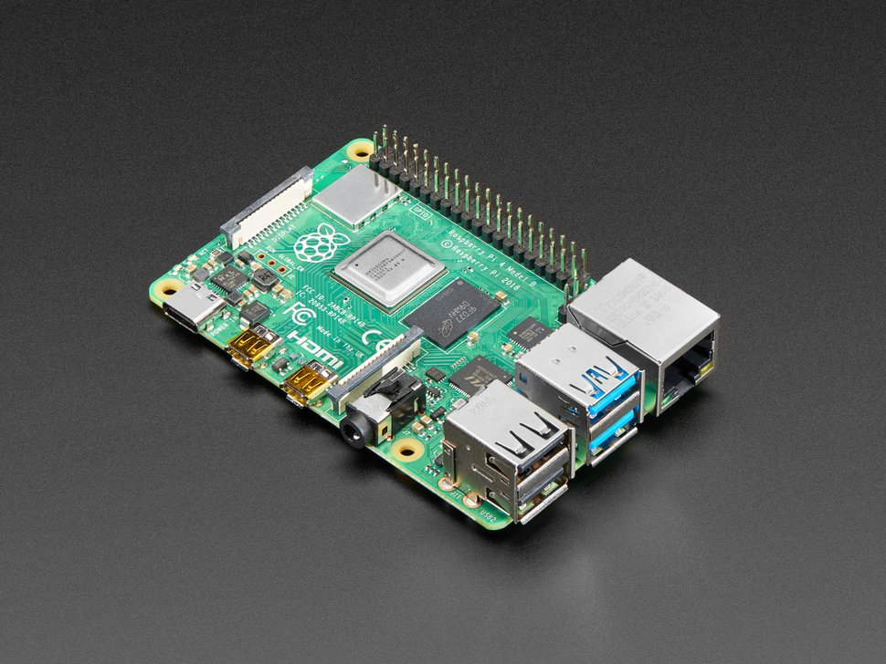

# EdgeX on Raspberry Pi 4B

## Why the Pi?
At the edge, you will see all sorts of compute platforms.  The edge is extremely heterogeneous - comprised of different architectures (Intel, ARM, etc.), different OSes (Linux, Unix, RTOS, Windows, etc.), different resourcing (CPU, memory, etc.) and varying levels of connectivity (always connected, intermittently connected, etc.).

While the platforms vary, it is often said that the edge is a bit more resource constrained.  This is not always the case as some edge platforms are as richly resourced as what you would find in an enterprise environment.  But because of environmental conditions (hot, damp, tight spaces,etc.), asset location (often hard to reach or exposed to external forces and damage) and the sheer cost for so many edge nodes, organizations will often use more resource constrained platforms to host their edge applications.

Therefore, the Raspberry Pi - in addition to being a developer or hobbyist preferred platform - has become somewhat of an example platform for those creating, running and testing out edge solutions.  It is cheap and (depending on the version and configuration) resource constrained, and therefore representative of some of the production edge and IoT platforms (if not the actually target platform).

## Pi Example Kit
Because of its wide spread use in edge and IoT situations, The EdgeX community gets numerous requests for assistance in getting EdgeX installed and running on a Raspberry Pi. To assist in this, the community has provided several working examples of EdgeX on a Raspberry Pi.  The latest can be found in [EdgeX Examples](https://github.com/edgexfoundry/edgex-examples/tree/master/deployment/raspberry-pi-4) and helps get EdgeX working on a Raspberry Pi 4B running Ubuntu Linux.

The EdgeX community isn't endorsing the Raspberry Pi or any platform - we remain committed to being agnostic with regard to the underlying hardware and OS.  The example is provided to quicken the introduction of EdgeX to new users and potential adopters on this popular platform.  Further, demonstrating that EdgeX can run on a Raspberry Pi also gives our community members a quick (albeit rough) means to answer questions about the underlying hardware characteristics needed to run EdgeX.  Saying EdgeX can easily run on platforms as small as an RP3 or RP4 (or even smaller - especially with selected micro services) provides adopters with context even before deeper research. 