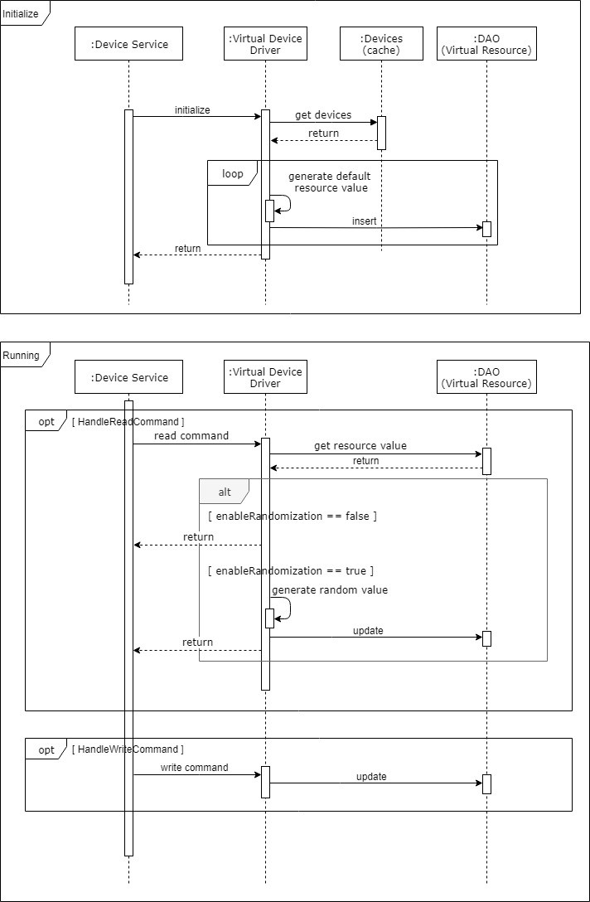

# Using the Virtual Device Service

## Overview

The [Virtual Device Service
GO](https://github.com/edgexfoundry/device-virtual-go) can simulate
different kinds of devices to generate Events and Readings to the Core
Data Micro Service. Furthermore, users can send commands and get
responses through the Command and Control Micro Service. The Virtual
Device Service allows you to execute functional or performance tests
without any real devices. This version of the Virtual Device Service is
implemented based on [Device SDK
GO](https://github.com/edgexfoundry/device-sdk-go), and uses
[ql](https://godoc.org/modernc.org/ql) (an embedded SQL database engine)
to simulate virtual resources.


## Introduction

For information on the virtual device service see [virtual device](../microservices/device/supported/device-virtual/Ch-VirtualDevice.md#) under the Microservices tab.

## Working with the Virtual Device Service

### Running the Virtual Device Service Container

The virtual device service depends on the EdgeX core services. By default, the virtual device service is part of the EdgeX community provided Docker Compose files.  If you use one of the [community provide Compose files](https://github.com/edgexfoundry/edgex-compose/tree/{{version}}), you can pull and run EdgeX inclusive of the virtual device service without having to make any changes.

### Running the Virtual Device Service Natively (in development mode)

If you're going to download the source code and run the virtual device service in development mode, make sure that the EdgeX core service containers are up before starting the virtual device service.  See how to work with EdgeX in a [hybrid environment](../getting-started/Ch-GettingStartedHybrid.md) in order to run the virtual device service outside of containers.  This same file will instruct you on how to get and [run the virtual device service code](../getting-started/Ch-GettingStartedHybrid.md#get-the-service-code).

### GET command example
The virtual device service is configured to send simulated data to core data every few seconds (from 10-30 seconds depending on device - see the [device configuration file](https://github.com/edgexfoundry/device-virtual-go/blob/{{version}}/cmd/res/devices/devices.yaml) for AutoEvent details).  You can exercise the `GET` request on the command service to see the generated value produced by any of the virtual device's simulated devices.  Use the curl command below to exercise the virtual device service API (via core command service).

``` bash
curl -X GET localhost:59882/api/v2/device/name/Random-Integer-Device/Int8
```

!!! Warning
  The example above assumes your core command service is available on `localhost` at the default service port of 59882.  Also, you must replace your device name and command name in the example above with your virtual device service's identifiers.  If you are not sure of the identifiers to use, query the command service for the full list of commands and devices at `http://localhost:59882/api/v2/device/all`.

The virtual device should respond (via the core command service) with event/reading JSON similar to that below.
``` json
{
  "apiVersion": "v2",
  "statusCode": 200,
  "event": {
    "apiVersion": "v2",
    "id": "3beb5b83-d923-4c8a-b949-c1708b6611c1",
    "deviceName": "Random-Integer-Device",
    "profileName": "Random-Integer-Device",
    "sourceName": "Int8",
    "origin": 1626227770833093400,
    "readings": [
      {
        "id": "baf42bc7-307a-4647-8876-4e84759fd2ba",
        "origin": 1626227770833093400,
        "deviceName": "Random-Integer-Device",
        "resourceName": "Int8",
        "profileName": "Random-Integer-Device",
        "valueType": "Int8",
        "binaryValue": null,
        "mediaType": "",
        "value": "-5"
      }
    ]
  }
}
```

### PUT command example - Assign a value to a resource
The virtual devices managed by the virtual device can also be actuated.  The virtual device can be told to enable or disable random number generation.  When disabled, the virtual device services can be told what value to respond with for all `GET` operations.  When setting the fixed value, the value must be valid for the data type of the virtual device. For example, the minimum value of Int8 cannot be less than -128 and the maximum value cannot be greater than 127.

Below is example actuation of one of the virtual devices.  In this example, it sets the fixed `GET` return value to 123 and turns off random generation.

``` bash
curl -X PUT -d '{"Int8": "123", "EnableRandomization_Int8": "false"}' localhost:59882/api/v2/device/name/Random-Integer-Device/Int8
```

!!! Note
    The value of the resource's EnableRandomization property is simultaneously updated to false when sending a put command to assign a specified value to the resource.  Therefore, the need to set EnableRandomization_Int8 to false is not actually required in the call above 

Return the virtual device to randomly generating numbers with another `PUT` call.

``` bash
curl -X PUT -d '{"EnableRandomization_Int8": "true"}' localhost:59882/api/v2/device/name/Random-Integer-Device/Int8
```

## Reference

### Architectural Diagram


### Sequence Diagram



### Virtual Resource Table Schema
  
|Column                                          |Type|
| --- | --- |
|DEVICE\_NAME                                    |STRING|
|COMMAND\_NAME                                   |STRING|
|DEVICE\_RESOURCE\_NAME                          |STRING|
|ENABLE\_RANDOMIZATION                           |BOOL|
|DATA\_TYPE                                      |STRING|
|VALUE                                           |STRING|