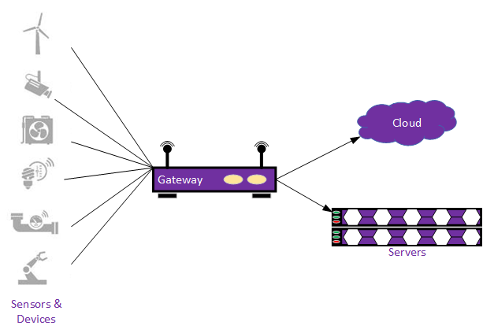
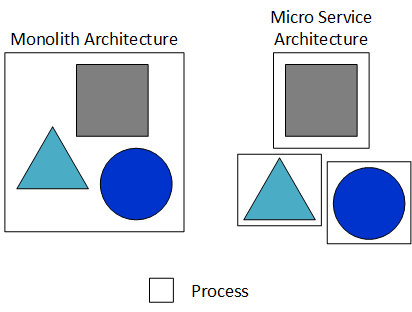

# Definitions
The following glossary provides terms used in EdgeX Foundry.  The definition are based on how EdgeX and its community use the term versus any strict technical or industry definition.

## Brownfield and Greenfield
Brownfield refers to older legacy equipment (nodes, devices, sensors) in an edge/IoT deployment, which typically uses older protocols.  Greenfield refers to, typically, new equipment with modern protocols.

## Containerized
EdgeX micro services and infrastrucutre (i.e. databases, registry, etc.) are built as executable programs, put into Docker images, and made available via Docker Hub (and Nexus repository for nightly builds).  A service (or infrastructure element) that is available in Docker Hub (or Nexus) is said to be containerized.  Docker images can be quickly downloaded and new Docker containers created from the images.

## Contributor/Developer
If you want to change, add to or at least build the existing EdgeX code base, then you are a "Developer". "Contributors" are developers that further wish to contribute their code back into the EdgeX open source effort.

## Device
In EdgeX parlance, "device" is used to refer to a sensor, actuator, or IoT "thing".  A sensor generally collects information from the physical world - like a temperature or vibration sensor.  Actuators are machines that can be told to do something.  Actuators move or otherwise control a mechanism or system - like a value on a pump.  While there may be some technical differences, for the purposes of EdgeX documentation, device will refer to a sensor, actuator or "thing".

## Edge Analytics
The terms edge or local analytics (the terms are used interchangeably and have the same meaning in this context) for the purposes of edge computing (and EdgeX), refers to an “analytics” service is that:
- Receives and interprets the EdgeX sensor data to some degree; some analytics services are more sophisticated and able to provide more insights than others
- Make determinations on what actions and actuations need to occur based on the insights it has achieved, thereby driving actuation requests to EdgeX associated devices or other services (like notifications)

The analytics service could be some simple logic built into an app service, a rules engine package, or an agent of some artificial intelligence/machine learning system.  From an EdgeX perspective, actionable intelligence generation is all the same.  From an EdgeX perspective, edge analytics = seeing the edge data and be able to make requests to act on what is seen.  While EdgeX provides a rules engine service as its reference implementation of local analytics, app services and its data preparation capability allow sensor data to be streamed to any analytics package.

Because of EdgeX’s micro service architecture and distributed nature, the analytics service would not necessarily have to run local to the devices / sensors.  In other words, it would not have to run at the edge.  App services could deliver the edge data to analytics living in the cloud.  However, in these scenarios, the insight intelligence would not be considered local or edge in context.  Because of latency concerns, data security and privacy needs, intermittent connectivity of edge systems, and other reasons, it is often vital for edge platforms to retain an analytic capability at the edge or local.

## Gateway
An IoT gateway is a compute platform at the farthest ends of an edge or IoT network.  It is the host or “box” to which physical sensors and devices connect and that is, in turn, connected to the networks (wired or wirelessly) of the information technology realm.

IoT or edge gateways are compute platforms that connect “things” (sensors and devices) to IT networks and systems.

## Micro service
In a micro service architecture, each component has its own process.  This is in contrast to a monolithic architecture in which all components of the application run in the same process.

Benefits of micro service architectures include:
- Allow any one service to be replaced and upgraded more easily
- Allow services to be programmed using different programming languages and underlying technical solutions (use the best technology for each specific service)
    - Ex: services written in C can communicate and work with services written in Go
- This allows organizations building solutions to maximize available developer resources and some legacy code
- Allow services to be distributed across host compute platforms - allowing better utilization of available compute resources
- Allow for more scalable solutions by adding copies of services when needed

## Reference Implementation
Default and example implementation(s) offered by the EdgeX community.  Other implementations may be offered by 3rd parties or for specialization.

## South and North Side
South Side: All IoT objects, within the physical realm, and the edge of
the network that communicates directly with those devices, sensors, 
actuators, and other IoT objects, and collects the data from them, is
known collectively as the "south side."

North Side: The cloud (or enterprise system) where data is collected, 
stored, aggregated, analyzed, and turned into information, and the part
of the network that communicates with the cloud, is referred to as the
"north side" of the network.

EdgeX enables data to be sent "north, " "south, " or laterally as
needed and as directed.

## User
If you want to get the EdgeX platform and run it (but do not intend to change or add to the existing code base now) then you are considered a "User".