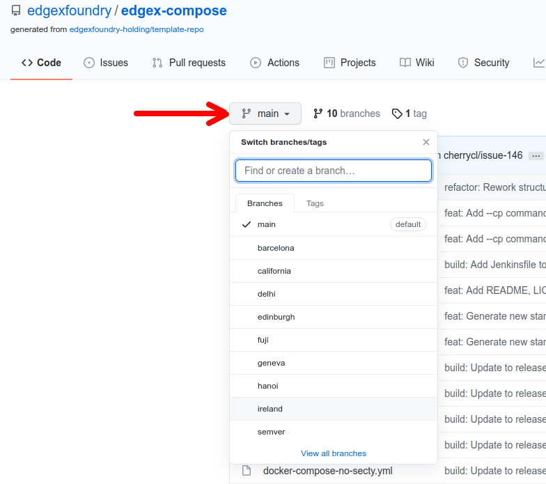
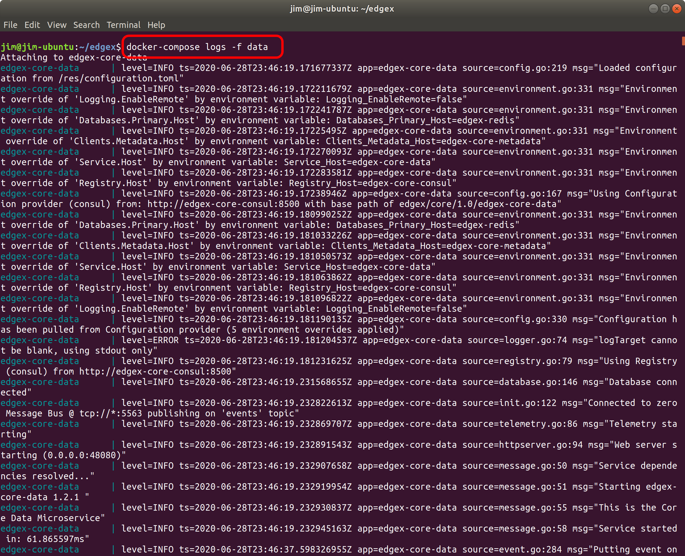

# Getting Started using Docker

## Introduction

These instructions are for users to get and run EdgeX Foundry using the latest stable Docker images.

If you wish to get the latest builds of EdgeX Docker images (prior to releases), then see the
[EdgeX Nexus Repository](./Ch-GettingStartedUsersNexus.md) guide.

## Get & Run EdgeX Foundry

### Install Docker & Docker Compose

To run Dockerized EdgeX, you need to install Docker first. See
<https://docs.docker.com/engine/install/> to learn how to install
Docker. If you are new to Docker, the same web site provides you
educational information. The following short video is also very
informative <https://www.youtube.com/watch?time_continue=3&v=VhabrYF1nms>

Use Docker Compose to orchestrate the fetch (or pull), install,
and start the EdgeX micro service containers.  Also use Docker Compose to stop the micro service containers. See: <https://docs.docker.com/compose/> to learn more about Docker Compose and <https://docs.docker.com/compose/install/linux/>  to install it.

You do not need to be an expert with Docker (or Docker Compose) to get and run EdgeX. This guide provides the steps to get EdgeX running in your environment. Some knowledge of Docker and Docker Compose are nice to have, but not required. Basic Docker and Docker Compose commands provided here enable you to run, update, and diagnose issues within EdgeX.

### Select a EdgeX Foundry Compose File

After installing Docker and Docker Compose, you need a EdgeX Docker Compose file.  EdgeX Foundry has over a dozen micro services, each deployed in its own Docker container.  This file is a manifest of all the EdgeX Foundry micro services to run.  The Docker Compose file provides details about how to run each of the services.  Specifically, a Docker Compose file is a manifest file, which lists:

- The Docker container images that should be downloaded,
- The order in which the containers should be started,
- The parameters (such as ports) under which the containers should be run

The EdgeX development team provides Docker Compose files for each release.  Visit the project's GitHub and find the [edgex-compose repository](https://github.com/edgexfoundry/edgex-compose).  This repository holds all of the EdgeX Docker Compose files for each of the EdgeX releases/versions. The Compose files for each release are found in separate branches.  Click on the `main` button to see all the branches.


*The edgex-compose repositor contains branches for each release.  Select the release branch to locate the Docker Compose files for each release.*

Locate the branch containing the EdgeX Docker Compose file for the version of EdgeX you want to run.

!!! Note
    The `main` branch contains the Docker Compose files that use artifacts created from the latest code submitted by contributors (from the night builds).  Most end users should avoid using these Docker Compose files.  They are work-in-progress.  Users should use the Docker Compose files for the latest version of EdgeX. 

In each edgex-compose branch, you will find several Docker Compose files (all with a .yml extension).  The name of the file will suggest the type of EdgeX instance the Compose file will help setup.  The table below provides a list of the Docker Compose filenames for the `{{version}}` release.
Find the Docker Compose file that matches:

- your hardware (x86 or ARM)
- your desire to have security services on or off

|filename|Docker Compose contents|
|---|---|
|docker-compose-arm64.yml|Specifies x86 containers, uses Redis database for persistence, and includes security services|
|docker-compose-no-secty-arm64.yml|Specifies ARM 64 containers, uses Redis database for persistence, but does not include security services|
|docker-compose-no-secty.yml|Specifies x86 containers, uses Redis database for persistence, but does not include security services|
|docker-compose.yml|Specifies x86 containers, uses Redis database for persistence, and includes security services|
|docker-compose-no-secty-with-ui-arm64.|Same as docker-compose-no-secty-arm64.yml but also includes EdgeX user interface|
|docker-compose-no-secty-with-ui.yml|Same as docker-compose-no-secty.yml but also includes EdgeX user interface|
|docker-compose-portainer.yml|Specifies the Portainer user interface extension (to be used with the x86 or ARM EdgeX platform)|

### Download a EdgeX Foundry Compose File
Once you have selected the release branch of edgex-compose you want to use, download it using your favorite tool.  The examples below uses *wget* to fetch Docker Compose for the Ireland release with no security.

=== "x86"
    ```
    wget https://raw.githubusercontent.com/edgexfoundry/edgex-compose/{{version}}/docker-compose-no-secty.yml -O docker-compose.yml
    ```
=== "ARM"
    ```
    wget https://raw.githubusercontent.com/edgexfoundry/edgex-compose/{{version}}/docker-compose-no-secty-arm64.yml -O docker-compose.yml
    ```

!!! Note
    The commands above fetch the Docker Compose to a file named 'docker-compose.yml' in the current directory.  Docker Compose commands look for a file named 'docker-compose.yml' by default.  You can use an alternate file name but then must specify that file name when issuing Docker Compose commands.  See Compose [reference documentation](https://docs.docker.com/compose/reference/overview/) for help.  

### Generate a custom Docker Compose file

The Docker Compose files in the `ireland` branch contain the standard set of EdgeX services configured to use `Redis` message bus and include only the Virtual and REST device services. If you need to have different device services running or use `MQTT` for the message bus, you need a modified version of one of the standard Docker Compose files. You could manually add the device services to one of the existing EdgeX Compose files or, use the EdgeX Compose Builder tool to generate a new custom Compose file that contains the services you would like included. When you use Compose Builder, you don't have to worry about adding all the necessary ports, variables, etc. as the tool will generate the service elements in the file for you. The Compose Builder tool was added with the Hanoi release. You will find the Compose Builder tool in each of the release branches since `Hanoi` under the compose-builder folder of those branches.  You will also find a compose-builder folder on the `main` branch for creating custom Compose files for the nightly builds. 

Do the following to use this tool to generate a custom Compose file:

1. Clone the edgex-compose repository.

   ```
   git clone https://github.com/edgexfoundry/edgex-compose.git
   ```
2. Change directories to the clone and checkout the appropriate release branch.  Checkout of the Ireland release branch is shown here.

   ```
   cd edgex-compose/
   git checkout kamakura
   ```
3. Change directories to the compose-builder folder and then use the `make gen <options>` command to generate your custom compose file. The generated Docker Compose file is named `docker-compose.yaml`.  Here are some examples:

   ```
   cd compose-builder/
   make gen ds-mqtt mqtt-broker
     - Generates secure Compose file configured to use MQTT for the message bus, adds then MQTT broker and the Device MQTT services. 
   
   make gen no-secty ds-modbus 
     - Generates non-secure compose file with just the Device Modbus device service.
   
   make gen no-secty arm64 ds-grove 
     - Generates non-secure compose file for ARM64 with just the Device Grove device service.
   ```
   

See the README document in the compose-builder directory for details on all the available options.  The Compose Builder is different per release, so make sure to consult the README in the appropriate release branch.  See [Ireland's Compose Builder README](https://github.com/edgexfoundry/edgex-compose/blob/{{version}}/compose-builder/README.md) for details on the lastest release Compose Builder options for `make gen`.

!!! Note
    The generated Docker Compose file may require addition customizations for your specific needs, such as environment override(s) to set appropriate Host IP address, etc.

### Run EdgeX Foundry

Now that you have the EdgeX Docker Compose file, you are ready to run EdgeX. Follow these steps to get the container images and start EdgeX!

In a command terminal, change directories to the location of your docker-compose.yml.  Run the following command in the terminal to pull (fetch) and then start the EdgeX containers.

``` bash
docker-compose up -d
```
!!! Warning
    If you are using Docker Compose Version 2, please replace `docker-compose` with `docker compose` before proceeding. This change should be applied to all the `docker-compose` in this tutorial. See:  <https://www.docker.com/blog/announcing-compose-v2-general-availability/> for more information.
!!! Info
    If you wish, you can fetch the images first and then run them.  This allows you to make sure the EdgeX images you need are all available before trying to run.

    ``` bash
    docker-compose pull
    docker-compose up -d
    ```

!!! Note
    The -d option indicates you want Docker Compose to run the EdgeX containers in detached mode - that is to run the containers in the background. Without -d, the containers will all start in the terminal and in order to use the terminal further you have to stop the containers.

### Verify EdgeX Foundry Running 

In the same terminal, run the process status command shown below to confirm that all the
containers downloaded and started.

``` bash
docker-compose ps
```


*If all EdgeX containers pulled and started correctly and without error, you should see a process status (ps) that looks similar to the image above.  If you are using a custom Compose file, your containers list may vary.  Also note that some "setup" containers are designed to start and then exit after configuring your EdgeX instance.*

## Checking the Status of EdgeX Foundry
In addition to the process status of the EdgeX containers, there are a number of other tools to check on the health and status of your EdgeX instance.

### EdgeX Foundry Container Logs

Use the command below to see the log of any service.

``` bash
# see the logs of a service
docker-compose logs -f [compose-service-name]
# example - core data
docker-compose logs -f data
```

See [EdgeX Container Names](./quick-start/index.md#REFERENCE-EdgeX-Container-Names) for a list of the EdgeX Docker Compose service names.


*A check of an EdgeX service log usually indicates if the service is running normally or has errors.* 

When you are done reviewing the content of the log, select **Control-c** to stop the output to your terminal.

### Ping Check

Each EdgeX micro service has a built-in response to a "ping" HTTP request. In networking environments, use a [ping request](https://techterms.com/definition/ping) to check the reach-ability of a network resource.  EdgeX uses the same concept to check the availability or reach-ability of a micro service. After the EdgeX micro service containers are running, you can "ping" any one of the micro services to check that it is running. Open a browser or HTTP REST client tool and use the service's ping address (outlined below) to check that is available.

```
http://localhost:[service port]/api/v2/ping
```

See [EdgeX Default Service Ports](../../general/ServicePorts) for a list of the EdgeX default service ports.


*"Pinging" an EdgeX micro service allows you to check on its availability.  If the service does not respond to ping, the service is down or having issues.*

### Consul Registry Check

EdgeX uses the open source [Consul](https://www.consul.io/) project as its registry
service. All EdgeX micro services are expected to register with Consul as they start. Going to Consul's dashboard UI enables you to see which services are up. Find the Consul UI at
<http://localhost:8500/ui>.


