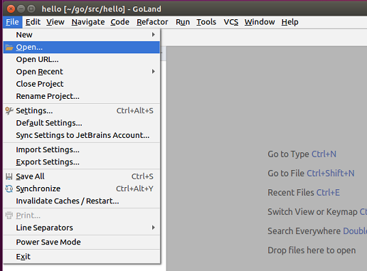
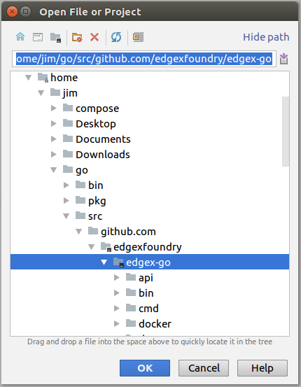
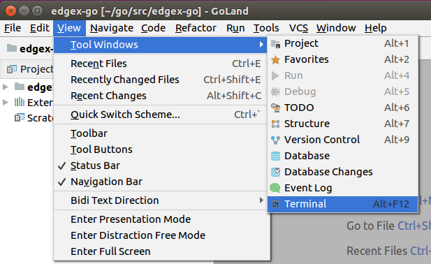

# Getting Started - Go Developers

## Introduction 

These instructions are for Go Lang Developers and Contributors to get, run and otherwise work with Go-based EdgeX Foundry
micro services. Before reading this guide, review the general [developer requirements](./Ch-GettingStartedDevelopers.md#what-you-need).

If you want to get the EdgeX platform and run it (but do not intend to change or add to the existing code base now) then you are considered a "User". Users should read:
[Getting Started Users](./Ch-GettingStartedUsers.md))

## What You Need For Go Development

In additional to the hardware and software listed in the [Developers
guide](./Ch-GettingStartedDevelopers.md), you will need the following to work with the EdgeX Go-based
micro services.

### Go

The open sourced micro services of EdgeX Foundry are written in Go 1.15.
See <https://golang.org/dl/> for download and installation instructions.
Newer versions of Go are available and may work, but the project has not
built and tested to these newer versions of the language.
Older versions of Go, especially 1.10 or older, are likely to cause
issues (EdgeX now uses Go Modules which were introduced with Go Lang
1.11).

### Build Essentials

In order to compile and build some elements of EdgeX, Gnu C compiler, utilities (like make), and associated librarires need to be installed.  Some [IDEs](#IDE) may already come with these tools.  Some OS environments may already come with these tools.  Others environments may require you install them.  For Ubuntu environments, you can install a convenience package called [Build Essentials](https://packages.ubuntu.com/bionic/build-essential).

!!! Note
    If you are installing Build Essentials, note that there is a build-essential pacakge for each Ubuntu release.  Search for 'build-essential' associated to your Ubuntu version via [Ubuntu Packages Search](https://packages.ubuntu.com/).

### IDE (Optional)

There are many tool options for writing and editing Go Lang code.  You could use a simple text editor. For more convenience, you may choose to use an integrated development environment (IDE).  The list below highlights IDEs used by some of the EdgeX community (without any project endorsement).

#### GoLand
GoLand is a popular, although subscription-fee based,  Go specific IDE.
Learn how to purchase and download Go Land here:
<https://www.jetbrains.com/go/>.

#### Visual Studio Code

Visual Studio Code is a free, open source IDE developed by Microsoft. Find and
download Visual Studio Code here: <https://code.visualstudio.com/>.

#### Atom

Atom is also a free, open source IDE used with many languages. Find and download Atom
here: <https://ide.atom.io/>.

## Get the code

This part of the documentation assumes you wish to get and work with the key EdgeX services. This includes but is not limited to Core, Supporting, some security, and system management services. To
work with other Go-based security services, device services, application services, SDKs, user interface, or other service you may need to pull in other EdgeX repository code. See other getting started guides for working with other Go-based services. As you will see below, you do not need to explicitly pull in dependency modules (whether EdgeX or 3rd party provided). Dependencies will automatically be pulled through the building process.

To work with the key services, you will need to download the source code from the EdgeX Go repository. The EdgeX Go-based micro services are
all available in a single GitHub repository download.  Once the code is pulled, the Go micro services are built and packaged as
platform dependent executables.  If Docker is installed, the executable can also be [containerized](../general/Definitions.md#Containerized) for end user deployment/use.

The EdgeX Foundry Go Lang micro service code is hosted at <https://github.com/edgexfoundry/edgex-go>.

To download the EdgeX Go code, first change directories to the location where you want to download the code (to edgex in the image below).  Then use your **git**
tool and request to clone this repository with the following command:

``` bash
git clone <https://github.com/edgexfoundry/edgex-go.git>
```


!!! Note
    If you plan to contribute code back to the EdgeX project (as a
    Contributor), you are going to want to fork the repositories you plan to
    work with and then pull your fork versus the EdgeX repositories
    directly. This documentation does not address the process and procedures
    for working with an EdgeX fork, committing changes and submitting
    contribution pull requests (PRs). See some of the links below in the
    EdgeX Wiki for help on how to fork and contribute EdgeX code.

    -   <https://wiki.edgexfoundry.org/display/FA/Contributor%27s+Guide>
    -   <https://wiki.edgexfoundry.org/display/FA/Contributor%27s+Guide+-+Go+Lang>
    -   <https://wiki.edgexfoundry.org/display/FA/Contributor+Process?searchId=AW768BAW7>

## Build EdgeX Foundry

To build the Go Lang services found in edgex-go, first change
directories to the root of the edgex-go code

``` bash
cd edgex-go
```
Second, use the community provided Makefile to build all the services in a single
call

``` bash
make build
```


!!! Info
    The first time EdgeX builds, it will take longer than other builds
    as it has to download all dependencies. Depending on the size of your
    host machine, an initial build can take several minutes. Make sure the build
    completes and has no errors. If it does build, you should find new service executables in each of the service folders
    under the service directories found in the /edgex-go/cmd folder.

## Run EdgeX Foundry

### Run the Database

Several of the EdgeX Foundry micro services use a database.
This includes core-data, core-metadata, support-scheduler, among others. Therefore, when
working with EdgeX Foundry its a good idea to have the database up and
running as a general rule. See the [Redis Quick Start Guide](https://redis.io/topics/quickstart)
for how to run Redis in a Linux environment (or find similar documentation for other environments).

!!! Note
    MongoDB can run in place of Redis with the Geneva release or earlier.  MongoDB is deprecated and developers should transition to Redis.  See the [Run MongoDB documenation](https://docs.mongodb.com/manual/tutorial/install-mongodb-on-ubuntu/#run-mongodb-community-edition) for how to run Mongo in a Linux environment (or find similar documentation for other environments).

    Running MongoDB in place of Redis will also require that you alter the configuration **for all services** that need the database to use MongoDB instead of Redis.  As an example, the configuration of core-data is located in the file edgex-go/cmd/core-data/res/configuration.toml.  In the configuration.toml file of the affected services, find the **[Databases]** section and change the "Type" to 'mongodb' along with any associated connection information similar to that shown below
    ```
      Host = 'localhost'
      Name = 'coredata'
      Password = 'password'
      Port = 27017
      Username = 'core'
      Timeout = 5000
      Type = 'mongodb'
    ```

### Run EdgeX Services

With the services built, and the database up and running,
you can now run all the services via second make command. Simply call

``` bash
make run
```


This will start the EdgeX go services and leave them running
until you terminate the process (with Ctrl-C). The log entries from each
service will start to display in the terminal. Watch the log entries for
any **ERROR** indicators. While the EdgeX services are running you can
make EdgeX API calls to `localhost`.

!!! Note
    Use the ampersand ('&') sign at the end of make run if you wish to run the services in the background in detached mode.  In so doing, Ctrl-C will not stop the services.  You will have to kill the services by other means.

!!! Info
    No sensor data will flow yet as this just gets the key services up
    and running. To get sensor data flowing into EdgeX, you
    will need to get, build and run an EdgeX device service in a similar
    fashion. The community provides a virtual device service to test and
    experiment with (<https://github.com/edgexfoundry/device-virtual-go>).

### Verify EdgeX is Working

Each EdgeX micro service has a built-in respond to a "ping" HTTP request. In networking environments, use a [ping request](https://techterms.com/definition/ping) to check the reach-ability of a network resource.  EdgeX uses the same concept to check the availability or reach-ability of a micro service. After the EdgeX micro services are running, you can "ping" any one of the micro services to check that it is running. Open a browser or HTTP REST client tool and use the service's ping address (outlined below) to check that is available.

```
http://localhost:[port]/api/v1/ping
```

See [EdgeX Default Service Ports](./quick-start/index.md#reference-default-service-ports) for a list of the EdgeX default service ports.


*"Pinging" an EdgeX micro service allows you to check on its availability.  If the service does not respond to ping, the service is down or having issues.*

## Next Steps
Application services and some device services are also built in Go.  To explore how to create and build EdgeX application and devices services in Go, head to SDK documentation covering these EdgeX elements.

- [Application Services and the Application Functions SDK](./ApplicationFunctionsSDK.md)
- [Device Services in Go](./Ch-GettingStartedSDK-Go.md)

## EdgeX Foundry in GoLand

IDEs offer many code editing conveniences. Go Land was specifically
built to edit and work with Go code. So if you are doing any significant
code work with the EdgeX Go micro services, you will likely find it
convenient to edit, build, run, test, etc. from GoLand or other IDE.

### Import EdgeX

To bring in the EdgeX repository code into Go Land, use the File → Open\... menu option in Go
Land to open the Open File or Project Window.



In the "Open File or Project" popup, select the location of the folder
containing your cloned edgex-go repo.



### Open the Terminal

From the View menu in Go Land, select the Terminal menu option. This
will open a command terminal from which you can issue commands to
install the dependencies, build the micro services, run the
micro services, etc.



### Build the EdgeX Micro Services

Run **"make build"** in the Terminal view (as shown
below) to build the services. This can take a few minutes to build all
the services.


!!! Warning
    In some cases, Go Land IDE may encounter an error (go:
    parsing \$GOFLAGS: non-flag ""-X") when building as shown below.

    

    If you encounter this issue, unset the GOFLAGS env var in GoLand. Make a
    call to unset GOFLAGS as shown below and then call make build again.

    

Just as when running make build from the command line in a terminal, the
micro service executables that get built in Go Land's terminal will be
created in each of the service folders under the service directories found in the /edgex-go/cmd folder..


### Run EdgeX

With all the micro services built, you can now run EdgeX. You may first
want to make sure the database is running. Then issue the command
`make run` in the terminal.


You can now call on the service APIs to make sure they are running
correctly. Namely, call on localhost:\[service port\]/api/v1/ping to see
each service respond to the simplest of requests.
