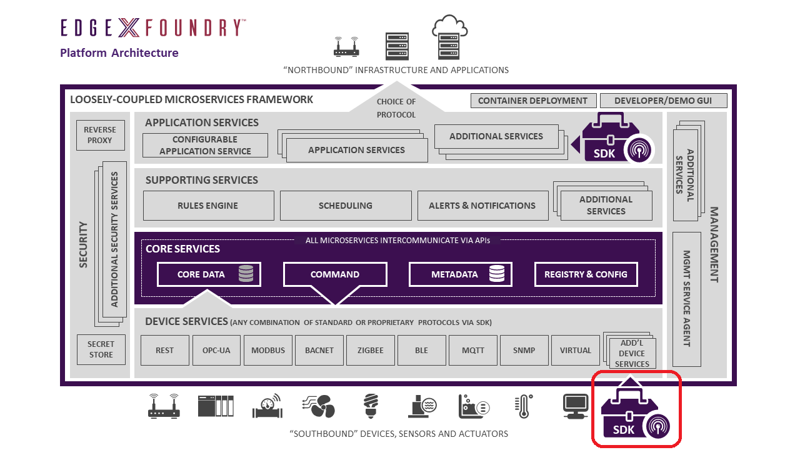

# Device Service SDK

The EdgeX device service [software development kits](../general/Definitions.md#Software-Development-Kit) (SDKs) help developers create new [device](..general/../../general/Definitions.md#Device) connectors for EdgeX.  An SDK provides the common scaffolding that each device service needs.  This allows developers to create new device/sensor connectors more quickly.

The EdgeX community already provides many device services.  However, there is no way the community can provide for every protocol and every sensor.
Even if the EdgeX community provided a device service for every protocol, your use case, sensor, or security infrastructure might require customization.  Thus, the device service SDKs provide the means to extend or customize EdgeX’s device connectivity.

EdgeX provides two SDKs to help developers create new device services.   Most of EdgeX is written in Go and C. Thus, there's a device service SDK written in both Go and C to support the more popular languages used in EdgeX today. In the future, the community may offer alternate language SDKs.

The SDKs are libraries that get incorporated into a new micro services.  They make writing a new device service much easier. By importing the SDK library into your new device service project, developers are left to focus on the code that is specific to the communications with the device via the protocol of the device.

The code in the SDK handles the other details, such as:
- initialization of the device service
- getting the service configured
- sending sensor data to core data
- managing communications with core metadata
- and much more.

The code in the SDK also helps to ensure your device service adheres to rules and standards of EdgeX.  For example, it makes sure the service registers with the EdgeX registry service when it starts.

[Use the GoLang SDK](Ch-GettingStartedSDK-Go.md)

[Use the C SDK](Ch-GettingStartedSDK-C.md)

