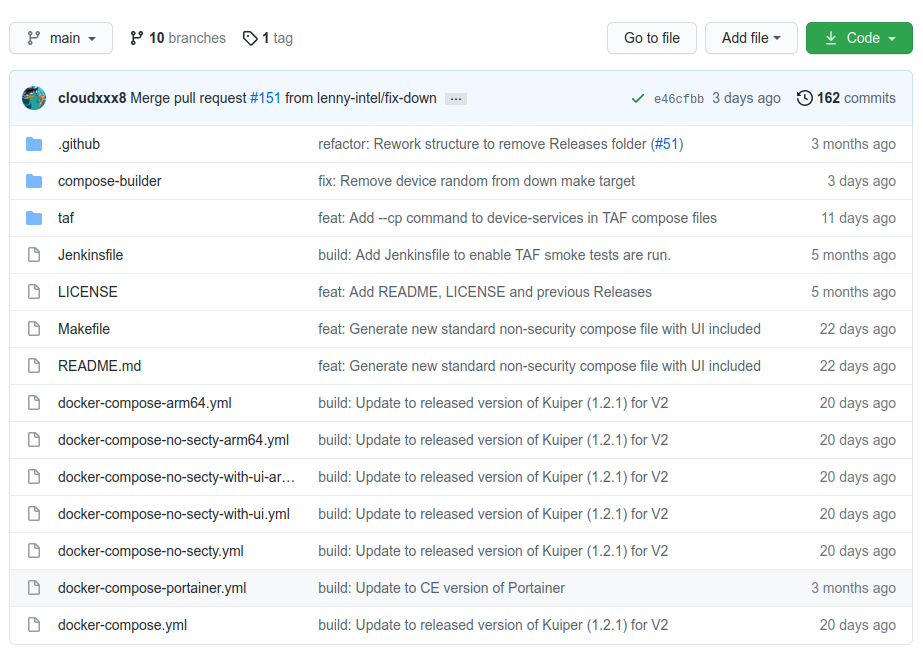
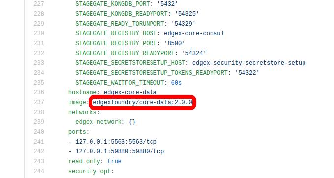
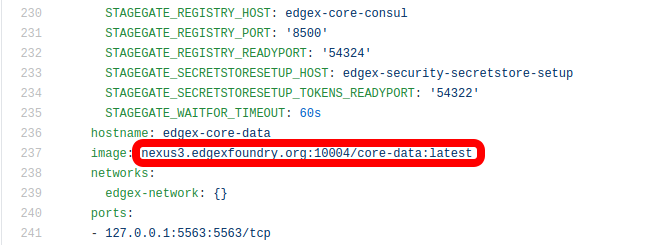

# Getting Docker Images from EdgeX Nexus Repository

Released EdgeX Docker container images are available from [Docker Hub](https://hub.docker.com/search?q=edgexfoundry&type=image).  In some cases, it may be necessary to get your EdgeX container images from the Nexus repository.  The Linux Foundation manages the Nexus repository for the project.

Nexus contains the EdgeX project staging and development container images. In other words, Nexus contains work-in-progress or pre-release images.  These, pre-release/work-in-progress Docker images are built nightly and made available at the following Nexus location:

```
nexus3.edgexfoundry.org:10004
```

## Rationale To Use Nexus Images

Reasons you might want to use container images from Nexus include:

1.  The container is not available from Docker Hub (or Docker Hub is down temporarily)
2.  You need the latest development container image (the work in progress)
3.  You are working in a Windows or non-Linux environment and you are unable to build a container without some issues.

A set of Docker Compose files have been created to allow you to get and use the latest EdgeX service images from Nexus.  Find these [Nexus "Nightly Build" Compose files](https://github.com/edgexfoundry/edgex-compose) in the `main` branch of the `edgex-compose` respository in GitHub.  The EdgeX development team provides these Docker Compose files.  As with the EdgeX release Compose files, you will find several different Docker Compose files that allow you to get the type of EdgeX instance setup based on: 

- your hardware (x86 or ARM)
- your desire to have security services on or off
- your desire to run with the EdgeX GUI included



!!! Warning
    The "Nightly Build" images are provided as-is and may not always function properly or with other EdgeX services.  Use with caution and typically only if you are a developer/contributor to EdgeX. These images represent the latest development work and may not have been thoroughly tested or integrated.

## Using Nexus Images
The operations to pull the images and run the Nexus Repository containers are the same as when using EdgeX images from Docker Hub (see [Getting Started with Docker](./Ch-GettingStartedUsers.md#run-edgex-foundry)).

To get container images from the Nexus Repository, in a command terminal, change directories to the location of your downloaded Nexus Docker Compose yaml.  Rename the file to docker-compose.yml.  Then run the following command in the terminal to pull (fetch) and then start the EdgeX Nexus-image containers.

``` bash
docker-compose up -d
```

## Using a Single Nexus Image
In some cases, you may only need to use a single image from Nexus while other EdgeX services are created from the Docker Hub images.  In this case, you can simply replace the image location for the selected image in your original Docker Compose file.  The address of Nexus is **nexus3.edgexfoundry.org** at port **10004**.  So, if you wished to use the EdgeX core data image from Nexus, you would replace the name and location of the core data image `edgexfoundry/core-data:2.0.0` with `nexus3.edgexfoundry.org:10004/core-data:latest` in the Compose file.




!!! Note
    The example above replaces the Ireland core data service from Docker Hub with the latest core data image in Nexus. 
