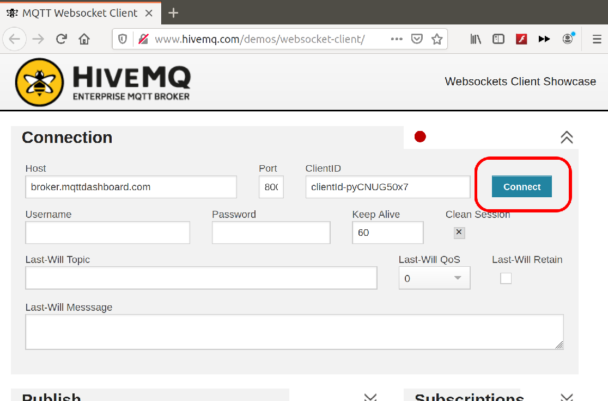
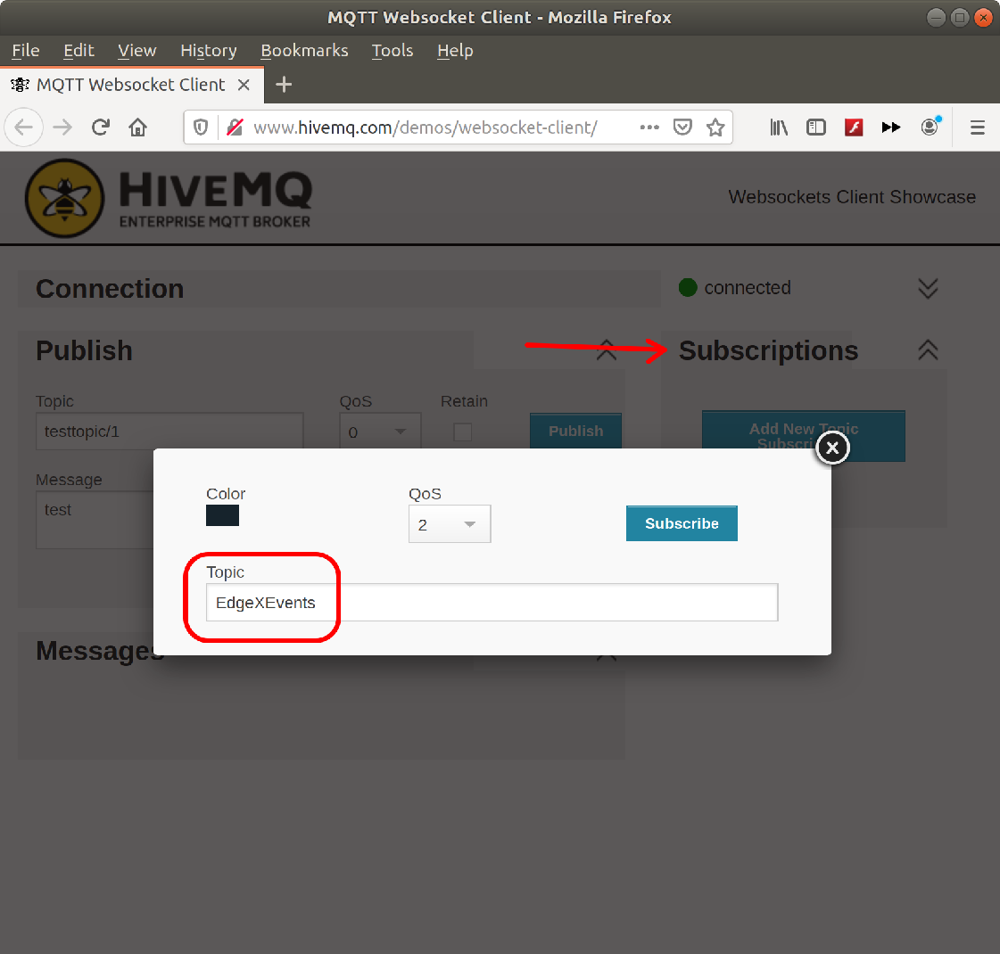

# Quick Start
This guide will get EdgeX up and running on your machine in as little as 5 minutes. We will skip over lengthy descriptions for now. The goal here is to get you a working IoT Edge stack, from device to cloud, as simply as possible.  

When you need more detailed instructions or a breakdown of some of the commands you see in this quick start, see either the [Getting Started- Users](../Ch-GettingStartedUsers) or [Getting Started - Developers](../Ch-GettingStartedDevelopers) guides.

## Setup
The fastest way to start running EdgeX is by using our pre-built Docker images. To use them you'll need to install the following:

* Docker <https://docs.docker.com/install/>
* Docker Compose <https://docs.docker.com/compose/install/>

## Running EdgeX
Once you have Docker and Docker Compose installed, you need to:

* download / save the latest [`docker-compose` file](https://github.com/edgexfoundry/developer-scripts/blob/master/releases/geneva/compose-files/docker-compose-geneva-redis-no-secty.yml)
* issue command to download and run the EdgeX Foundry Docker images from Docker Hub

This can be accomplished with a single command as shown below (please note the tabs for x86 vs ARM architectures).

=== "x86"
    ```
    curl https://raw.githubusercontent.com/edgexfoundry/developer-scripts/master/releases/geneva/compose-files/docker-compose-geneva-redis-no-secty.yml -o docker-compose.yml; docker-compose up
    ```
=== "ARM"
    ```
    curl https://raw.githubusercontent.com/edgexfoundry/developer-scripts/master/releases/geneva/compose-files/docker-compose-geneva-redis-no-secty-arm64.yml -o docker-compose.yml; docker-compose up
    ```

Verify that the EdgeX containers have started:
```
docker-compose ps 
```

*If all EdgeX containers pulled and started correctly and without error, you should see a process status (ps) that looks similar to the image above.*

## Connecting a Device
EdgeX Foundry provides a [Random Number device service](https://github.com/edgexfoundry/device-random) which is useful to testing, it returns a random number within a configurable range. Configuration for running this service is in the `docker-compose.yml` file you downloaded at the start of this guide, but it is disabled by default. To enable it, uncomment the following lines in your `docker-compose.yml`:
``` yaml
  device-random:
    image: edgexfoundry/docker-device-random-go:1.2.1
    ports:
      - "127.0.0.1:49988:49988"
    container_name: edgex-device-random
    hostname: edgex-device-random
    networks:
      - edgex-network
    environment:
      <<: *common-variables
      Service_Host: edgex-device-random
    depends_on:
      - data
      - command
```
Then you can start the Random device service with:
```
docker-compose up -d device-random
```
The device service will register a device named `Random-Integer-Generator01`, which will start sending its random number readings into EdgeX.

You can verify that those readings are being sent by querying the EdgeX core data service for the last 10 event records sent for Random-Integer-Generator01:
```
curl http://localhost:48080/api/v1/event/device/Random-Integer-Generator01/10
```

*Verify the random device service is operating correctly by requesting the last 10 event records received by core data for the Random-Integer-Generator device.*

## Controlling the Device

Reading data from devices is only part of what EdgeX is capable of.  You can also use it to control your devices - this is termed 'actuating' the device. When a device registers with the EdgeX services, it provides a [Device Profile](../../microservices/device/profile/Ch-DeviceProfile.md) that describes both the data readings available from that device, and also the commands that control it. 

When our Random Number device service registered the device `Random-Integer-Generator01`, it used a [profile](https://github.com/edgexfoundry/device-random/blob/master/cmd/res/device.random.yaml) which defines commands for changing the minimum and maximum values for the random numbers it will generate.

You won't call commands on devices directly, instead you use the EdgeX Foundry [Command Service](../../microservices/core/command/Ch-Command.md) to do that. The first step is to check what commands are available to call by asking the Command service about your device:
``` bash
curl http://localhost:48082/api/v1/device/name/Random-Integer-Generator01
```
This will return a lot of JSON, because there are a number of commands you can call on this device, but the one we're going to try in this guide in will look something like this:
``` json
{
  "created": 1592190157924,
  "modified": 1592190157924,
  "id": "5353248d-8006-4b01-8250-a07cb436aeb1",
  "name": "GenerateRandomValue_Int8",
  "get": {
    "path": "/api/v1/device/{deviceId}/GenerateRandomValue_Int8",
    "responses": [
     {
       "code": "200",
       "expectedValues": [
          "RandomValue_Int8"
       ]
     },
     {
       "code": "503",
       "description": "service unavailable"
     }
    ],
    "url": "http://edgex-core-command:48082/api/v1/device/4a602dc3-afd5-4c76-9d72-de02407e80f8/command/5353248d-8006-4b01-8250-a07cb436aeb1"
  },
  "put": {
    "path": "/api/v1/device/{deviceId}/GenerateRandomValue_Int8",
    "responses": [
      {
        "code": "200"
      },
      {
        "code": "503",
        "description": "service unavailable"
      }
    ],
    "url": "http://edgex-core-command:48082/api/v1/device/4a602dc3-afd5-4c76-9d72-de02407e80f8/command/5353248d-8006-4b01-8250-a07cb436aeb1",
    "parameterNames": [
      "Min_Int8",
      "Max_Int8"
    ]
  }
}
```
!!! Note
    The URLs won't be exactly the same for you, as the generated unique IDs for both the Device and the Command will be different. So be sure to use your values for the following steps.

You'll notice that this one command has both a **GET** and a **PUT** option. The **GET** call will return a random number, and is what is being called automatically to send data into the rest of EdgeX (specifically core data). You can also call **GET** manually using the URL provided:
``` bash
curl http://localhost:48082/api/v1/device/4a602dc3-afd5-4c76-9d72-de02407e80f8/command/5353248d-8006-4b01-8250-a07cb436aeb1
```
!!! Warning
    Notice that **localhost** replaces **edgex-core-command** here. That's because the EdgeX Foundry services are running in Docker.  Docker recognizes the internal hostname **edgex-core-command**, but when calling the service from outside of Docker, you have to use **localhost** to reach it.

This command will return a JSON result that looks like this:
``` json
{
  "device": "Random-Integer-Generator01",
  "origin": 1592231895237359000,
  "readings": [
    {
      "origin": 1592231895237098000,
      "device": "Random-Integer-Generator01",
      "name": "RandomValue_Int8",
      "value": "-45",
      "valueType": "Int8"
    }
  ],
  "EncodedEvent": null
}
```


*A call to GET of the Random-Integer-Generator01 device's GenerateRandomValue_Int8 operation through the command service results in the next random value produced by the device in JSON format.*

The default range for this reading is -128 to 127. We can limit that to only positive values between 0 and 100 by calling the **PUT** command with new minimum and maximum values:
``` bash
curl -X PUT -d '{"Min_Int8": "0", "Max_Int8": "100"}' http://localhost:48082/api/v1/device/4a602dc3-afd5-4c76-9d72-de02407e80f8/command/5353248d-8006-4b01-8250-a07cb436aeb1
```
!!! Warning
    Again, also notice that **localhost** replaces **edgex-core-command**.

There is no visible result of calling **PUT** if the call is successful.


*A call to the device's PUT command through the command service will return no results.*

Now every time we call **GET** on this command, the returned value will be between 0 and 100.

## Exporting Data

EdgeX provides exporters (called application services) for a variety of cloud services and applications. To keep this guide simple, we're going to use the community provided 'application service configurable' to send the EdgeX data to a public MQTT broker hosted by HiveMQ.  You can then watch for the EdgeX event data via HiveMQ provided MQTT browser client.

First add the following application service to your docker-compose.yml file right after the 'rulesengine' service (around line 255).  Spacing is important in YAML, so make sure to copy and paste it correctly.

``` yaml
  app-service-mqtt:
    image: edgexfoundry/docker-app-service-configurable:1.1.0
    ports:
      - "127.0.0.1:48101:48101"
    container_name: edgex-app-service-configurable-mqtt
    hostname: edgex-app-service-configurable-mqtt
    networks:
      - edgex-network
    environment:
      <<: *common-variables
      edgex_profile: mqtt-export
      Service_Host: edgex-app-service-configurable-mqtt
      Service_Port: 48101
      MessageBus_SubscribeHost_Host: edgex-core-data
      Binding_PublishTopic: events
      Writable_Pipeline_Functions_MQTTSend_Addressable_Address: broker.mqttdashboard.com
      Writable_Pipeline_Functions_MQTTSend_Addressable_Port: 1883
      Writable_Pipeline_Functions_MQTTSend_Addressable_Protocol: tcp
      Writable_Pipeline_Functions_MQTTSend_Addressable_Publisher: edgex
      Writable_Pipeline_Functions_MQTTSend_Addressable_Topic: EdgeXEvents
    depends_on:
      - consul
      - data
```

!!! Note
    This adds the application service configurable to your EdgeX system.  The application service configurable allows you to configure (versus program) new exports - in this case exporting the EdgeX sensor data to the HiveMQ broker at broker.mqttdashboard.com port 1883.  You will be publishing to EdgeXEvents topic.

Save the compose file and then execute another compose up command to have Docker Compose pull and start the configurable application service.

```
docker-compose up -d
```
You can connect to this broker with any MQTT client to watch the sent data. HiveMQ provides a [web-based client](http://www.hivemq.com/demos/websocket-client/) that you can use.  Use a browser to go to the client's URL.  Once there, hit the Connect button to connect to the HiveMQ public broker.  


*Using the HiveMQ provided client tool, connect to the same public HiveMQ broker your configurable application service is sending EdgeX data to.*

Then, use the Subscriptions area to subscribe to the "EdgeXEvents" topic.


*You must subscribe to the same topic - EdgeXEvents - to see the EdgeX data sent by the configurable application service.*

You will begin seeing your random number readings appear in the Messages area on the screen.


*Once subscribed, the EdgeX event data will begin to appear in the Messages area on the browser screen.*

## Next Steps

Congratulations! You now have a full EdgeX deployment reading data from a (virtual) device and publishing it to an MQTT broker in the cloud, and you were able to control your device through commands into EdgeX. 

It's time to continue your journey by reading the [Introduction](../../index.md) to EdgeX Foundry, what it is and how it's built. From there you can take the [Walkthrough](../../walk-through/Ch-Walkthrough.md) to learn how the microservices work together to control devices and read data from them as you just did.
