# EdgeX Foundry User Interface

EdgeX's graphical user interface (GUI) is provided for demonstration and development use to manage and monitor a single instance of EdgeX Foundry.

## Setup
You can quickly run the GUI in a Docker container or as part of the EdgeX Snap.  You can also download, build and run the GUI natively on your host.

### Docker Compose
The EdgeX GUI is already incorporated into Docker Compose files provided by the project.  Locate and download the Docker Compose file that includes the GUI container by looking for a file that has "-with-ui" in the file name.  For example, in the Ireland branch of edgex-compose, notice the two Docker Compose files that include the GUI below.

!!! Note
    Because the GUI can only to be used in unsecured EdgeX, you will not find a Docker Compose file that includes security and the GUI.

See the [Getting Started](../quick-start/Ch-GettingStartedUsers#select-a-edgex-foundry-compose-file) guide for help on how to find, download and use a Docker Compose file to run EdgeX - in this case with the GUI.

### Snaps

** Coming Soon! **  Canonical is developing a Snap that incorporates the EdgeX GUI.  Look for an update here soon.

### Native
If you are running EdgeX natively (outside of Docker Compose or a Snap), you will find instructions on how to build and run the GUI on your platform in the [GUI repository README](https://github.com/edgexfoundry/edgex-ui-go/blob/main/README.md)

## General

### GUI Address
Once the GUI is up and running, simply visit port 4000 on the GUI's host machine (ex:  http://localhost:4000) to enter the GUI Dashboard (see below).  The GUI does not require any login.

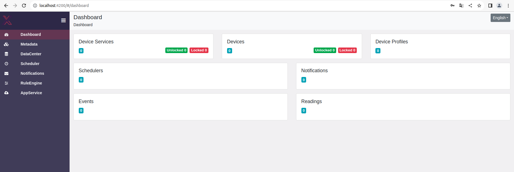

### Menu Bar
The left side of the Dashboard holds a menu bar that allows you access to the GUI functionality.  The "hamburger" icon on the menu bar allows you to shrink or expand the menu bar to icons vs icons and menu bar labels.

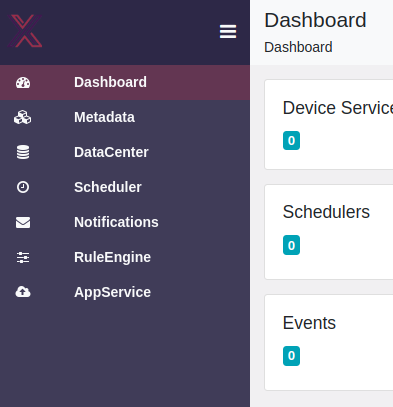   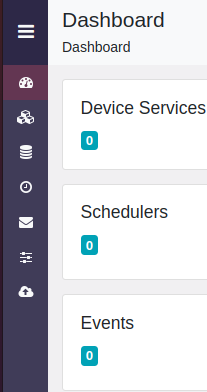

### Mobile Device Ready
The EdgeX GUI can be used/displayed on a mobile device via the mobile device's browser if the GUI address is accessible to the device.  The display may be skewed in order to fit the device screen.  For example, the Dashboard menu will often change to icons  over the expanded labeled menu bar when shown on a mobile device.

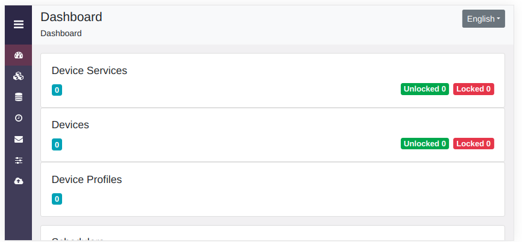

## Capability

The GUI allows you to 

- manage (add, remove, update) most of the EdgeX objects to include devices, device profiles, device services, rules, schedules, notifications, app services, etc.
- start, stop or restart the EdgeX services
- explore the memory, CPU and network traffic usage of EdgeX services
- monitor the data stream (the events and readings) collected by sensors and devices
- explore the configuration of an EdgeX service

### Dashboard
The Dashboard page (the main page of the GUI) presents you with a set of clickable "tiles" that provide a quick view of the status of your EdgeX instance.  That is, it provides some quick data points about the EdgeX instance and what the GUI is tracking.  Specifically, the tiles in the Dashboard show you:

- the number of [device services](../../microservices/device/Ch-DeviceServices.md) that it is aware of and their status (locked vs unlocked)
- the number of devices being managed by EdgeX (through the associated device services)
- the number of [device profiles](../../microservices/device/profile/Ch-DeviceProfile.md) registered with core metadata
- the number of [schedules](../../microservices/support/scheduler/Ch-Scheduler.md) (or intervals) EdgeX is managing
- the number of [notifications](../../microservices/support/notifications/Ch-AlertsNotifications.md) EdgeX has seen
- the number of [events and readings](../../microservices/core/data/Ch-CoreData.md#events-and-readings) generated by device services and passing through core data
- the number of EdgeX micro services currently being monitored through the [system management service](../../microservices/system-management/Ch_SystemManagement.md)

If for some reason the GUI has an issue or difficulty getting the information it needs to display a tile in the Dashboard when it is displayed, a popup will be displayed over the screen indicating the issue.  In the example below, the support scheduling service was down and the GUI Dashboard was unable to access the scheduler service.

In this way, the Dashboard provides a quick and easy way to see whether the EdgeX instance is nominal or has underlying issues.

You can click on each of the tiles in the Dashboard.  Doing so provides more details about each.  More precisely, clicking on a tile takes you to another part of the GUI where the details of that item can be found.  For example, clicking on the Device Profiles tile takes you to the Metadata page and the Device Profile tab (covered below)

### System

The EdgeX platform is comprised of a set of micro services.  The system management service (and associated executors) tracks the micro services status (up or down), metrics of the running service (memory, CPU, network traffic), and configuration influencing the operation of the service.  The system management service also provides the ability (through APIs) to start, stop and restart a service.

Service information and the ability to call on the start, stop, restart APIs is surfaced through the System page.

!!! Warning
    The system management services are deprecated in EdgeX as of Ireland.  Their full replacement has not been identified, but adopters should be aware that the service will be replaced in a future release.

Please note that the System List display provides access to a static list of EdgeX services.  As device services and application services (among other services) may be added or removed based on use case needs (often requireing new custom south and north side services), the GUI is not made aware of these and therefore will not display details on these services.

#### Metrics

From the System Service List, you can click on the `Metric` icon for any service to see the memory, CPU and network traffic telemetry for any service.

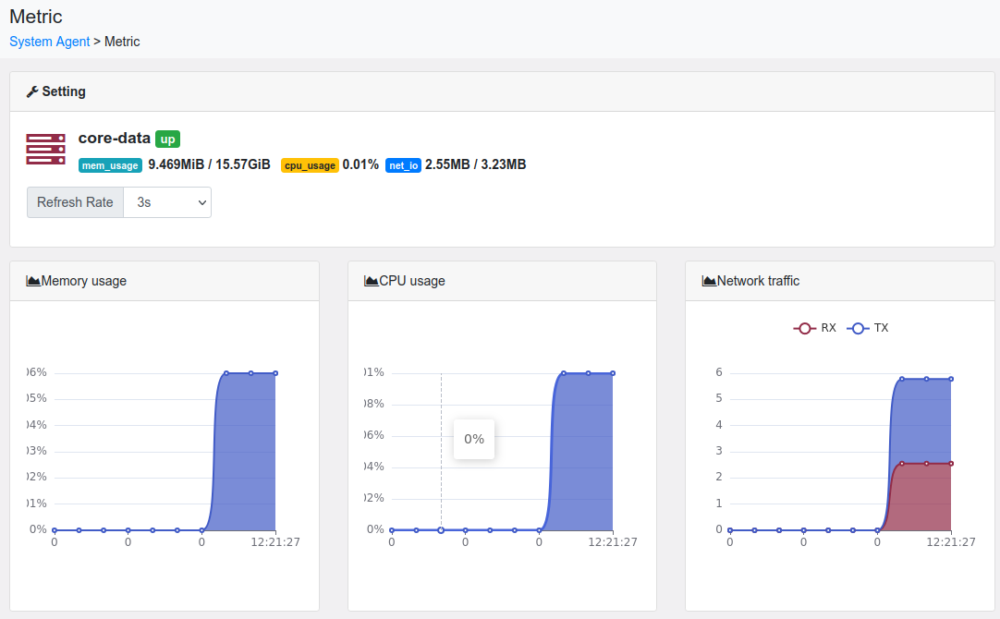

The referesh rate can be adjusted on the display to have the GUI poll the system management service more or less frequently.

!!! Info
    The metrics are provided via an associated [executor](../../microservices/system-management/executor/Ch_SysMgmtExecutor.md) feeding the system management agent telemtry data.  In the case of Docker, a Docker executor is capturing standard Docker stats and relaying them to the system management agent that in turn makes these available through its APIs to the GUI.

#### Config

The configuration of each service is made available for each service by clicking on the `Config` icon for any service from the System Service List.  The configuration is displayed in JSON form and is read only.  If running Consul, use the [Consul Web UI](../../microservices/configuration/ConfigurationAndRegistry.md#web-user-interface) to make changes to the configuration.

#### Operation

From the System Service List, you can request to stop, start or restart any of the listed services with the operation buttons in the far right column.

!!! Warning
    There is no confirmation popup or warning on these requests.  When you push a stop, start, restart button, the request is immediately made to the system management service for that operation.

The state of the service will change when these operations are invoked.  When a service is stopped, the metric and config information for the service will be unavailable.

After starting (or restarting) a service, you may need to hit the `Refresh` button on the page to get the state and metric/config icons to change.

### Metadata

The Metadata page (available from the Metadata menu option) provides three tabs to be able to see and manage the basic elements of metadata:  device services, device profiles and devices.

#### Device Service Tab

The Device Service tab displays the device services known to EdgeX (as device services registered in core metadata).  Device services cannot be added or removed through the GUI, but information about the existing device services (i.e., port, admin state) and several actions on the existing device services can be accomplished on this tab.

First note that for each device service listed, the number of associated devices are depicted.  If you click on the `Associated Devices` button, it will take you to the Device tab to be able to get more information about or work with any of the associated devices.

The `Settings` button on each device service allows you to change the description or the admin state of the device service.

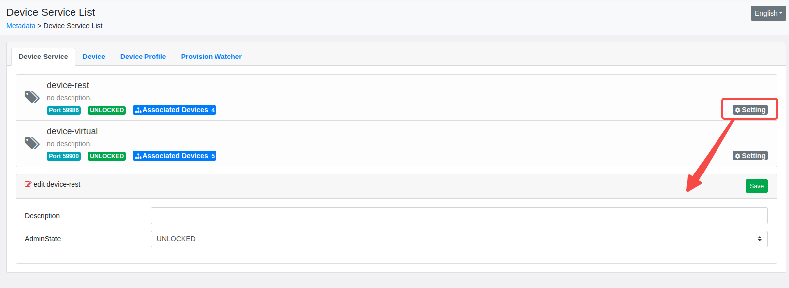

!!! Alert
    Please note that you must hit the `Save` button after making any changes to the Device Service Settings.  If you don't and move away from the page, your changes will be lost.

#### Device Tab

The Device Tab on the Metadata page offers you details about all the sensors/devices known to your EdgeX instance.  Buttons at the top of the tab allow you to add, remove or edit a device (or collection of devices when deleting and using the selector checkbox in the device list).

On the row of each device listed, links take you to the appropriate tabs to see the associated device profile or device service for the device.

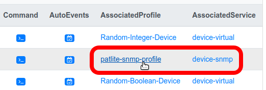

Icons on the row of each device listed cause editable areas to expand at the bottom of the tab to execute a device command or see/modify the device's AutoEvents.

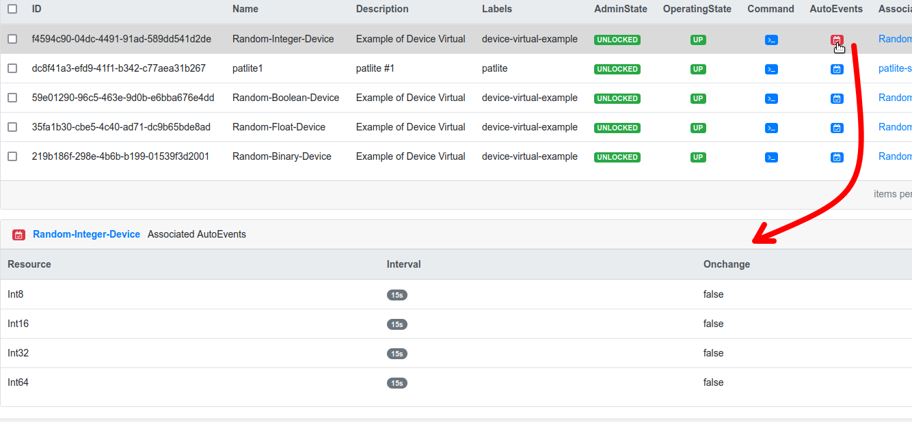

The command execution display allows you to select the specific device resource or device command (from the `Command Name List`), and execute or `try` either a GET or SET command (depending on what the associated device profile for the device says is allowed).  The response will be displayed in the `ResponseRaw` area after the `try` button is pushed.

##### Add Device Wizard

The `Add` button on the Device List tab will take you to the `Add Device Wizard`.  This nice utility will assist you, entry screen by entry screen, in getting a new device setup in EdgeX.  Specifically, it has you (in order):

- select the device service to which the new device will be associated
- select the device profile to which the new device will be templated or typed after
- enter general characteristics for the device (name, description, labels, etc.) and set its operating and admin states
- optionally setup auto events for scheduled data collection
- enter specific protocol properties for the device (based on known templates the GUI has at its disposal such as REST, MQTT, Modbus, etc.)

Once all the information in the `Add Device Wizard` screens is entered, the `Submit` button at the end of the wizard causes your new device to be created in core metadata with all appropriate associations.

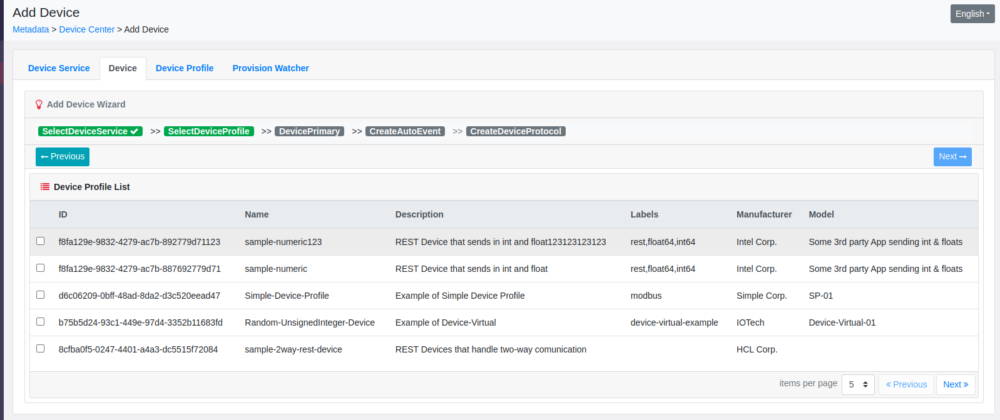

#### Device Profile Tab

The Device Profile Tab on the Metadata page displays the device profiles known to EdgeX and allows you to add new profiles or edit/remove existing profiles.

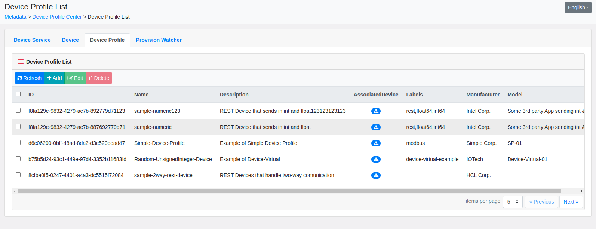

The `AssociatedDevice` button on each row of the Device Profile List will take you to the Device tab and show you the list of devices currently associated to the device profile.

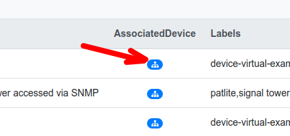

!!! Warning
    When deleting a profile, the system will popup an error if deices are still associated to the profile.

    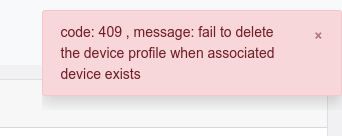

### Data Center (Seeing Event/Reading Data)

From the Data Center option on the GUI's menu bar you can see the stream of Event/Readings coming from the device services into core data.  The event/reading data will be displayed in JSON form.

There are two tabs on the Data Stream page, both with `Start` and `Pause` buttons:

- Event (which allows incoming events to be displayed and the display will include the event's associated readings)
- Reading (allows incoming readings to be displayed, which will only show the reading and not its associated owning event)

Hit the `Start` button on either tab to see the event or reading data displayed in the stream pane (events are shown in the example below).  Push the `Pause` button to stop the display of event or reading data.

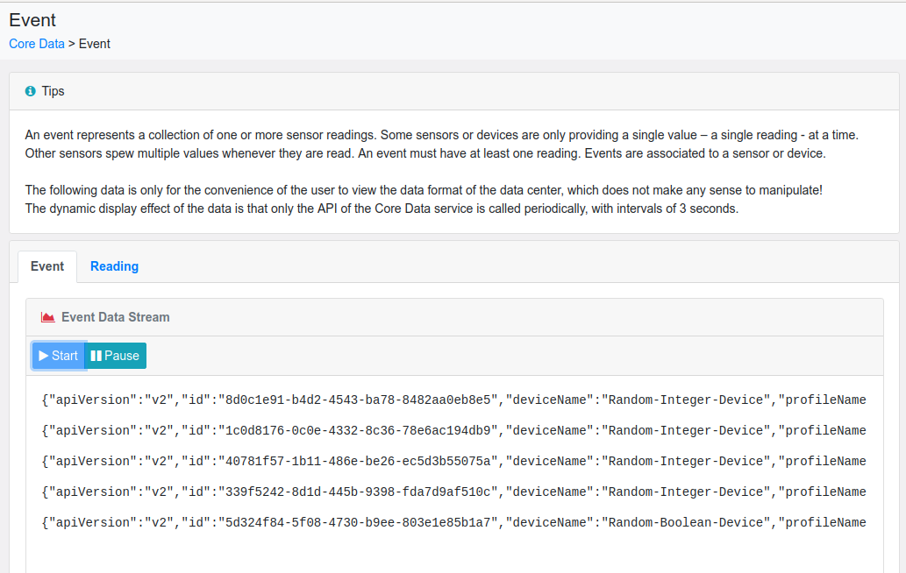

!!! Warning
    In actuality, the event and reading data is pulled from core data via REST call every three (3) seconds - so it is not a live stream display but a poll of data.  Furthermore, if EdgeX is setup to have device services send data directly to application services via message bus and core data is not running or if core data is configured to have persistence turned off, there will be no data in core data to pull and so there will be no events or readings to see.

### Scheduler (Interval/Interval List)

Interval and Interval Actions, which help define task management schedules in EdgeX, are managed via the Scheduler page from selecting Scheduler off the menu bar.

Again, as with many of the EdgeX GUI pages, there are two tabs on the Scheduler page:

- Interval List to display, add, edit and delete [Intervals](../../microservices/support/scheduler/Ch-Scheduler.md#interval)
- Interval Action List to display, add, edit and delete [Interval Actions](../../microservices/support/scheduler/Ch-Scheduler.md#intervalaction) which must be associated to an Interval

#### Interval List

When updating or adding an Interval, you must provide a name Interval duration string which takes an unsigned integer plus a unit of measure which must be one of "ns", "us" (or "µs"), "ms", "s", "m", "h" representing nanoseconds, microseconds, milliseconds, seconds, minutes or hours.  Optionally provide a start/end dates and an indication that the interval runs only once (and thereby ignores the interval).

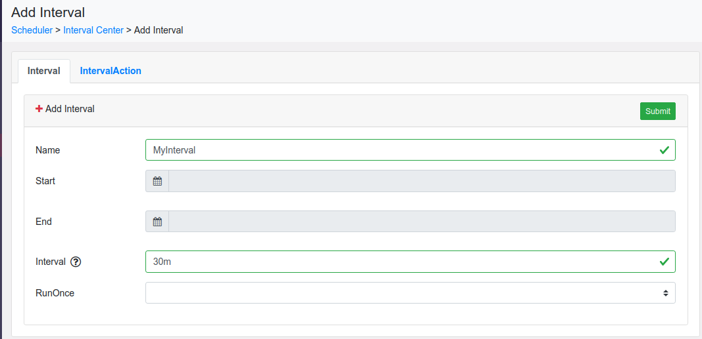

#### Interval Action List

Interval Actions define what happens when the Interval kicks off.  Interval Actions can define REST, MQTT or Email actions that take place when an Interval timer hits.  The GUI provides the means to edit or create any of these actions.  Note that an Interval Action must be associated to an already defined Interval.

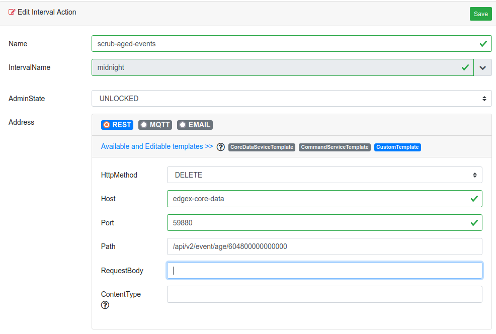

### Notifications

[Notifications](../../microservices/support/notifications/Ch-AlertsNotifications.md) are messages from EdgeX to external systems about something that has happened in EdgeX - for example that a new device has been created.  Currently, notifications can be sent by email or REST call.

The Notification Center page, available from the Notifications menu option, allows you to see new (not processed), processed or escalated (notifications that have failed to be sent within its resend limit) notifications.  By default, the new notifications are displayed, but if you click on the `Advanced >>` link on the page (see below), you can select which type of notifications to display.

The Subscriptions tab on the Notification Center page allows you to add, update or remove subscriptions to notifications.  Subscribers are registered receivers of notifications - either via email or REST.

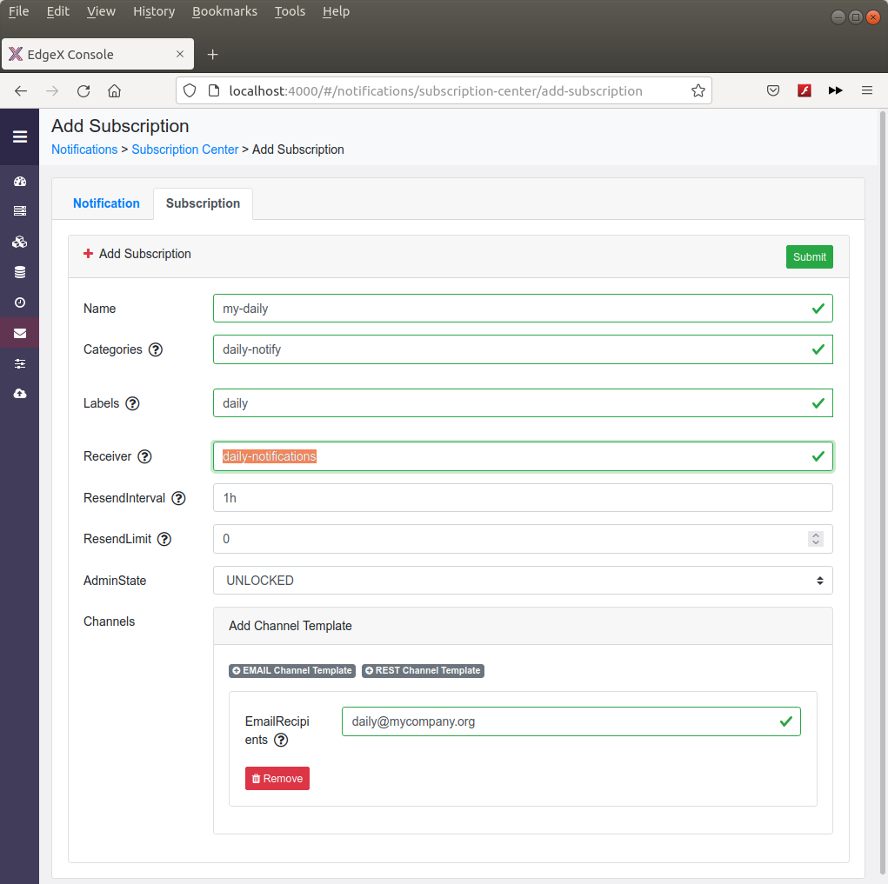

When adding (or editing) a subscription, you must provide a name, category, label, receiver, and either an email address or REST endpoint.  A template is provided to specify either the email or REST endpoint configuration data needed for the subscription.

### RuleEngine

The Rule Engine page, from the RuleEngine menu option, provides the means to define [streams and rules](https://github.com/lf-edge/ekuiper/blob/master/docs/en_US/edgex/edgex_rule_engine_tutorial.md) for the integrated [eKuiper](https://www.lfedge.org/projects/ekuiper/) rules engine.

Via the Stream tab, streams are defined by JSON.  All that is really required is a stream name (EdgeXStream in the example below).

The Rules tab allows eKuiper rules to be added, removed or updated/edited as well as started, stopped or restarted.  When adding or editing a rule, you must provide a name, the rule SQL and action.  The action can be one of the following (some requiring extra parameters):

- send the result to a REST HTTP Server (allowing an EdgeX command to be called)
- send the result to an MQTT broker
- send the result to the EdgeX message bus
- send the result to a log file 

See the [eKuiper documentation](https://github.com/lf-edge/ekuiper/blob/master/docs/en_US/rules/overview.md) for more information on how to define rules.

!!! Alert
    Once a rule is created, it is started by default.  Return to the Rules tab on the RulesEngine page to stop a new rule.

When creating or editing the rule, if the stream referenced in the rule is not already defined, the GUI will present an error when trying to submit the rule.

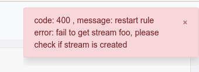

### AppService

In the AppService page, you can configure existing configurable [application services](../../microservices/application/ApplicationServices.md).  The list of available configurable app services is determined by the UI automatically (based on a query for available app services from the registry service). 

#### Configurable

When the application service is a configurable app service and is known to the GUI, the `Configurable` button on the App Service List allows you to change the triggers, functions, secrets and other configuration associated to the configurable app service.

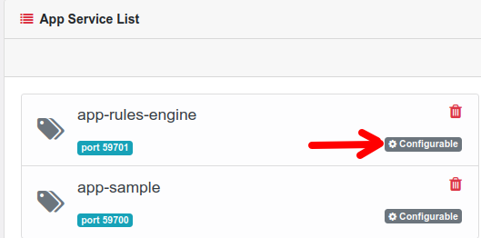

There are four tabs in the Configurable Setting editor:

- [Trigger](../../microservices/application/Triggers.md) which defines how the configurable app service begins execution
- [Pipeline Functions](../../microservices/application/BuiltIn.md) defining which functions are part of the configurable app service pipeline and in which order should they be executed 
- [Insecure Secrets](../../microservices/application/AdvancedTopics.md#secrets) - setting up secrets used by the configurable app service when running in non-secure mode (meaning Vault is not used to provide the secrets)
- [Store and Forward](../../microservices/application/AdvancedTopics.md#store-and-forward) which enables and configures the batch store and forward export capability

!!! Note
    When the Trigger is changed, the service must be restarted for the change to take effect.

## Why Demo and Developer Use Only

The GUI is meant as a developer tool or to be used in EdgeX demonstration situations.  It is not yet designed for production settings.  There are several reasons for this restriction.

- The GUI is not designed to assist you in managing multiple EdgeX instances running in a deployment as would be typical in a production setting.  It cannot be dynamically pointed to any  running instance of EdgeX on multiple hosts. The GUI knows about a single instance of EdgeX running (by default, the instance that is on the same host as the GUI).
- The GUI provides no access controls.  All functionality is open to anyone that can access the GUI URL.
- The GUI does not have the Kong token to negotiate through the API Gateway when the GUI is running outside of the Docker network - where the other EdgeX services are running.  This would mean that the GUI would not be able to access any of the EdgeX service instance APIs.

The EdgeX community is exploring efforts to make the GUI available in secure mode in a future release.

