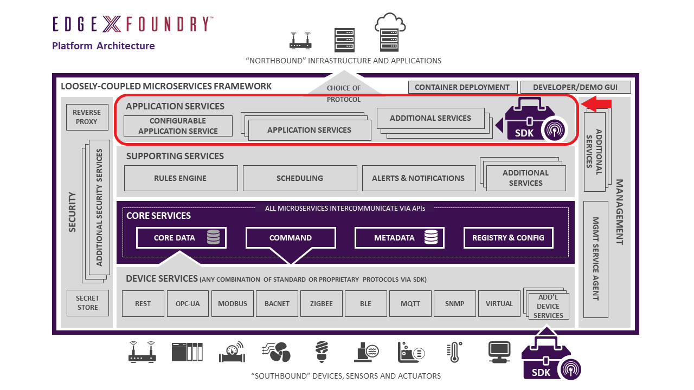
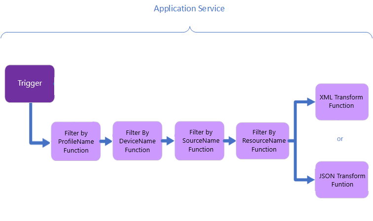

# Application Services - Overview

Application Services are a means to process sensor data at the edge and/or send it to external systems 
(be it analytics package, enterprise on-prem application, cloud systems like Azure IoT, AWS IoT, or Google IoT Core, etc.). 
Application Services provide the means for data to be prepared (transformed, enriched, filtered, etc.) and groomed 
(formatted, compressed, encrypted, etc.) before being sent to an endpoint of choice or published back for another 
Application Service to consume. The export endpoints supported out of the box today include HTTP and MQTT endpoints, 
but custom endpoints can be implemented alongside the existing functionality.

Application Services are based on the idea of "Functions Pipelines". A functions pipeline is a collection of functions 
that processes messages (EdgeX event/reading messages by default) in the specified order. Triggers seed the 
first function(s) in the defined pipeline(s) with the data received by the Application Service. A trigger is something like a message 
landing in a watched message queue. The most commonly used Trigger is the MessageBus Trigger. See the [Triggers](sdk/details/Triggers.md) section for more details

An Applications Functions Software Development Kit (or `App Functions SDK`) is available to help create custom Application Services. 
Currently, the only SDK supported language is Golang, with the intention that community developed and supported SDKs may come in the 
future for other languages. The SDK is available as a Golang module to remain operating system (OS) agnostic and to comply with the
latest EdgeX guidelines on dependency management.

Any application built on top of the Application Functions SDK is considered an Application Service. This SDK is provided to 
help build custom Application Services by assembling triggers, pre-existing functions and custom functions of your making 
into one or more functions pipelines.

## Standard Functions

As mentioned, an Application Service is built around the idea of functions pipelines. The SDK provides many standard functions 
that can be used in a functions pipeline. Additionally, developers can implement their own custom pipeline functions and add those to 
their Application Service functions pipeline(s).

!!! example - "Example functions pipeline"
    
    
    One of the most common use cases for working with data that comes from the MessageBus is to filter data down to what is relevant for a given application and to format it. To help facilitate this, six primary pipeline functions are included in the SDK. 
    
    - The first is the `FilterByProfileName` function which will remove events that do or do not match the configured `ProfileNames` and execution of the pipeline will cease if no event remains after filtering.
    - The second is the `FilterByDeviceName` function which will remove events that do or do not match the configured `DeviceNames` and execution of the pipeline will cease if no event remains after filtering.  
    - The third is the `FilterBySourceName` function which will remove events that do or do not match the configured `SourceNames` and execution of the pipeline will cease if no event remains after filtering. A `SourceName` is the name of the source (command or resource) that the Event was created from. 
    - The fourth is the `FilterByResourceName` which exhibits the same behavior as `DeviceNameFilter` except filtering the event's `Readings` on `ResourceName` instead of `DeviceName`. Execution of the pipeline will cease if no readings remain after filtering. 
    - The fifth and sixth provided functions in the SDK transform the data received to either XML or JSON by calling `XMLTransform` or `JSONTransform`.

Typically, after filtering and transforming the data as needed, exporting is the last step in a pipeline to ship the data where it needs to go. There are three primary functions included in the SDK to help facilitate this. The first and second are the`HTTPPost/HTTPPut` functions that will POST/PUT the provided data to a specified endpoint, and the third is an `MQTTSecretSend()` function that will publish the provided data to a MQTT Broker as specified in the configuration.

See [Built-in Pipeline Functions](sdk/api/BuiltInPipelineFunctions.md) section for full list of SDK supplied pipeline functions 

!!! Note
    The App SDK provides much more functionality than just filtering, formatting and exporting. The above simple example is provided to demonstrate how the functions pipeline works. With the ability to write your own custom pipeline functions, your custom application services can do what ever your use case demands.

There are three primary triggers that have been included in the SDK that initiate the start of the function pipeline.

1. HTTP Trigger via a POST to the endpoint `/api/{{api_version}}/trigger` with the message (typically EdgeX Event data) as the body. 
2. EdgeX MessageBus Trigger with connection details as specified in the configuration. 
3. External MQTT Trigger with connection details as specified in the configuration. 

See the [Triggers](sdk/details/Triggers.md) section for full details on the available triggers.

Finally, data may be sent back to the Trigger response by calling `.SetResponseData()` on the context. 

- If the trigger is HTTP, then it will in the HTTP Response. 
- If the trigger is EdgeX MessageBus, then it will be published  back to the EdgeX MessageBus on the configured publish topic. 
- If the trigger is External MQTT, then it will be published to the configured publish topic.

