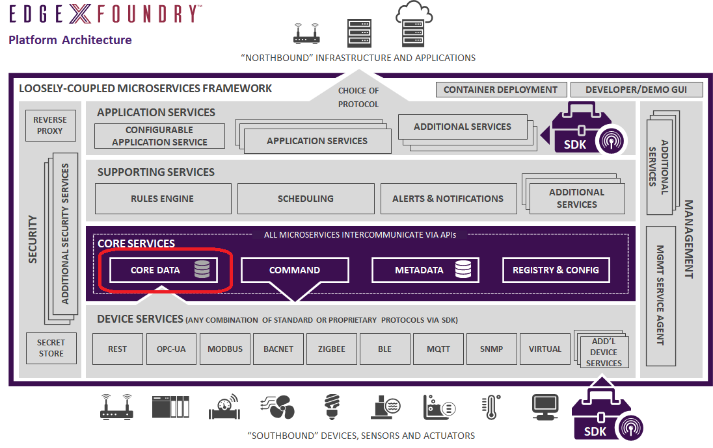
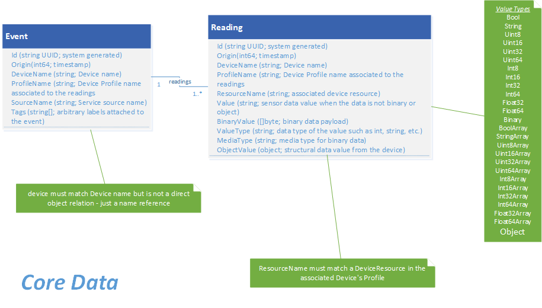
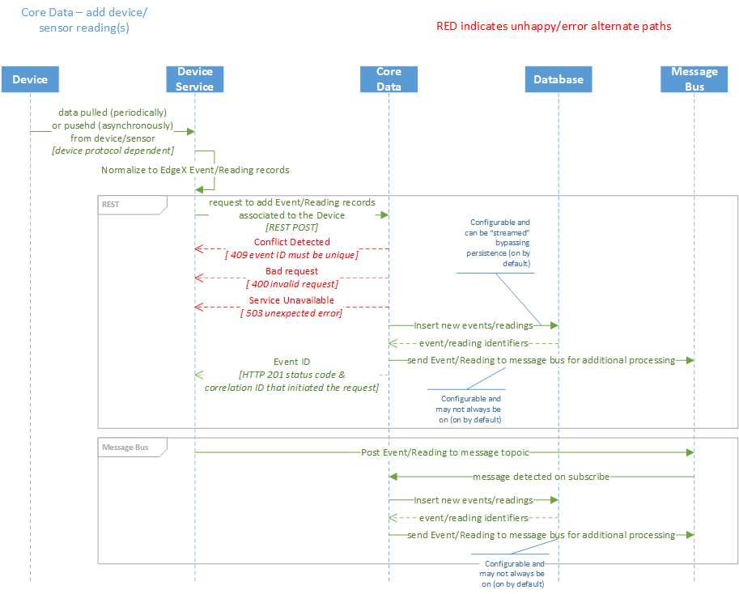

# Core Data

## Introduction

The core data micro service provides centralized persistence for data collected by [devices](../../../general/Definitions.md#device). 
Device services that collect sensor data call on the core data service to
store the sensor data on the edge system (such as in a
[gateway](../../../general/Definitions.md#gateway)) until the data gets moved "north" and then exported to
Enterprise and cloud systems.  Core data persists the data in a local database.  [Redis](https://redis.io/) is used by default, but a database abstraction layer allows for other databases to be used.

!!! Note
        EdgeX has used [MongoDB](https://www.mongodb.com/) in the past. Through the Geneva release, MongoDB is still supported but is considered deprecated.  Alternate (both open source and commercial) implementations have also been provided in the past. 

Other services and systems, both within EdgeX Foundry and
outside of EdgeX Foundry, access the sensor data
only through the core data service. Core data
could also provide a degree of security and protection of the data collected while the data is at the edge.

Core data has a REST API for moving data into and out of the local
storage. In the future, core data could be expandable to send or access sensor data via other protocols such as MQTT, AMQP, etc. Core data moves data to the application service (and [edge analytcs](../../../general/Definitions.md#edge-analytics)) via ZeroMQ by default. EdgeX provides a message bus abstraction that supports ZeroMQ (default) and MQTT.  Use of MQTT requires the installation of a broker such as ActiveMQ.  You can also add your own implementation of the message bus abstraction as needed.

## Core Data "Streaming"

By default, core data persists all data collected by devices sent to it. However, when the data is too sensitive to keep
at the edge, or there is no use for the data at the edge by other local services (e.g. by an analytics micro service), the data
can be "streamed" through core data without persisting it. A
configuration change to core data (PersistData=false) has core data
send data to the application services without
persisting the data. This option has the advantage of reducing
latency through this layer and storage needs at the network edge.  But
the cost is having no historical data to use for analytics that need to look back in time to make a decision.

!!! Note
    When persistence is turned off via the PersistData flag, it is off for all devices.  At this time, you cannot specify which device data is persisted and which device data is not.  [Application services](../../application/ApplicationServices.md) do allow filtering of device data before it is exported or sent to another service like the rules engine, but this is not based on whether the data is persisted or not.

## Events and Readings

Data collected from sensors is marshalled into EdgeX event and reading objects (delivered as JSON objects in service REST calls to core data).  An event represents a collection of one or more sensor readings.  Some sensors or devices are only providing a single value – a single reading - at a time. Other sensors spew multiple values whenever they are read.

An event must have at least one reading.  Events are associated to a sensor or device – the “thing” that sensed the environment and produced the readings.  Readings represent a sensing on the part of a device or sensor.  Readings only exist as part of (are owned by) an event.  Readings are essentially a simple key/value pair of what was sensed (the key) and the value sensed (the value).  A reading may include other bits of information to provide more context (for example data type information) for the users of that data.  Consumers of the reading data could include things like user interfaces, data visualization systems and analytics tools.

In the diagram below, an example event/reading collection is depicted.  The event coming from the “motor123” device has two readings (or sensed values).  The first reading indicates that the motor123 device reported the pressure of the motor was 1300 (the unit of measure might be something like PSI).

The value type property (shown as type above) on the reading lets the consumer of the information know that the value is an integer, base 64.  The second reading indicates that the motor123 device also reported the temperature of the motor was 120 at the same time it reported the pressure (perhaps in degrees Fahrenheit).

## Data Model

The following diagram shows the Data Model for core data.  Device services send Event objects containing a collection or Readings to core data when a device captures a sensor reading.

## Data Dictionary

=== "Event"
    |Property|Description|
    |---|---|
    ||Event represents a single measurable event read from a device.  Event has a one-to-many relationship with Reading.|
    |ID|Uniquely identifies an event, for example a UUID|
	|Pushed|A timestamp indicating when the event was exported. If unexported, the value is zero.|
	|Device|Device identifies the source of the event, can be a device name or id. Usually the device name.|
	|Created|A timestamp indicating when the event was created in the database|
	|Modified|A timestamp indicating when the event was last modified.|
	|Origin|A timestamp indicating when the original event/reading took place.  Most of the time, this indicates when the device service collected/created the event|
	|Readings|A collection (one to many) of associated readings of a given event.
=== "Reading"
    |Property|Description|
    |---|---|
    |ID|Uniquely identifies a reading, for example a UUID|
	|Pushed|A timestamp indicating when the reading was exported. If unexported, the value is zero.|
	|Device|Device identifies the source of the reading, can be a device name or id. Usually the device name.|
	|Created|A timestamp indicating when the reading was created in the database|
	|Modified|A timestamp indicating when the reading was last modified.|
	|Origin|A timestamp indicating when the original event/reading took place.  Most of the time, this indicates when the device service collected/created the event|
    |Name|Name-Value provide the key/value pair of what was sensed by a device.  Name specifies what was the value collected.  Name should match a value descriptor name.|
    |Value|The sensor data value|
    |ValueType|The type of the sensor data - from a list of allowed value types that includes Bool, String, Uint8, Int8, ...|
    |FloatEncoding|Floating point encoding format for float values|
    |BinaryValue|Byte array of sensor data when the data captured is not structured; for example an image is captured.  This information is not persisted in the Database and is expected to be empty when retrieving a Reading for the ValueType of Binary|
    |MediaType|Indicating the type of binary data when collected|
=== "ValueDescriptor"
    |Property|Description|
    |---|---|
    ||Provide the context, unit of measure and more information about any sensed data value| 
    |ID|Uniquely identifies a value descriptor, for example a UUID|
	|Created|A timestamp indicating when the value descriptor was created in the database|
	|Modified|A timestamp indicating when the value descriptor was last modified.|
	|Origin|A timestamp indicating when the original value descriptor was created.  Most of the time, this indicates when the device service requested the value descriptor be created|
    |Descrption|Describes what the value descriptor is used for (example: defines a thermostat temperature value)|
    |Name|Name of the value descriptor and used as the name key in the reading|
    |Min|Minimum allowed value|
    |Max|Maximum allowed value|
    |DefaultValue||
    |Type|Value data type|
    |UomLabel|Unit of measure label|
    |Formatting|Printf convention for display of the value|
    |Labels|array of associated means to label or tag a value (examples: BACNet, temp, thermostat)|
    |FloatEncoding|Floating point encoding format for float values|
    |MediaType|Indicating the type of binary data when collected|

## High Level Interaction Diagrams

The two following High Level Interaction Diagrams show:

- How new sensor readings are collected by a device and added as event/readings to core data and the associated persistence store
- How a client (inside or outside of EdgeX) can query for events (in this case by device name)

**Core Data Add Sensor Readings**

**Core Data Request Event / Reading for a Device**

## Configuration Properties

Please refer to the general [Configuration documentation](../../configuration/Ch-Configuration.md#configuration-properties) for configuration properties common to all services.

=== "Writable"
    |Property|Default Value|Description|
    |---|---|---|
    ||Writable properties can be set and will dynamically take effect without service restart|
    |DeviceUpdateLastConnected|false|When true, core data updates the last connected timestamp for the device in metadata with each event from a given device|
    |MetaDataCheck|false|When true, core data calls metadata to check that the event's referenced device is known to meta data|
    |PersistData|true|When true, core data persists all sensor data sent to it in its associated database|
    |ServiceUpdateLastConnected|false|When true, core data updates the last connected timestamp for the device service in metadata|
    |ValidateCheck|false|When true, core data checks that the name (the value descriptor) of a reading is known to metadata|
    |ChecksumAlgo|'xxHash'|Identifies the algorithm to use when calculating an event's checksum.|
=== "Service"
    |Property|Default Value|Description|
    |---|---|---|
    |MaxResultCount|50000|Maximum number of objects (example: events) that are to be returned on any query of core data via its API|
=== "Databases/Databases.Primary"
    |Property|Default Value|Description|
    |---|---|---|
    ||Properties used by the service to access the database|
    |Host|'localhost'|Host running the core data persistence database|
    |Name|'coredata'|Document store or database name|
    |Password|'password'|Password used to access the database|
    |Username|'core'|Username used to access the database|
    |Port|6379|Port for accessing the database service - the Redis port by default|
    |Timeout|5000|Database connection timeout in milliseconds|
    |Type|'redisdb'|Database to use - either redisdb or mongodb|
=== "MessageQueue"
    |Property|Default Value|Description|
    |---|---|---|
    ||Entries in the MessageQueue section of the configuration allow for publication of events to a message bus|
    |MessageQueue Protocol | tcp | Indicates the connectivity protocol to use to use the bus.|
    |MessageQueue Host | * | Indicates the host of the messaging broker, if applicable.|
    |MessageQueue Port | 5563 | Indicates the port to use when publishing a message.|
    |MessageQueue Type | zero | Indicates the type of messaging library to use. Currently this is ZeroMQ by default. Refer to the [go-mod-messaging](https://github.com/edgexfoundry/go-mod-messaging) module for more information. |
    |MessageQueue Topic | events | Indicates the topic to which messages should be published.|
=== "MessageQueue.Optional"
    |Property|Default Value|Description|
    |---|---|---|
    ||Configuration and connection parameters for use with MQTT message bus - in place of 0MQ |
    |Password|'password'|Password used to access the message system|
    |Username|'core'|Username used to access the message system|
    |ClientId|'core-data'|Client ID used to put messages on the bus|
    |Qos|'0'| Quality of Sevice values are 0 (At most once), 1 (At least once) or 2 (Exactly once)|
    |KeepAlive |'10'| Period of time in seconds to keep the connection alive when there is no messages flowing (must be 2 or greater)|
    |Retained|false|Whether to retain messages|
    |AutoReconnect |true |Whether to reconnect to the message bus on connection loss|
    |ConnectTimeout|5|Message bus connection timeout in seconds|
    |SkipCertVerify|false|TLS configuration - Only used if Cert/Key file or Cert/Key PEMblock are specified|

## API Reference
[Core Data API Reference](../../../api/core/Ch-APICoreData.md)