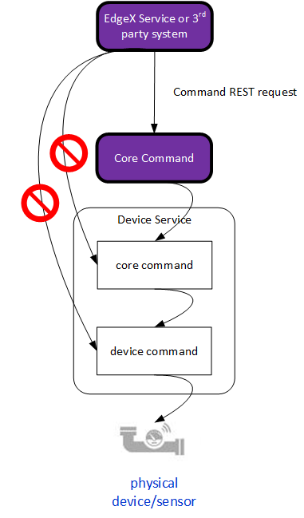
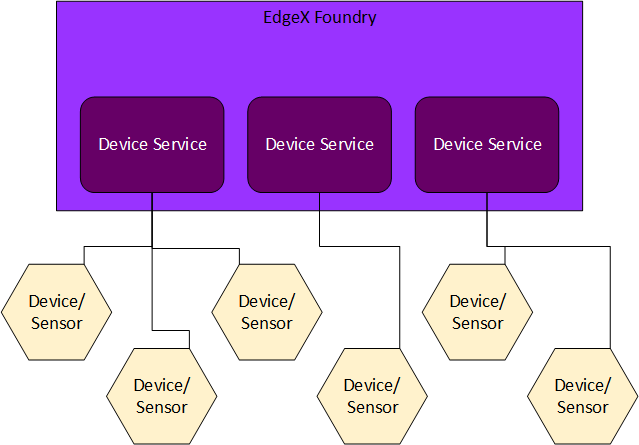
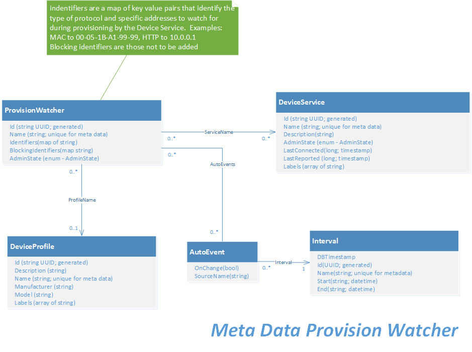
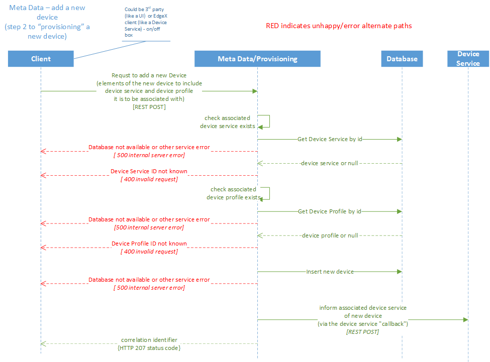
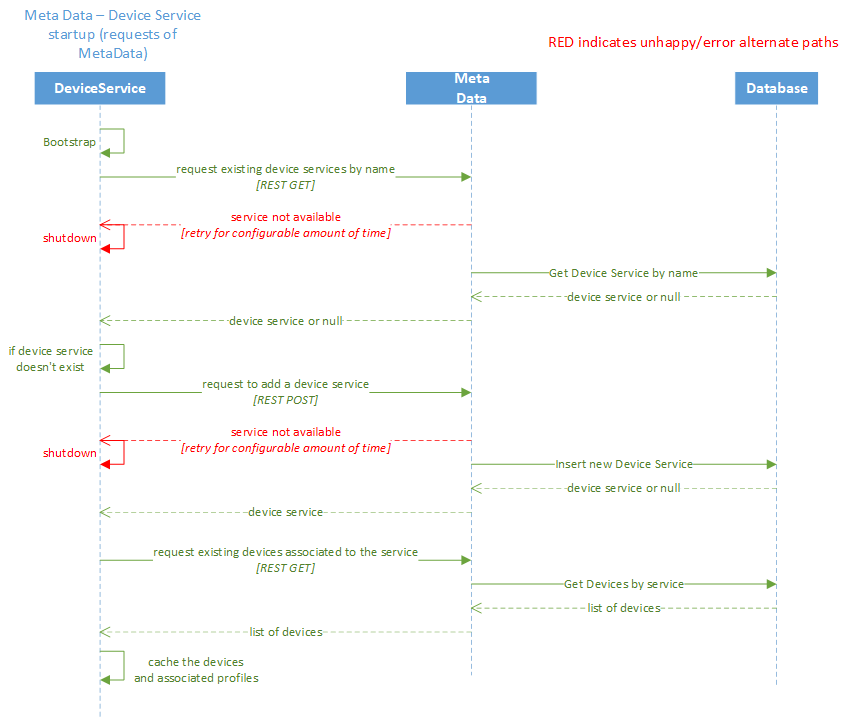

# Metadata


## Introduction

The core metadata micro service has the knowledge about the [devices](../../../general/Definitions.md#device) and
sensors and how to communicate with them used by the other
services, such as core data, core command, and so forth.

Specifically, metadata has the following abilities:

-   Manages information about the devices connected to, and
    operated by, EdgeX Foundry
-   Knows the type, and organization of data reported by the devices
-   Knows how to command the devices

Although metadata has the knowledge, it does not do the following activities:

-   It is not responsible for actual data collection from
    devices, which is performed by device services and core
    data
-   It is not responsible for issuing commands to the
    devices, which is performed by core command and device
    services

## Data Models

To understand metadata, its important to understand the EdgeX data objects it manages.  Metadata stores its knowledge in a local persistence database.  [Redis](https://redis.io/) is used by default, but a database abstraction layer allows for other databases to be used.

!!! Note
        EdgeX has used [MongoDB](https://www.mongodb.com/) in the past. Through the Geneva release, MongoDB is still supported but is considered deprecated.  Alternate (both open source and commercial) implementations have also been provided in the past. 

### Device Profile

Device profiles define general characteristics about devices, the data they provide, and how to command them. Think of a device profile as a template of a type or classification of device. For example, a device profile for BACnet thermostats provides general characteristics for the types of data a BACnet thermostat sends, such as current temperature and humidity level. It also defines which types of commands or actions EdgeX can send to the BACnet thermostat.  Examples might include actions that set the cooling or heating point.  Device profiles are typically specified in YAML file and uploaded to EdgeX.  More details are provided below.

#### Device Profile Details


*Metadata device profile object model*

=== "General Properties"

    A device profile has a number of high level properties to give the profile context and identification. Its name field is required and must be unique in an EdgeX deployment. Other fields are optional - they are not used by device services but may be populated for informational purposes:

    - Description
    - Manufacturer
    - Model
    - Labels

    Here is an example general information section for a sample KMC 9001 BACnet thermostat device profile provided with the BACnet device service (you can find the [profile](https://github.com/edgexfoundry/device-bacnet-c/blob/master/profiles/BAC-9001.yaml) in Github) .  Only the name is required in this section of the device profile.  The name of the device profile must be unique in any EdgeX deployment.  The manufacturer, model and labels are all optional bits of information that allow better queries of the device profiles in the system.

    ``` YAML
    name: "BAC-9001"
    manufacturer: "KMC"
    model: "BAC-9001"
    labels: 
        - "B-AAC"
    description: "KMC BAC-9001 BACnet thermostat"
    ``` 

    Labels provided a way to tag, organize or categorize the various profiles.  They serve no real purpose inside of EdgeX.

=== "Device Resources"

    A device resource (deviceResource in the YAML file) specifies a sensor value within a device that may be read from or written to either individually or as part of a device command (see below).  Think of a device resource as a specific value that can be obtained from the underlying device or a value that can be set to the underlying device.  In a thermostat, a device resource may be a temperature or humidity (values sensed from the devices) or cooling point or heating point (values that can be set/actuated to allow the thermostat to determine when associated heat/cooling systems are turned on or off).  A device resource has a name for identification and a description for informational purposes.

    Back to the BACnet example, here are two device resources.  One will be used to get the temperature (read) the current temperature and the other to set (write or actuate) the active cooling set point.  The device resource name must be provided and it must also be unique in any EdgeX deployment.

    ``` YAML
    name: Temperature
    description: "Get the current temperature"

    name: ActiveCoolingSetpoint
    description: "The active cooling set point"
    ```

    The device service allows access to the device resources via REST endpoint.  Values specified in the device resources section of the device profile can be accessed through the following URL patterns:

    -  http://<device-service>:<port>/api/v1/device/<DeviceID>/<DeviceResourceName>
    -  http://<device-service>:<port>/api/v1/device/name/<DeviceName>/<DeviceResourceName>

    The <DeviceID> is the physical identifier for the device, which is generated when the device is created in EdgeX.

=== "Attributes"

    The attributes associated to a device resource are the specific parameters required by the device service to access the particular value.   In other words, attributes are “inward facing” and are used by the device service to determine how to speak to the device to either get or set some of its values. Attributes are detailed protocol and/or device specific information that informs the device service how to communication with the device to get (or set) values of interest.

    Returning to the BACnet device profile example, below are the complete device resource sections for Temperature and ActiveCoolingSetPoint – inclusive of the attributes – for the example device.

    ``` YAML
    -
        name: Temperature
        description: "Get the current temperature"
        attributes: 
            { type: "analogValue", instance: "1", property: "presentValue", index: "none"  }
    -
        name: ActiveCoolingSetpoint
        description: "The active cooling set point"
        attributes:
            { type: "analogValue", instance: "3", property: "presentValue", index: "none"  }
    ```

=== "Properties"

    The properties of a device resource describe the value obtained or set on the device.  The properties can optionally inform the device service of some simple processing to be performed on the value.  Again, using the BACnet profile as an example, here are the properties associated to the thermostat's temperature device resource.

    ``` YAML
    name: Temperature
    description: "Get the current temperature"
    attributes: 
        { type: "analogValue", instance: "1", property: "presentValue", index: "none"  }
    properties: 
        value:
            { type: "Float32", floatEncoding: "eNotation", readWrite: "R" }
        units:
            { type: "String", readWrite: "R", defaultValue: "Degrees Fahrenheit" }
    ```

    The 'value' property of properties gives more detail about the value collected or set.  In this case giving the details of the temperature value to be set.  The value provides details such as the type of the data collected or set, whether the value can be read, written or both.

    The following fields are available in the value property:

    - type - Required. The data type of the value. Supported types are bool, int8 - int64, uint8 - uint64, float32, float64, string, binary and arrays of the primitive types (ints, floats, bool). Arrays are specified as eg. float32array, boolarray etc.
    - readWrite - R, RW, or W indicating whether the value is readable or writable.
    - defaultValue - a value used for PUT requests which do not specify one.
    - base - a value to be raised to the power of the raw reading before it is returned.
    - scale - a factor by which to multiply a reading before it is returned.
    - offset - a value to be added to a reading before it is returned.
    - mask - a binary mask which will be applied to an integer reading.
    - shift - a number of bits by which an integer reading will be shifted right.

    The processing defined by base, scale, offset, mask and shift is applied in that order. This is done within the SDK. A reverse transformation is applied by the SDK to incoming data on set operations (NB mask transforms on set are NYI)

    The 'units' property gives more detail about the unit of measure associated with the value. In this case, the temperature unit of measure is in degrees Fahrenheit.  The unit of measure can also have a type (although it is most often just a String), a default value, whether the unit can be read, written or both (although it is most often set to read only).

=== "Device Commands"

    Device commands (deviceCommand in YAML) define access to reads and writes for multiple simultaneous device resources. Device commands are optional.  Each named device command should contain a number of get and/or set resource operations, describing the read or write respectively.

    Device commands may be useful when readings are logically related, for example with a 3-axis accelerometer it is helpful to read all axes (X, Y and Z) together.

    A resource operation consists of the following properties:

    - index - a number, used to define an order in which the resource is processed.
    - operation - get or set (mixing of get and set operations is not supported)
    - deviceResource - the name of the device resource to access.
    - parameter - optional, a value that will be used if a PUT request does not specify one.
    - mappings - optional, allows readings of String type to be re-mapped.

    The device commands can also be accessed through a device service’s REST API in a similar manner as described for device resources.

    - http://<device-service>:<port>/api/v1/device/<DeviceID>/<DeviceCommandName>
    - http://<device-service>:<port>/api/v1/device/name/<DeviceName>/<DeviceCommandName>

    If a device command and device resource have the same name, it will be the device command which is available.

=== "Core Commands"

    Core commands (coreCommands in the YAML) are associated to either a device resource or a device command by name.  Core commands are also optional.  Core commands are available through the core command service’s REST API for reading and writing to a device.  In other words, core commands specify which of the device service’s device resource or device commands are seen and available via the EdgeX core command service. 

    Other services (such as the rules engine) or external clients of EdgeX, should make requests of device services through the core command service, and when they do, they are calling on the device service’s core commands (which under the covers calls on the device resource or device commands of the device service).  Direct access to the device commands or device resources of a device service is frowned upon.  Core commands, made available through the EdgeX command service allows the EdgeX adopter to add additional security or controls on who/what/when things are triggered and called on an actual device.

    

    Core commands provide the command service with information about which device commands are accessible.  Other services or external systems should access device services (and devices) through the core command service which call on core commands.

    Core commands support both get and/or put methods. For a get, the returned values are specified in the expectedValues field of the device profile.  For a put, the parameters to be given are specified in the parameterNames field of the device profile. Both fields are arrays and specify the device resources to be read or written to.  In either case, the different HTTP status codes that the device service generates are shown as response indicators.

    
    *Metadata's command object model*

### Device

Data about actual devices is another type of information that the metadata micro service stores and manages. Each device managed by EdgeX Foundry registers with metadata (via its owning device service.  Each device must have a unique ID associated to it. 

Metadata stores information about a device (such as its address)  against the identifier in its database. Each device is also associated to a device profile. This association enables metadata to apply knowledge provided by the device profile to each device. For example, a thermostat profile would say that it reports temperature values in Celsius.  Associating a particular thermostat (the thermostat in the lobby for example) to the thermostat profile allows metadata to know that the lobby thermostat reports temperature value in Celsius. 


### Device Service

Metadata also stores and manages information about the device services.  Device services serve as EdgeX's interfaces to the actual devices and sensors.

Device services are other micro services that communicate with  devices via the protocol of that device.  For example, a Modbus device service facilitates communications among all types of Modbus devices.  Examples of Modbus devices include motor controllers, proximity sensors, thermostats, and power meters.  Device services simplify communications with the device for the rest of EdgeX.

When a device service starts, it registers itself with metadata.  When EdgeX provisions a new devices the device gets associated to its owning device service.  That association is also stored in metadata.



**Metadata Device, Device Service and Device Profile Model**


*Metadata's Device Profile, Device and Device Service object model and the association between them* 

### Provision Watcher

Device services may contain logic to automatically provision new devices.  This can be done statically or dynamically.  In static device configuration (also known as static provisioning) the device service connects to and establishes a new device that it manages in EdgeX (specifically metadata) from configuration the device service is provided.  For example, a device service may be provided with the specific IP address and additional device details for a device (or devices) that it is to onboard at startup.  In static provisioning, it is assumed that the device will be there and that it will be available at the address or place specified through configuration.  The devices and the connection information for those devices is known at the point that the device service starts.

In dynamic discovery (also known as automatic provisioning), a device service is given some general information about where to look and general parameters for a device (or devices).  For example, the device service may be given a range of BLE address space and told to look for devices of a certain nature in this range.  However, the device service does not know that the device is physically there – and the device may not be there at start up.  It must continually scan during its operations (typically on some sort of schedule) for new devices within the guides of the location and device parameters provided by configuration. 

Not all device services support dynamic discovery.  If it does support dynamic discovery, the configuration about what and where to look (in other words, where to scan) for new devices is specified by a provision watcher.  A provision watcher, is specific configuration information provided to a device service (usually at startup) that gets stored in metadata.  In addition to providing details about what devices to look for during a scan, a provision watcher may also contain “blocking” indicators, which define parameters about devices that are not to be automatically provisioned.  This allows the scope of a device scan to be narrowed or allow specific devices to be avoided.  


*Metadata's provision watcher object model*

## Data Dictionary

=== "Action"
    |Property|Description|
    |---|---|
    ||Action describes state related to the capabilities of a device|
    |Path|Path used by service for action on a device or sensor|
	|Responses|Responses from get or put requests to service|
	|URL|Url for requests from command service|
=== "Addressable"
    |Property|Description|
    |---|---|
    ||The metadata required to make a request to an EdgeX Foundry target. For example, the Addressable could be HTTP and URL address |details to reach a device service by REST and might include attributes such as HTTP Protocol, URL host of edgex-modbus-device-service, port of 49090.|
    |Id|Unique identifier for the Addressable, such as a UUID|
	|Name|Unique name given to the Addressable|
	|Protocol|Protocol for the address (HTTP/TCP)|
	|HTTPMethod|Method for connecting (i.e. POST)|
	|Address|Address of the addressable|
	|Port|Port for the address|
	|Path|Path for callbacks|
	|Publisher|For message bus protocols|
	|User|User id for authentication|
	|Password|Password of the user for authentication for the addressable|
	|Topic|Topic for message bus addressables|
=== "AutoEvent"
    |Property|Description|
    |---|---|
    ||AutoEvent supports auto-generated events sourced from a device service| 
    |Frequency|Frequency indicates how often the specific resource needs to be polled.|
	|OnChange|indicates whether the device service will generate an event only|
	|Resource|the name of the resource in the device profile which describes the event to generate|
=== "CallBackAlert"
    |Property|Description|
    |---|---|
    ||An action to take when a callback fires| 
    |Id|Unique identifier such as a UUID|
    |ActionType|Frequency indicates how often the specific resource needs to be polled.|
=== "Command"
    |Property|Description|
    |---|---|
    ||defines a specific read/write operation targeting a device; the REST description of an interface.| 
    |Id|Unique identifier such as a UUID|
	|Name|Unique name (on a profile) given to the Command|
    |Get|Get or read Command|
    |Put|Put or write Command|
=== "CommandResponse"
    |Property|Description|
    |---|---|
    |Id|Unique identifier such as a UUID|
	|Name|name given to the CommandResponse|
    |AdminState|Admin state (locked/unlocked)|
    |OperatingState|Operating state (enabled/disabled)|
    |LastConnected|Time (milliseconds) that the device last provided any feedback or responded to any request|
	|LastReported||Time (milliseconds) that the device reported data to the core microservice|
	|Labels|Other labels applied to the device to help with searching|
	|Location|Device service specific location (interface{} is an empty interface so it can be anything)|
	|Commands|array of commands|
=== "Device"
    |Property|Description|
    |---|---|
    ||The object that contains information about the state, position, reachability, and methods of interfacing with a Device; represents a registered device participating within the EdgeX Foundry ecosystem|
    |Id|uniquely identifies the device, a UUID for example|
    |Description||
    |Name|Name for identifying a device|
    |AdminState|Admin state (locked/unlocked)|
	|OperatingState||Operating state (enabled/disabled)|
	|Protocols|A map of supported protocols for the given device|
	|LastConnected|Time (milliseconds) that the device last provided any feedback or responded to any request|
	|LastReported||Time (milliseconds) that the device reported data to the core microservice|
	|Labels|Other labels applied to the device to help with searching|
	|Location|Device service specific location (interface{} is an empty interface so it can be anything)|
	|Service|Associated Device Service - One per device|
	|Profile||Associated Device Profile - Describes the device|
	|AutoEvents|A list of auto-generated events coming from the device|
=== "DeviceProfile"
    |Property|Description|
    |---|---|
    ||represents the attributes and operational capabilities of a device. It is a template for which there can be multiple matching devices within a given system.|
    |Id|uniquely identifies the device, a UUID for example|
    |Description||
    |Name|Name for identifying a device|
    |Manufacturer| Manufacturer of the device|
	|Model|Model of the device|
	|Labels|Labels used to search for groups of profiles|
	|DeviceResources|deviceResource collection|
	|DeviceCommands|collect of deviceCommand|
	|CoreCommands|List of commands to Get/Put information for devices associated with this profile|
=== "DeviceResource"
    |Property|Description|
    |---|---|
    ||The atomic description of a particular protocol level interface for a class of Devices; represents a value on a device that can be read or written|
    |Description||
    |Name||
    |Tag||
    |Properties|list of associated properties|
    |Attributes|list of associated attributes|
=== "DeviceService"
    |Property|Description|
    |---|---|
    ||represents a service that is responsible for proxying connectivity between a set of devices and the EdgeX Foundry core services; the current state and reachability information for a registered device service|
    |Id|uniquely identifies the device service, a UUID for example|
	|Name||time in milliseconds that the device last provided any feedback or responded to any request|
	|LastConnected||time in milliseconds that the device last reported data to the core|
	|LastReported|ime (milliseconds) that the device service reported data to the core microservice|
	|OperatingState|operational state - ether enabled or disabled|
    |Labels||tags or other labels applied to the device service for search or other identification needs|
	|Addressable|address (MQTT topic, HTTP address, serial bus, etc.) for reaching the service|
	|AdminState||Device Service Admin State|
=== "Get"
    |Property|Description|
    |---|---|
    ||a get command|
    |Action|an action object|
=== "ProfileProperty"
    |Property|Description|
    |---|---|
    ||The transformation, constraint, and unit properties for a class of Device data.|
    |PropertyValue|value|
    |Units|units of measure for the value|
=== "ProfileResource"
    |Property|Description|
    |---|---|
    ||The set of operations that is executed by a Service for a particular Command.|
    |Name||
    |Get|list of get resource operations|
    |Set|list of set resource operations|
=== "ProfileValue"
    |Property|Description|
    |---|---|
    ||The transformation and constraint properties for a class of data.|
	|Type|ValueDescriptor Type of property after transformations|
	|ReadWrite|Read/Write Permissions set for this property|
	|Minimum|Minimum value that can be get/set from this property|
	|Maximum|Maximum value that can be get/set from this property|
	|DefaultValue|Default value set to this property if no argument is passed|
	|Size|Size of this property in its type  (i.e. bytes for numeric types, characters for string types)|
	|Mask|Mask to be applied prior to get/set of property|
	|Shift|Shift to be applied after masking, prior to get/set of property|
	|Scale|Multiplicative factor to be applied after shifting, prior to get/set of property|
	|Offset|Additive factor to be applied after multiplying, prior to get/set of property|
	|Base|Base for property to be applied to, leave 0 for no power operation (i.e. base ^ property: 2 ^ 10)|
	|Assertion|Required value of the property, set for checking error state.  Failing an assertion condition will mark the device with an error state|
	|Precision||
    |FloatEncoding|FloatEncoding indicates the representation of floating value of reading.  It should be 'Base64' or 'eNotation'|
	|MediaType||
=== "ProvisionWatcher"
    |Property|Description|
    |---|---|
    ||The metadata used by a Service for automatically provisioning matching Devices.|
	|Id||
	|Name|unique name and identifier of the provision watcher|
	|Identifiers|set of key value pairs that identify property (MAC, HTTP,...) and value to watch for (00-05-1B-A1-99-99, 10.0.0.1,...)|
	|BlockingIdentifiers|set of key-values pairs that identify devices which will not be added despite matching on Identifiers|
	|Profile|device profile that should be applied to the devices available at the identifier addresses|
	|Service|device service that new devices will be associated to|
	|AdminState|administrative state for new devices - either unlocked or locked|
=== "Put"
    |Property|Description|
    |---|---|
    ||a put command|
    |Action|an action object|
    |ParameterNames||
=== "Response"
    |Property|Description|
    |---|---|
    ||A description of a possible REST response for a Command|
    |Code|typically an HTTP response code|
    |Description||
    |ExpectedValues|list of value descriptors for response type
=== "Units"
    |Property|Description|
    |---|---|
    ||The unit metadata about a class of Device data.|
	|Type|ValueDescriptor Type of units after transformations - typically string|
	|ReadWrite|Read/Write Permissions set for this units - typically read|
	|DefaultValue|Default value set to this units if no argument is passed|

## High Level Interaction Diagrams

Sequence diagrams for some of the more critical or complex events regarding metadata.  These High Level Interaction Diagrams show:

1.  Adding a new device profile (Step 1 to provisioning a new device) via metadata
2.  Adding a new device via metadata (Step 2 to provisioning a new device)
3.  EdgeX Foundry device service startup (and its interactions with metadata)


*Add a New Device Profile (Step 1 to provisioning a new device)*


*Add a New Device (Step 2 to provisioning a new device)*


*What happens on a device service startup?*

## Configuration Properties

Please refer to the general [Configuration documentation](../../configuration/Ch-Configuration.md#configuration-properties) for configuration properties common to all services.

=== "Writable"
    |Property|Default Value|Description|
    |---|---|---|
    |||Writable properties can be set and will dynamically take effect without service restart|
    |EnableValueDescriptorManagement|false||
=== "Service"
    |Property|Default Value|Description|
    |---|---|---|
    |MaxResultCount|50000|Maximum number of objects (example: devices) that are to be returned on any query of metadata via its API|
=== "Databases/Databases.Primary"
    |Property|Default Value|Description|
    |---|---|---|
    |||Properties used by the service to access the database|
    |Host|'localhost'|Host running the metadata persistence database|
    |Name|'metadata'|Document store or database name|
    |Password|'password'|Password used to access the database|
    |Username|'core'|Username used to access the database|
    |Port|6379|Port for accessing the database service - the Redis port by default|
    |Timeout|5000|Database connection timeout in milliseconds|
    |Type|'redisdb'|Database to use - either redisdb or mongodb|
=== "Notifications"
    |Property|Default Value|Description|
    |---|---|---|
    |||Configuration to post device changes through the notifiction service|
    |PostDeviceChanges|true|Whether to send out notification when a device has been added, changed, or removed|
    |Slug|'device-change-'|Notification service slug to use in sending notification messages|
    |Content|'Device update: '|Start of the notification message when sending notification messages on device change|
    |Sender|'core-metadata'|Sender of any notification messages sent on device change|
    |Description|'Metadata device notice'|Message description of any notification messages sent on device change|
    |Label|'metadata'|Label to put on messages for any notification messages sent on device change|

## API Reference
[Core Metadata API Reference](../../../api/core/Ch-APICoreMetadata.md)