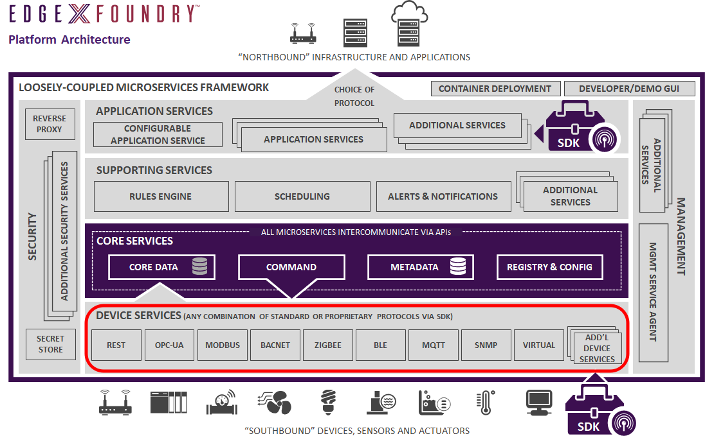

# Device Service - Overview

The Device Services Layer interacts with Device Services.

Device services are the edge connectors interacting with the
[devices](../../general/Definitions.md#device) that include, but are not limited to: appliances
in your home, alarm systems, HVAC equipment, lighting, machines in any
industry, irrigation systems, drones, traffic signals, automated
transportation, and so forth.

EdgeX device services translate information coming from devices via hundreds of protocols and thousands of formats and bring them into EdgeX.  In other terms, device services ingest sensor data provided by “things”.  When it ingests the sensor data, the device service converts the data produced and communicated by the “thing” into a common EdgeX Foundry data structure, and sends that converted data into the core services layer, and to other micro services in other layers of EdgeX Foundry.

Device services also receive and handle any request for actuation back to the device.  Device services take a general command from EdgeX to perform some sort of action and it translates that into a protocol specific request and forwards the request to the desired device.

Device services serve as the main means EdgeX interacts with sensors/devices.  So, in addition to getting sensor data and actuating devices, device services also:

- Get status updates from devices/sensors
- Transform data before sending sensor data to EdgeX
- Change configuration
- Discover devices

Device services may service one or a number of devices at one time. 

A device that a device service manages, could be something other than a simple, single, physical device.  The device could be an edge/IoT [gateway](../../general/Definitions.md#gateway) (and all of that gateway's devices), a device manager, a sensor hub, a web service available over HTTP, or a software sensor that acts as a device, or collection of devices, to EdgeX Foundry.

The device service communicates with the devices through protocols native to each device object.  EdgeX comes with a number of device services speaking many common IoT protocols such as Modbus, BACnet, BLE, etc.  EdgeX also provides the means to create new devices services through [device service software development kits (SDKs)](./sdk/Purpose.md) when you encounter a new protocol and need EdgeX to communicate with a new device.

## Device Service Abstraction

A device service is really just a software abstraction around a device and any associated firmware, software and protocol stack.  It allows the rest of EdgeX (and users of EdgeX) to talk to a device via the abstraction API so that all devices look the same from the perspective of how you communicate with them.  Under the covers, the implementation of the device service has some common elements, but can also vary greatly depending on the underlying device, protocol, and associate software.

A device service provides the abstraction between the rest of EdgeX and the physical device.  In other terms, the device service “wraps” the protocol communication code, device driver/firmware and actual device.

Each device service in EdgeX is an independent micro service.  Devices services are typically created using a [device service SDK](./sdk/Purpose.md). The SDK is really just a library that provides common scaffolding code and convenience methods that are needed by all device services.  While not required, the EdgeX community use the SDKs as the basis for the all device services the community provides.  The SDKs make it easier to create device service by allowing a developer to focus on device specific communications, features, etc. versus having to code a lot of EdgeX service boilerplate code.   Using the SDKs also helps to ensure the device services adhere to rules required of the device services.

Unless you need to create a new device service or modify an existing device service, you may not ever have to go under the covers, so to speak, to understand how a device service works.  However, having some general understanding of what a device service does and how it does it can be helpful in customization, setting configuration and diagnosing problems.

## Publish to MessageBus

Device services now have the capability to publish Events directly to the EdgeX MessageBus, rather than POST the Events to Core Data via REST. This capability is controlled by the `Device.UseMessageBus` configuration property (see below), which is set to `true` by default. Core Data is configured by default to subscribe to the EdgeX MessageBus to receive and persist the Events. Application services, as in EdgeX 1.x, subscribe to the EdgeX MessageBus to receive and process the Events.

!!! edgey "Edgex 3.0"
    Upon successful PUT command, Device services will also publish an Event with the updated Resource value(s) to the EdgeX MessageBus as long as the Resource(s) are not write-only.