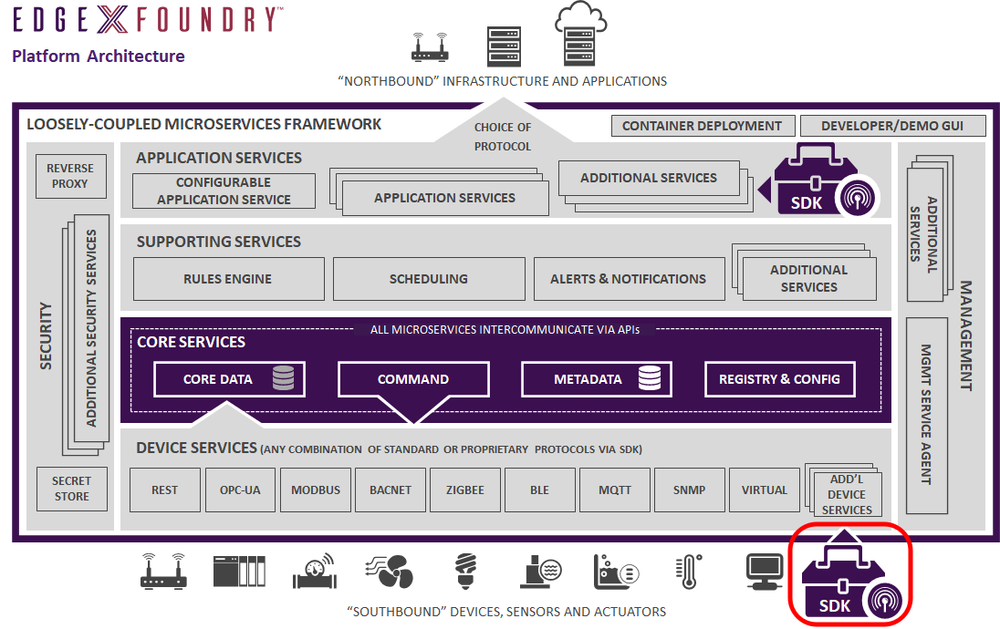

# Device Services SDK

## Introduction to the SDKs

EdgeX provides two software development kits (SDKs) to help developers create new device services.  While the EdgeX community and the larger EdgeX ecosystem provide a number of open source and commercially available device services for use with EdgeX, there is no way that every protocol and every sensor can be accommodated and connected to EdgeX with a pre-existing device service.  Even if all the device service connectivity were provided, your use case, sensor or security infrastructure may require customization.  Therefore, the device service SDKs provide the means to extend or customize EdgeX’s device connectivity.

EdgeX is mostly written in Go and C.  There is a device service SDK written in both Go and C to support the more popular languages used in EdgeX today.  In the future, alternate language SDKs may be provided by the community or made available by the larger ecosystem.

The SDKs are really libraries to be incorporated into a new micro service.  They make writing a new device service much easier.  By importing the SDK library of choice into your new device service project, you can focus on the details associated with getting and manipulating sensor data from your device via the specific protocol of your device.  Other details, such as initialization of the device service, getting the service configured, sending sensor data to core data, managing communications with core metadata, and much more are handled by the code in the SDK library.  The code in the SDK also helps to ensure your device service adheres to rules and standards of EdgeX – such as making sure the service registers with the EdgeX registry service when it starts up.

The EdgeX Foundry Device Service Software Development Kit (SDK) takes
the developer through the step-by-step process to create an EdgeX
Foundry device service micro service. Then setup the SDK and execute the
code to generate the device service scaffolding to get you started using
EdgeX.

The Device Service SDK supports:

-   Synchronous read and write operations
-   Asynchronous device data collection
-   Initialization and deconstruction of Driver Interface
-   Initialization and destruction of Device Connection
-   Framework for automated Provisioning Mechanism
-   Support for multiple classes of Devices with Profiles
-   Support for sets of actions triggered by a command
-   Cached responses to queries

## Writing a Device Service

- [Writing a new Device Service in Go](../../../getting-started/Ch-GettingStartedSDK-Go.md)
- [Writing a new Device Service in C](../../../getting-started/Ch-GettingStartedSDK-C.md)
