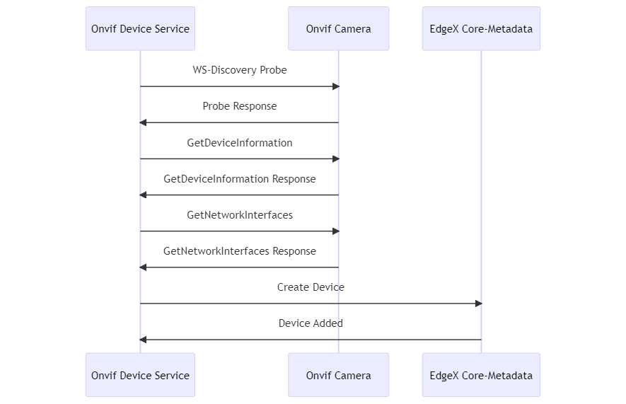
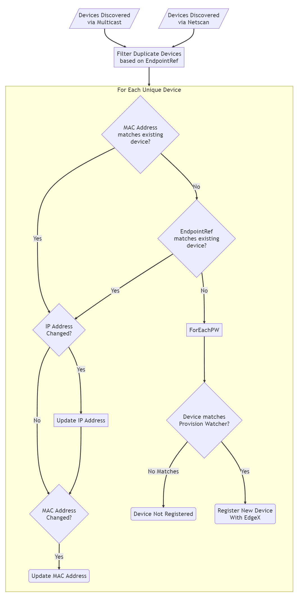

# Auto Discovery
There are two methods that the device service can use to discover and add ONVIF
compliant cameras using WS-Discovery: multicast and netscan.

For more info on how WS-Discovery works, see [here](./ws-discovery.md).

## How To

!!! Note
    Ensure that the cameras are all installed and configured before attempting discovery.

Device discovery is triggered by the device SDK. Once the device service starts, it will discover the Onvif camera(s) at the specified interval.

!!! Note
    You can also manually trigger discovery using this command: `curl -X POST http://<service-host>:59984/api/{{api_version}}/discovery`

### Step 1. Discovery Configuration

> _See [Configuration Section](./#configuration-guide) for full details_

!!! Note
        Alternatively, for `netscan` you can set the `DiscoverySubnets` automatically _after_ the service has been deployed by running the [bin/configure-subnets.sh](./utility-scripts.md#configure-subnetssh) script

1. For `Netscan`, there is a one line command to determine the `DiscoverySubnets` of your current machine:
```shell
    ip -4 -o route list scope link | sed -En "s/ dev ($(find /sys/class/net -mindepth 1 -maxdepth 2 -not -lname '*devices/virtual*' -execdir grep -q 'up' "{}/operstate" \; -printf '%f\n' | paste -sd\| -)).+//p" | grep -v "169.254.0.0/16" | sort -u | paste -sd, -
```
Example Output: `192.168.1.0/24`

=== "configuration.yaml"

    Define the following configurations in `cmd/res/configuration.yaml` for auto-discovery mechanism:

    ```yaml
    Device:
    # The location of Provision Watcher yaml files to import when using auto-discovery
    ProvisionWatchersDir: ./res/provisionwatchers
    Discovery:
        Enabled: true
        Interval: 1h

    # Custom configs
    AppCustom:
    DefaultSecretName: credentials001
    # Select which discovery mechanism(s) to use
    DiscoveryMode: both # netscan, multicast, or both
    # The target ethernet interface for multicast discovering
    DiscoveryEthernetInterface: eth0
    # List of IPv4 subnets to perform netscan discovery on, in CIDR format (X.X.X.X/Y)
    # separated by commas ex: "192.168.1.0/24,10.0.0.0/24"
    DiscoverySubnets: "192.168.1.0/24" # Fill in with your actual subnet(s)
    ```

=== "Docker / Env Vars"

    Define the following environment variables in `docker-compose.yaml`:
    ```yaml
    device-onvif-camera:
    environment:
        DEVICE_DISCOVERY_ENABLED: "true"  # enable device discovery
        DEVICE_DISCOVERY_INTERVAL: "1h"   # set to desired interval

        # The target ethernet interface for multicast discovering
        APPCUSTOM_DISCOVERYETHERNETINTERFACE: "eth0"
        # The Secret Name of the default credentials to use for devices
        APPCUSTOM_DEFAULTSECRETNAME: "credentials001"
        # Select which discovery mechanism(s) to use
        APPCUSTOM_DISCOVERYMODE: "both" # netscan, multicast, or both
        # List of IPv4 subnets to perform netscan discovery on, in CIDR format (X.X.X.X/Y)
        # separated by commas ex: "192.168.1.0/24,10.0.0.0/24"
        APPCUSTOM_DISCOVERYSUBNETS: "192.168.1.0/24" # Fill in with your actual subnet(s)
    ```

=== "Curl Command"
    Enter the subnet into this command, and execute it to set the `DiscoverySubnets`
    !!! note
        If you are operating in secure mode, you must use the [Consul ACL Token](../Walkthrough/deployment.md#deploy-edgex-and-onvif-device-camera-microservice) generated previously. If not, you can omit the `-H "X-Consul-Token:<consul-token>"` portion of the command.
    ```bash
    curl --data '<subnet>' -H "X-Consul-Token:<consul-token>" -X PUT "http://localhost:8500/v1/kv/edgex/{{api_version}}/device-onvif-camera/AppCustom/DiscoverySubnets"
    ```


### Step 2. Set CredentialsMap
See [Credentials Guide](credentials.md) for more information.

## Configuration Guide
### DiscoveryMode
!!! Note
    For docker, set the env var `APPCUSTOM_DISCOVERYMODE`

`DiscoveryMode` allows you to select which discovery mechanism(s) to use. The three options are: `netscan`, `multicast`, and `both`.

#### netscan
`netscan` works by sending unicast UDP [WS-Discovery](./ws-discovery.md) probes to a set of 
IP addresses on the CIDR subnet(s) configured via [`DiscoverySubnets`](#discoverysubnets).

For example, if the provided CIDR is `10.0.0.0/24`, it will probe the all IP addresses 
from `10.0.0.1` to `10.0.0.254`. This will result in a total of 254 probes on the network.

This method is a little slower and more network-intensive than multicast WS-Discovery, because it has to 
make individual connections. However, it can reach a much wider set of networks and works 
better behind NATs (such as docker networks).

#### multicast
`multicast` works by sending a single multicast UDP [WS-Discovery](./ws-discovery.md) Probe to the multicast address `239.255.255.250` on port `3702`.
In certain networks this traffic is blocked, and it is also not forwarded across subnets, so it is not compatible with NATs
such as docker networks (except in the case of running an Onvif simulator inside the same docker network).

`multicast` requires some additional configuration. Edit the `add-device-onvif-camera.yml` in the `edgex-compose/compose-builder` as follows:

!!! Example Config
    ```yml
    services:
        device-onvif-camera:
            image: edgexfoundry/device-onvif-camera:0.0.0-dev
            container_name: edgex-device-onvif-camera
            hostname: edgex-device-onvif-camera
            read_only: true
            restart: always
            network_mode: "host"
            environment:
                SERVICE_HOST: 192.168.93.151 # set to internal ip of your machine
                EDGEX_SECURITY_SECRET_STORE: "false"
                # Host Network Interface, IP, Subnet
                APPCUSTOM_DISCOVERYETHERNETINTERFACE: wlp1s0 # determine this setting for your machine
                APPCUSTOM_DISCOVERYSUBNETS: 192.168.93.0/24 # determine this setting for your machine
                APPCUSTOM_DISCOVERYMODE: multicast
            depends_on:
            - consul
            - data
            - metadata
            security_opt:
            - no-new-privileges:true
            user: "${EDGEX_USER}:${EDGEX_GROUP}"
            command: --cp=consul.http://localhost:8500
    ```

#### both
This option combines both [netscan](#netscan) and [multicast](#multicast).

### DiscoverySubnets
!!! Note
    For docker, set the env var `APPCUSTOM_DISCOVERYSUBNETS`

This is the list of IPv4 subnets to perform netscan discovery on, in CIDR format (X.X.X.X/Y)
separated by commas ex: "192.168.1.0/24,10.0.0.0/24". See how to configure this value [here](#step-1-discovery-configuration).

Also, the following one-line command can determine the subnets of your machine:
```shell
ip -4 -o route list scope link | sed -En "s/ dev ($(find /sys/class/net -mindepth 1 -maxdepth 2 -not -lname '*devices/virtual*' -execdir grep -q 'up' "{}/operstate" \; -printf '%f\n' | paste -sd\| -)).+//p" | grep -v "169.254.0.0/16" | sort -u | paste -sd, -
```
Example Output: `192.168.1.0/24`

### DiscoveryEthernetInterface
!!! Note
    For docker, set the env var `APPCUSTOM_DISCOVERYETHERNETINTERFACE`

This is the target Ethernet Interface to use for [multicast](#multicast) discovering. Keep in mind this interface
is relative to the environment it is being run under. For example, when running in docker, those interfaces
are different from your host machine's interfaces.

### ProbeAsyncLimit
!!! Note
    For docker, set the env var `APPCUSTOM_PROBEASYNCLIMIT`

This is the maximum simultaneous network probes when running netscan discovery.

### ProbeTimeoutMillis
!!! Note
    For docker, set the env var `APPCUSTOM_PROBETIMEOUTMILLIS`

This is the maximum amount of milliseconds to wait for each IP probe before timing out.
This will also be the minimum time the discovery process can take.

### MaxDiscoverDurationSeconds
!!! Note
    For docker, set the env var `APPCUSTOM_MAXDISCOVERDURATIONSECONDS`

This is the maximum amount of seconds the discovery process is allowed to run before it will be cancelled.
It is especially important to have this configured in the case of larger subnets such as /16 and /8.


## Adding the Devices to EdgeX



## Rediscovery
The device service is able to rediscover and update devices that have been discovered previously.
Nothing additional is needed to enable this. It will run whenever the discover call is sent, regardless
of whether it is a manual or automated call to discover.

The following logic is to determine if the device is already registered or not.



## Troubleshooting

#### netscan discovery was called, but DiscoverySubnets are empty!
This message occurs when you have not configured the `AppCustom.DiscoverySubnets` configuration.
It is required in order to know which subnets to scan for Onvif Cameras.
See [here](#discoverysubnets)

#### route ip+net: no such network interface
This message occurs when you have multicast discovery enabled, but `AppCustom.DiscoveryEthernetInterface`
is configured to a network interface that does not exist.
See [here](#discoveryethernetinterface)
