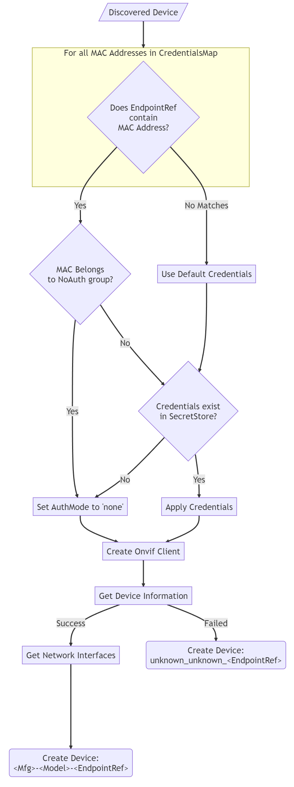

# Credentials
Camera credentials are stored in the EdgeX Secret Store and referenced by MAC Address. All 
devices by default are configured with credentials from `DefaultSecretName` unless configured
as part of a group within `AppCustom.CredentialsMap`.

Three things must be done in order to add an authenticated camera to EdgeX:
- Add device to EdgeX
  - Manually or via auto-discovery
- Add `Credentials` to `Secret Store`
  - Manually or via utility scripts
- Map `Credentials` to devices
  - Manually or via utility scripts
  - Configure as `DefaultSecretName`

## Terminology / Definitions
- **Secret**: A generic map/object which is stored as multiple key/value pairs in the `Secret Store` under a specific `Secret Name` key.
- **Credentials**: A specific type of `Secret` which contains a mapping of `username`, `password`, and authentication `mode`.
- **Secret Store**: The place EdgeX stores all `Secrets`
  - In secure mode this is `Vault`
  - In non-secure mode this is the configuration provider (typically `Consul`). 
    They can be pre-configured via `configuration.yaml`'s  `Writable.InsecureSecrets` section.
- **Secret Name**: The name/key of the `Secret` as they are stored in the `Secret Store`.
- **CredentialsMap**: (aka `AppCustom.CredentialsMap`) this contains the mappings between `Secret Name` and
    `MAC Address`. Each key in the map is a `Secret Name` which points to `Credentials` in the `Secret Store`. The value
    for each key is a comma separated list of `MAC Addresses` which should use those `Credentials`.
- **DefaultSecretName**: The `Secret Name` which points to the `Credentials` to use as the default for all devices
    which are not configured in the `CredentialsMap`.
- **NoAuth**: A special `Secret Name` that does not exist in the `Secret Store`. It is pre-configured as `Credentials`
    with `Authentication Mode` of `none`. `NoAuth` can be used most places where a `Secret Name` is expected.

Camera credentials are stored in the EdgeX Secret Store, which is Vault in secure mode, and Consul in non-secure mode.
The term `Secret Name` is often used to refer to the name of the credentials as they are stored in the Secret Store.
Credentials are then mapped to devices either using the `DefaultSecretName` which applies to all devices by default,
or by configuring the `AppCustom.CredentialsMap` which maps one or more MAC Addresses to the desired credentials.

## Credentials Structure
`Credentials` are `SecretData` comprised of three fields:
- `username`: the admin username for the camera
- `password`: the admin password
- `mode`: the type of Authentication to use
  - `usernametoken`: use a username and token based authentication
  - `digest`: use a digest based authentication
  - `both`: use both `usernametoken` and `digest`
  - `none`: do not send any authentication headers

## Add Credentials to Secret Store
!!! Note
        Credentials can be added and modified via [utility scripts](./utility-scripts.md) after the service is running

### Non-Secure Mode

=== "Helper Scripts"

    See [here](./utility-scripts.md) for the full guide.

=== "Manual"

    <div class="admonition note">
    <p class="admonition-title">
    Replace `<secret-name>` with the name of the secret, `<username>` with the username, `<password>` with the password, and `<mode>` with the auth mode.</p>
    </div>

    Set SecretName to `<device-name>`
    ```shell
    curl -X PUT --data "<secret-name>" \
        "http://localhost:8500/v1/kv/edgex/{{api_version}}/device-onvif-camera/Writable/InsecureSecrets/<secret-name>/SecretName"
    ```

    Set username to `<username>`
    ```shell
    curl -X PUT --data "<username>" \
        "http://localhost:8500/v1/kv/edgex/{{api_version}}/device-onvif-camera/Writable/InsecureSecrets/<secret-name>/SecretData/username"
    ```

    Set password to `<password>`
    ```shell
    curl -X PUT --data "<password>" \
        "http://localhost:8500/v1/kv/edgex/{{api_version}}/device-onvif-camera/Writable/InsecureSecrets/<secret-name>/SecretData/password"
    ```

    Set auth mode to `<auth-mode>`
    ```shell
    curl -X PUT --data "<auth-mode>" \
        "http://localhost:8500/v1/kv/edgex/{{api_version}}/device-onvif-camera/Writable/InsecureSecrets/<secret-name>/SecretData/mode"
    ```

### Secure Mode

=== "Helper Scripts"

    See [here](./utility-scripts.md) for the full guide.

=== "Manual"

    Credentials can be added via EdgeX Secrets:

    <div class="admonition note">
    <p class="admonition-title">
    Replace `<secret-name>` with the name of the secret, `<username>` with the username, `<password>` with the password, and `<mode>` with the auth mode.</p>
    </div>

    ```shell
    curl --location --request POST 'http://localhost:59984/api/{{api_version}}/secret' \
        --header 'Content-Type: application/json' \
        --data-raw '
    {
        "apiVersion" : "{{api_version}}",
        "name": "<secret-name>",
        "secretData":[
            {
                "key":"username",
                "value":"<username>"
            },
            {
                "key":"password",
                "value":"<password>"
            },
            {
                "key":"mode",
                "value":"<mode>"
            }
        ]
    }'
    ```

## Mapping Credentials to Devices
!!! Note
        Credential mappings can be set via [utility scripts](./utility-scripts.md) after the service is running

The device service supports three types of credential mapping. All three types can be used
in conjunction with each other.

- `1 to All` - All devices are given the default credentials based on `DefaultSecretName`
- `1 to Many` - In the `CredentialsMap`, one secret name can be assigned multiple MAC addresses
- `1 to 1` - In the `CredentialsMap`, assign each secret name 1 MAC Address

### Manual Configuration
!!! Note
        Any key present in `AppCustom.CredentialsMap` must also exist in the secret store!
```yaml
# AppCustom.CredentialsMap is a map of SecretName -> Comma separated list of mac addresses.
  # Every SecretName used here must also exist as a valid secret in the Secret Store.
  #
  # Note: Anything not defined here will be assigned the default credentials configured via `DefaultSecretName`.
  #
  # Example: (Single mapping for 1 mac address to 1 credential)
  #   credentials001 = "aa:bb:cc:dd:ee:ff"
  #
  # Example: (Multi mapping for 3 mac address to 1 shared credentials)
  #   credentials002 = "11:22:33:44:55:66,ff:ee:dd:cc:bb:aa,ab:12:12:34:34:56:56"
  #
  # These mappings can also be referred to as "groups". In the above case, the `credentials001` group has 1 MAC
  # Address, and the `credentials002` group has 3 MAC Addresses.
  #
  # The special group 'NoAuth' defines mac addresses of cameras where no authentication is needed.
  # The 'NoAuth' key does not exist in the SecretStore. It is not required to add MAC Addresses in here,
  # however it avoids sending the default credentials to cameras which do not need it.
  #
  # IMPORTANT: A MAC Address may only exist in one credential group. If a MAC address is defined in more
  # than one group, it is unpredictable which group the MAC will end up in! If you wish to change the group a MAC
  # address belongs to, first remove it from its existing group, and then add it to the new one.
  CredentialsMap:
    NoAuth: ""
    credentials001: "aa:bb:cc:dd:ee:ff"
    credentials002: "11:22:33:44:55:66,ff:ee:dd:cc:bb:aa,ab:12:12:34:34:56:56"
```

## Credential Lookup
Here is an in-depth look at the logic behind mapping `Credentials` to Devices.

### During Discovery


### Connecting to Existing Devices

