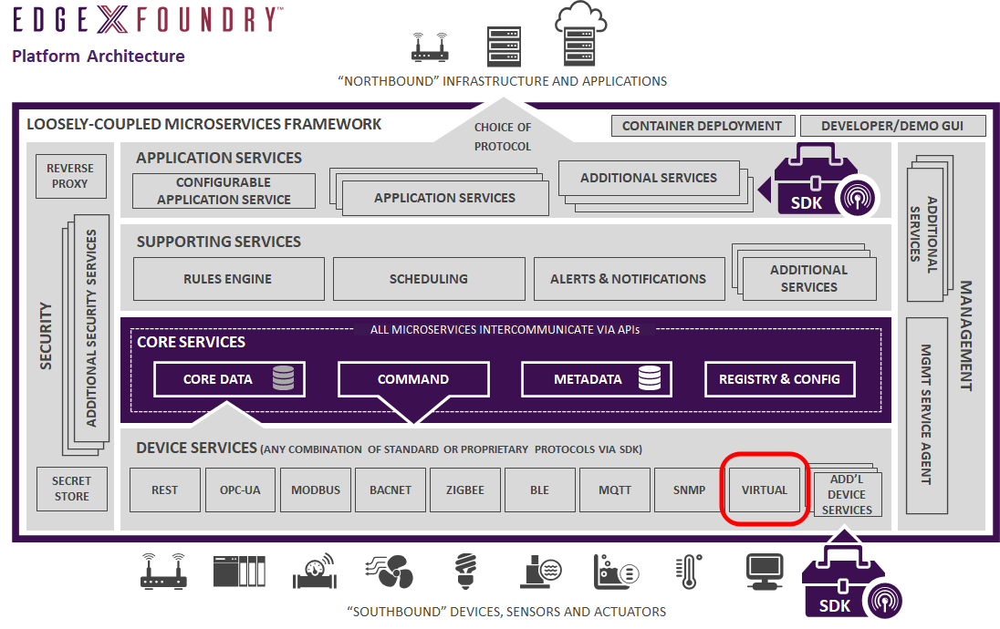

# Device Virtual



## Introduction

The virtual device service simulates different kinds of [devices](../../../../general/Definitions.md#device) to
generate events and readings to the [core data](../../../core/data/Ch-CoreData.md) micro service, and users
send commands and get responses through the [command and control](../../../core/command/Ch-Command.md) micro service. These features of the virtual device services are useful
when executing functional or performance tests without having any real devices.

The virtual device service, built in Go and based on the device service Go SDK, can simulate sensors by generating data of the following data types:

- Bool, BoolArray
- Int8, Int16, Int32, Int64, Int8Array, Int16Array, Int32Array, Int64Array
- Uint8, Uint16, Uint32, Uint64, Uint8Array, Uint16Array, Uint32Array, Uint64Array
- Float32, Float64, Float32Array, Float64Array
- Binary

By default, the virtual device service is included and configured to run with all EdgeX Docker Compose files.  This allows users to have a complete EdgeX system up and running - with simulated data from the virtual device service - in minutes.

## Using the Virtual Device Service

The virtual device service contains 4 pre-defined devices as random value generators:

- [Random-Boolean-Device](https://github.com/edgexfoundry/device-virtual-go/blob/{{edgexversion}}/cmd/res/profiles/device.virtual.bool.yaml)
- [Random-Integer-Device](https://github.com/edgexfoundry/device-virtual-go/blob/{{edgexversion}}/cmd/res/profiles/device.virtual.int.yaml)
- [Random-UnsignedInteger-Device](https://github.com/edgexfoundry/device-virtual-go/blob/{{edgexversion}}/cmd/res/profiles/device.virtual.uint.yaml)
- [Random-Float-Device](https://github.com/edgexfoundry/device-virtual-go/blob/{{edgexversion}}/cmd/res/profiles/device.virtual.float.yaml)
- [Random-Binary-Device](https://github.com/edgexfoundry/device-virtual-go/blob/{{edgexversion}}/cmd/res/profiles/device.virtual.binary.yaml)

These devices are created by the virtual device service in core metadata when the service first initializes. These devices are defined by device profiles that ship with the virtual device service.  Each virtual device causes the generation of one to many values of the type specified by the device name.  For example, Random-Integer-Device generates integer values:  Int8, Int16, Int32 and Int64.  As with all devices, the deviceResources in the associated device profile of the device defind what values are produced by the device service.  In the case of Random-Integer-Device, the Int8, Int16, Int32 and Int64 values are defined as deviceResources (see the [device profile](https://github.com/edgexfoundry/device-virtual-go/blob/{{edgexversion}}/cmd/res/profiles/device.virtual.int.yaml#L41-L72)). 

Additionally, there is an accompanying deviceResource for each of the generated value deviceResource. Each deviceResources has an associated EnableRandomization_X deviceResource.  In the case of the integer deviceResources above, there are the associated EnableRandomization_IntX deviceResources (see the [device profile](https://github.com/edgexfoundry/device-virtual-go/blob/{{edgexversion}}/cmd/res/profiles/device.virtual.int.yaml#L9-L40)).  The EnableRandomization deviceResources are boolean values, and when set to true, the associated simulated sensor value is generated by the device service.  When the EnableRandomization_IntX value is set to false, then the associated simulator sensor value is fixed.

!!! Info
    The Enable_Randomization attribute of resource is automatically set to false when you use a `PUT` command to set a specified generated value.  Furtehr, the minimum and maximum values of generated value deviceResource can be specified in the device profile. Below, Int8 is set to be between -100 and 100.

    ``` yaml
    deviceResources:
      -
        name: "Int8"
        isHidden: false
        description: "Generate random int8 value"
        properties:
          valueType: "Int8"
          readWrite: "RW"
          minimum: "-100"
          maximum: "100"
          defaultValue: "0"
    ```

For the binary deviceResources, values are generated by the function rand.Read(p []byte) in Golang math package. The []byte size is fixed to MaxBinaryBytes/1000.

## Core Command and the Virtual Device Service

Use the following core command service APIs to execute commands against the virtual device service for the specified devices.  Both `GET` and `PUT` commands can be issued with these APIs.  `GET` command request the next generated value while `PUT` commands will allow you to disable randomization (EnableRandomization) and set the fixed values to be returned by the device.

- http://[host]:59882/api/{{api_version}}/device/name/Random-Boolean-Device
- http://[host]:59882/api/{{api_version}}/device/name/Random-Integer-Device
- http://[host]:59882/api/{{api_version}}/device/name/Random-UnsignedInteger-Device
- http://[host]:59882/api/{{api_version}}/device/name/Random-Float-Device
- http://[host]:59882/api/{{api_version}}/device/name/Random-Binary-Device

!!! Note
    Port 59882 is the default port for the core command service.

## Configuration Properties

Please refer to the general [Common Configuration documentation](../../../configuration/CommonConfiguration.md) for configuration properties common to all services.

For each device, the virual device service will contain a DeviceList with associated Protocols and AutoEvents as shown by the example below.
=== "DeviceList"   
    |Property|Example Value|Description|
    |---|---|---|
    |||properties used in defining the static provisioning of each of the virtual devices|
    |Name|'Random-Integer-Device'|name of the virtual device|
    |ProfileName|'Random-Integer-Device'|device profile that defines the resources and commands of the virtual device|
    |Description|'Example of Device Virtual'|description of the virtual device|
    |Labels|['device-virtual-example']|labels array used for searching for virtual devices|
=== "DeviceList/DeviceList.Protocols/DeviceList.Protocols.other"
    |Property|Example Value|Description|
    |---|---|---|
    |Address|'device-virtual-int-01'|address for the virtual device|
    |Protocol|'300'||
=== "DeviceList/DeviceList.AutoEvents"
    |Property|Default Value|Description|
    |---|---|---|
    |||properties used to define how often an event/reading is schedule for collection to send to core data from the virtual device|
    |Interval|'15s'|every 15 seconds|
    |OnChange|false|collect data regardless of change|
    |SourceName|'Int8'|deviceResource to collect - in this case the Int8 resource|

## API Reference
[Device Service - SDK- API Reference](../../../../../api/devices/Ch-APIDeviceSDK)

  
