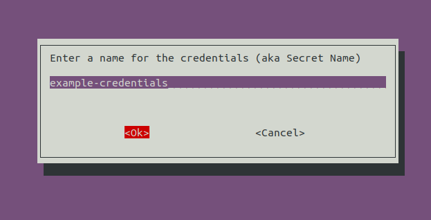
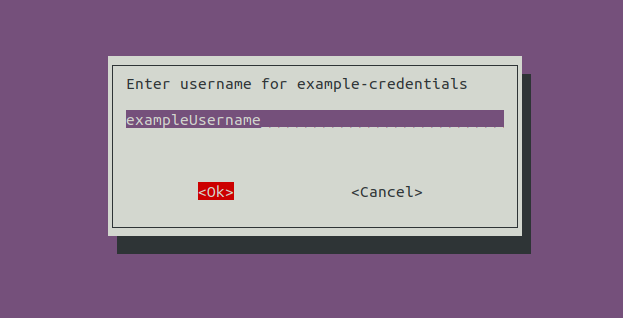
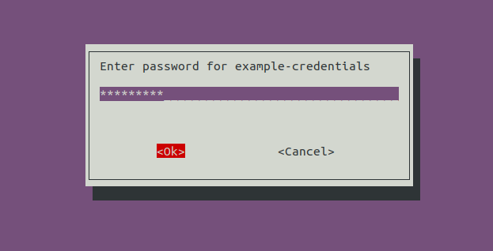
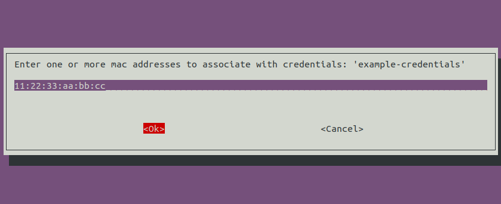
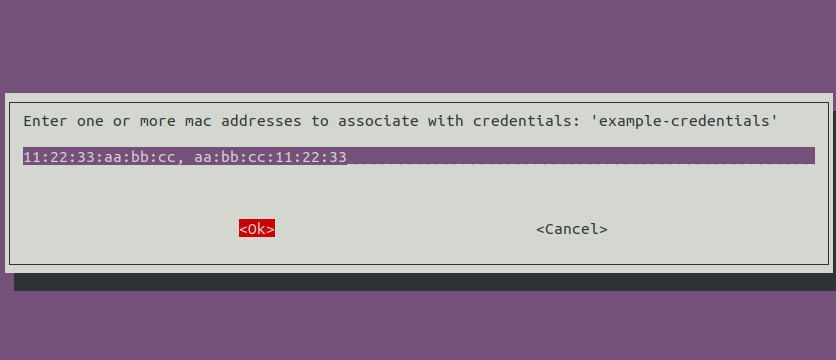
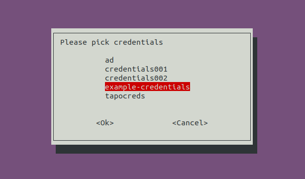
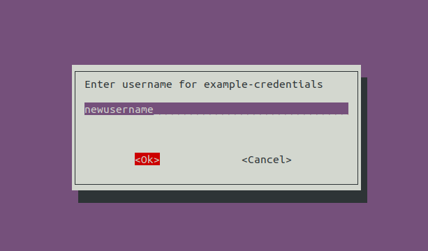

# Utility Scripts

!!! Note
      If running EdgeX in Secure Mode, you will need a [Consul ACL Token](../../../../../security/Ch-Secure-Consul.md#how-to-get-consul-acl-token) 
      and [JWT Token](../../../../../security/Ch-APIGateway.md#creating-access-token-for-api-gateway-authentication) in order to use these scripts.

## Use Cases
### Create new credentials and assign MAC Addresses
1. Run `bin/map-credentials.sh`
2. Select `(Create New)`
   
3. Enter the Secret Name to associate with these credentials
   
4. Enter the username
   
5. Enter the password
   
6. Choose the Authentication Mode
   
7. Assign one or more MAC Addresses to the credential group
   

### Assign MAC Addresses to existing credentials
!!! Note
      Currently EdgeX is unable to provide a way to query the names of existing secrets from the secret store, so this method only works with credentials which have a key in the CredentialsMap. If the credentials were added via these utility scripts, a placeholder key was added for you to the CredentialsMap.

1. Run `bin/map-credentials.sh`
2. Select the name of the existing credentials you want to assign devices to
   
3. Assign one or more MAC Addresses to the credential group
   

### Modify existing credentials
1. Run `bin/edit-credentials.sh`
2. Select the name of the existing credentials you want to modify
!!! warning
    This will modify the username/password for ALL devices using these credentials. Proceed with caution!

   

3. Enter the new username
   
4. Enter the new password
   
5. Choose the new Authentication Mode
   


### List all existing credential mappings
1. Run `bin/query-mappings.sh`

Output will look something like this:
```
    Credentials Map:
             mycreds = 'aa:bb:cc:dd:ee:ff'
            mycreds2 = ''
            simcreds = 'cb:4f:86:30:ef:19,87:52:89:4d:66:4d,f0:27:d2:e8:9e:e1,9d:97:d9:d8:07:4b,99:70:6d:f5:c2:16'
           tapocreds = '10:27:F5:EA:88:F3'
```

### Configure DiscoverySubnets
1. Run `bin/configure-subnets.sh`
2. (Optional) If running secure mode, enter Consul Token
   


## configure-subnets.sh
### Usage
```shell
bin/configure-subnets.sh [-s/--secure-mode] [-t <consul token>]
```
### About
The purpose of this script is to make it easier for an end user to configure Onvif device discovery
without the need to have knowledge about subnets and/or CIDR format. The `DiscoverySubnets` config
option defaults to blank in the `configuration.yaml` file, and needs to be provided before a discovery can occur.
This allows the device-onvif-camera device service to be run in a NAT-ed environment without host-mode networking,
because the subnet information is user-provided and does not rely on `device-onvif-camera` to detect it.

This script finds the active subnet for any and all network interfaces that are on the machine 
which are physical (non-virtual) and online (up). It uses this information to automatically fill out the 
`DiscoverySubnets` configuration option through Consul of a deployed `device-onvif-camera` instance.

## edit-credentials.sh
### Usage
```shell
bin/edit-credentials.sh [-s/--secure-mode] [-u <username>] [-p <password>] [--auth-mode {usernametoken|digest|both}] [-P secret-name] [-M mac-addresses] [-t <consul token>]
```
### About
The purpose of this script is to allow end-users to modify credentials either through
EdgeX InsecureSecrets via Consul, or EdgeX Secrets via the device service.

## map-credentials.sh
### Usage
```shell
bin/map-credentials.sh [-s/--secure-mode] [-u <username>] [-p <password>] [--auth-mode {usernametoken|digest|both}] [-P secret-name] [-M mac-addresses] [-t <consul token>]
```
### About
The purpose of this script is to allow end-users to add credentials either through
EdgeX InsecureSecrets via Consul, or EdgeX Secrets via the device service. It then allows the
end-user to add a list of MAC Addresses to map to those credentials via Consul.

## query-mappings.sh
### Usage
```shell
bin/query-mappings.sh [-s/--secure-mode] [-u <username>] [-p <password>] [--auth-mode {usernametoken|digest|both}] [-P secret-name] [-M mac-addresses] [-t <consul token>]
```
### About
The purpose of this script is to allow end-users to see what MAC Addresses are
mapped to what credentials.

