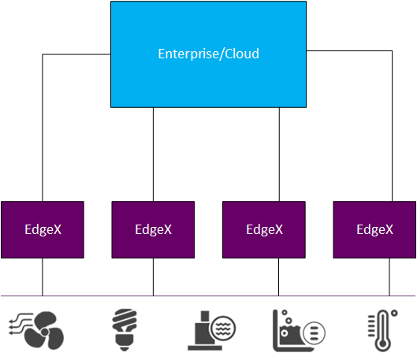

# Cross Cutting Concerns

## Event Tagging

In an edge solution, it is likely that several instances of EdgeX are all sending edge data into a central location (enterprise system, cloud provider, etc.)



In these circumstances, it will be critical to associate the data to its origin.  That origin could be specified by the GPS location of the sensor, the name or identification of the sensor, the name or identification of some edge gateway that originally collected the data, or many other means.

EdgeX provides the means to “tag” the event data from any point in the system.  The Event object has a `Tags` property which is a key/value pair map that allows any service that creates or otherwise handles events to add custom information to the Event in order to help identify its origin or otherwise label it before it is sent to the [north side](../../general/Definitions.md#south-and-north-side).

For example, a device service could populate the `Tags` property with latitude and longitude key/value pairs of the physical location of the sensor when the Event is created to send sensed information to Core Data.

When the Event gets to an [Application Service](../application/ApplicationServices.md), the service has an optional function (defined by `Writable.Pipeline.Functions.AddTags` in configuration) that will add a default key/value pair to the Event `Tags`.  The key and value for the default tag are provided in configuration (as shown by the example below).  Multiple tags can be provide separated by commas.

```toml
    [Writable.Pipeline.Functions.AddTags]
      [Writable.Pipeline.Functions.AddTags.Parameters]
      tags = "GatewayId:HoustonStore000123,Latitude:29.630771,Longitude:-95.377603"
```

If the Event already has `Tags` when it arrives at the application service, then default tags will be added to the `Tags` map.  If the default tags have the same key as an existing key in the `Tags` map, then the default key/value will override what is already in the Event `Tags` map.

!!! Note
    At this time, because XML cannot marshal maps, use of the tagging function with the XML transformation in the same pipeline is prohibited.   

