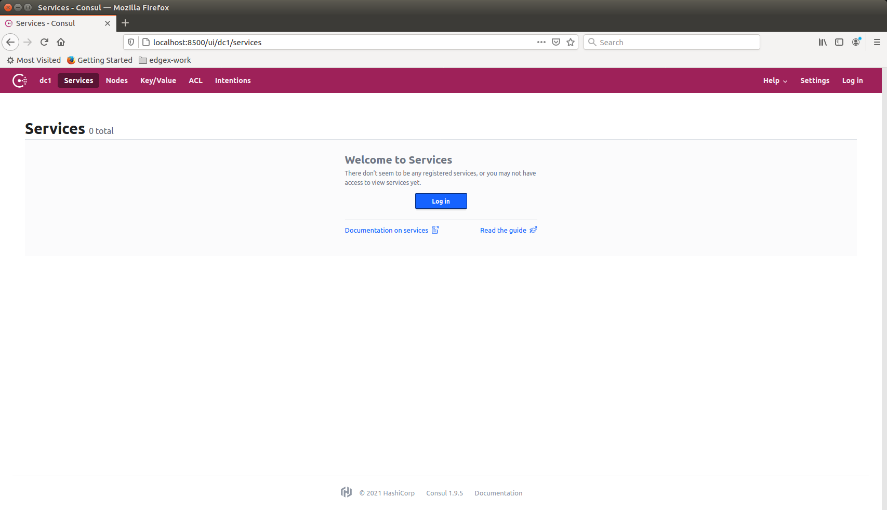

# Secure Consul

## Introduction

!!! Note
    Vault will be deprecated in EdgeX 4.0. OpenBao will be the default secret store for new implementations.

In the current EdgeX architecture, `Consul` is pre-wired as the default agent service for
`Service Configuration`, `Service Registry`, and `Service Health Check` purposes. Prior to EdgeX's
Ireland release, the communication to `Consul` uses plain HTTP calls without any access control (ACL)
token header and thus are insecure.  With the Ireland release, that situation is now improved by
adding required ACL token header `X-Consul-Token` in any HTTP calls.
Moreover, `Consul` itself is now bootstrapped and started with its ACL system enabled and thus provides
better authentication and authorization security features for services.  In other words, with the required
Consul's ACL token for accessing Consul, assets inside Consul like EdgeX's configuration items in Key-Value (KV)
store are now better protected.

In this documentation, we will highlight some major features incorporated into EdgeX framework system for
`Securing Consul`, including how the `Consul` token is generated via the integration of secret store
management system `Vault` with `Consul` via Vault's Consul Secrets Engine APIs.
Also a brief overview on how Consul token is governed by Vault using Consul's ACL policy associated with
a Vault role for that token is given.  Finally, EdgeX provides an easy way for getting Consul token
from `edgex-compose`'s `compose-builder` utility for better developer experiences.

## Consul access token with Vault integration

In order to reduce another token generation system to maintain, we utilize the Vault's feature of
`Consul Secrets Engine` APIs, governed by Vault itself, and integrated with Consul.
Consul service itself provides ACL system and is enabled via Consul's configuration settings like:

```hcl
acl = {
    enabled = true
    default_policy = "deny"
    enable_token_persistence = true
}
```

and this is set as part of EdgeX `security-bootstrapper` service's process. Note that the default ACL policy
is set to "deny" so that anything is not listed in the ACL list will get access denied by nature.
The flag `enable_token_persistence` is related to the persistence of Consul's agent token and is set
to true so as to re-use the same agent token when EdgeX system restarts again.

During the process of Consul bootstrapping, the first main step of `security-bootstrapper` for Consul
is to bootstrap Consul's ACL system with Consul's API endpoint `/acl/bootstrap`.

Once Consul's ACL is successfully bootstrapped, `security-bootstrapper` stores the Consul's ACL bootstrap token
onto the pre-configured folder under `/tmp/edgex/secrets/consul-acl-token`.

As part of `security-bootstrapper` process for Consul, Consul service's agent token is also set
via Consul's sub-command: `consul acl set-agent-token agent` or Consul's HTTP API endpoint
`/agent/token/<agent_token>` using Consul's ACL bootstrap token for the authentication.
This agent token provides the identity for Consul service itself and access control for any
agent-based API calls from client and thus provides better security.

The management token provides the identity for Consul service itself and access control for remote configuration
from client and thus provides better security. It's created and stored onto the pre-configured folder under
`/tmp/edgex/secrets/consul-acl-token`.

`security-bootstrapper` service also uses Consul's bootstrap token to generate Vault's role based from
Consul Secrets Engine API `/consul/role/<role_name>` for all internal default EdgeX services
and add-on services via environment variable `EDGEX_ADD_REGISTRY_ACL_ROLES`. Please see more details
and some examples in [Configuring Add-on Service documentation section](Ch-Configuring-Add-On-Services.md)
for how to configure add-on services' ACL roles.

`security-bootstrapper` then automatically associated with Consul's ACL policy rules
with this provided ACL role so that Consul token will be created or generated with that ACL rules
and hence enforced access controls by Consul when the service is communicating with it.

Note that Consul token is generated via Vault's `/consul/creds/<role_name>` API with Vault's
secretstore token and hence the generated Consul token is inherited the time-restriction nature
from Vault system itself. Thus Consul token will be revoked by Vault if Vault's token used to generate
it expires or is revoked. Currently in EdgeX we utilize the auto-renewal feature of Vault's token
implemented in `go-mod-secrets` to keep Consul token alive and not expire.

## How to get Consul ACL token

Consul's access token can be obtained from the `compose-builder` of `edgex-compose` repository via command `make get-consul-acl-token`.  One example of this will be like:

```console
$ make get-consul-acl-token 
ef4a0580-d200-32bf-17ba-ba78e3a546e7
```

This output token is Consul's ACL management token and thus one can use it to login and access
Consul service's features from Consul's GUI on http://localhost:8500/ui.

From the upper right-hand corner of Consul's GUI or the "Log in" button in the center,
one can login with the obtained Consul token in order to access Consul's GUI features:




If the end user wants to access consul from the command line and since by default now Consul is running in
ACL enabled mode, any API call to Consul's endpoints will requires the access token
and thus one needs to give the access token into the header `X-Consul-Token` of HTTP calls.

One example using `curl` command with Consul access token to do local Consul KV store is given as follows:

```console
curl -v -H "X-Consul-Token:8775c1db-9340-d07b-ac95-bc6a1fa5fe57" -X PUT --data 'TestKey="My key values"' \
    http://localhost:8500/v1/kv/my-test-key
```

where the Consul access token is passed into the header `X-Consul-Token` and assuming it has write permission
for accessing and updating data in Consul's KV store.
