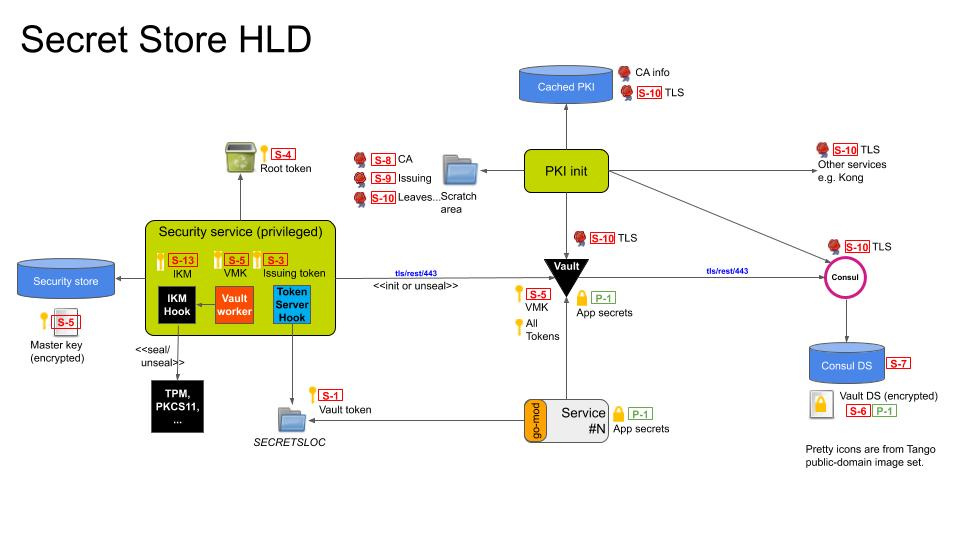
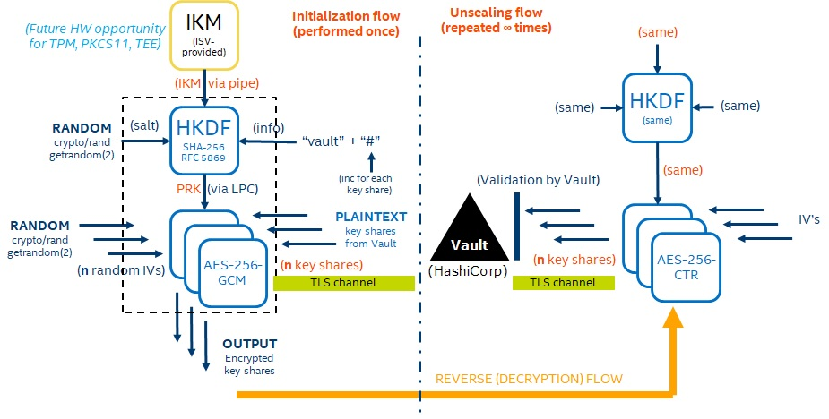
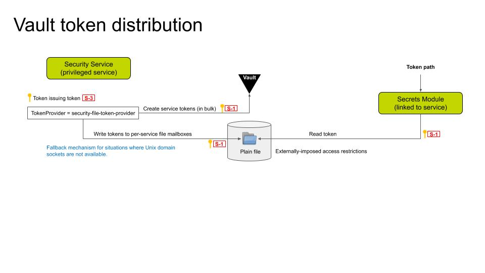

# Detailed Design

This document gets into the design details of the proposed secret management architecture, starting with a design overview and going into greater detail for each subsystem.

## Design Overview

In context of the stated future goal to support hardware-based secret storage, it is important to note that in a Vault-based design, not _every secret_ is actually wrapped by a hardware-backed key.
Instead, the secrets in Vault are wrapped by a single master key, and the encryption and decryption of secrets are done in a user-level process _in software_.
The Vault master key is then wrapped by one more additional keys, ultimately to a root key that is hardware-based using some authorization mechanism.
In a PKCS#11 hardware token, authorization is typically a PIN.
In a TPM, authorization is typically a set of PCR values and an optional password.
The idea is that the Vault master key is _eventually_ protected by some uncopyable unique secret attached to physical hardware.

The hardware may or may not have non-volatile tamper-resistant storage.  Non-volatile storage is useful for integrity protection as well as in pre-OS scenarios.  An example of the former would be to store a hash value for HTTP Public Key Pinning (HPKP) in a manner that makes it difficult for an attacker to pin a different key.  An example of the latter would be storing a LUKS disk encryption key that can decrypt a root file system when normal file system storage is not yet available.  If non-volatile storage is available, it is often available only in very limited quantity.

Obvious with the above design is that at some point along the line, the Vault master key or a wrapping key is observably exposed to user-mode software.
In fact, the number two recommendation for [Vault hardening](https://www.vaultproject.io/guides/operations/production) is "single tenancy" which is further explained, in priority order, as (a) giving Vault its own physical machine, (b) giving Vault its own virtual machine, or (c) giving Vault its own container.
The general solution to the exposure of the Vault master key or a wrapping key is to use a Trusted Execution Environment (TEE) to limit observability.
There is currently no platform- and architecture-independent TEE solution.

## High-level design

Figure 1:  High-level design.

The secrets to be protected are the application secrets **(P-1)**. The application secrets are protected with a per-service [Vault](https://www.vaultproject.io/) [service token](https://www.vaultproject.io/docs/concepts/tokens.html#service-tokens) **(S-1)**.  The Vault service token is delivered by a "token server" running in the security service to a pre-agreed rendezvous location, where mandatory access control, namespaces, or file system permissions constrain path accessibility. Vault access tokens are simply 128-bit random handles that are renewed at the Vault server.  They can be shared across multiple instances of a load-balanced service, and unlike a JWT there is no need to periodically re-issue them if they have not expired.

The token server has its own non-root token-issuing token **(S-3)** that is created by the security service with the root token after it has initialized or unlocked the vault but before the root token is revoked. **(S-4)**
Because of the sensitive nature of this token, it is co-located in the security service, and revoked immediately after use.

The actual application secrets are stored in the Vault encrypted data store **(S-6)** that is logically stored in Consul's data store **(S-7)**.
The vault data store is encrypted with a master key **(S-5)** that is held in Vault memory and forgotten across Vault restarts.
The master key must be resupplied whenever Vault is restarted.
The security service encrypts the master key using AES-256-GCM where the key **(S-13)** is derived using an RFC5869 key derivation function (KDF).
The input key material for the KDF originates from a vendor-defined plugin that interfaces with a hardware security mechanism such as a TPM, PKCS11-compatible HSM, trusted execution environments (TEE), or enclave.
An encrypted Vault master key is what is ultimately saved to storage.

Confidentiality of the secret management APIs is established using server-side TLS.  The PKI initialization component is responsible for generating a root certificate authority **(S-8)**, one or more intermediate certificate authorities **(S-9)**, and several leaf certificates **(S-10)** needed for initialization of the core services.
The PKI can be generated afresh every boot, or installed during initial provisioning and cached.
PKI intialization is covered next.

## PKI Initialization

Figure 2: PKI initialization.

PKI initialization must happen before any other component in the secret management architecture is started because Vault requires a PKI to be in place to protect its HTTP API.  Creation of a PKI is a multi-stage operation and care must be taken to ensure that critical secrets, such as the the CA private keys, are not written to a location where they can be recovered, such as bulk storage devices.  The PKI can be created on-device at every boot, at device provisioning time, or created off-device and imported.  Caching of the PKI is optional if the PKI is created afresh every boot, but required otherwise.

If the implementation allows, the private keys for certificate authorities should be destroyed after PKI generation to prevent unauthorized issuance of new leaf certificates, except where the certificate authority is stored in Vault and controlled with an appropriate policy.
Following creation of the PKI, or retrieving it from cache, the PKI initialization is responsible for distributing keying material to pre-agreed per-service drop locations that service configuration files expect to find them.

PKI initialization is not instantaneous.  Even if PKI initialization is started first, dependent services may also be started before PKI initialization is completed.  It is necessary to implement init-blocking code in dependent services that delays service startup until PKI assets have been delivered to the service.

Most dependent services do not support encrypted TLS private keys.  File access controls offered by the underlying execution environment are their only protection.  A potential future enhancement might be to re-use the key derivation strategy used earlier to generate additional keys to encrypt the cached PKI keying material at rest.

(Update: ADR 0015, adopted after this threat model was written, stipulates that TLS will not be used for single-node deployments of EdgeX.)

## Vault initialization and unsealing flow

Figure 3: Vault initialization and unsealing flow

When the security service starts the first thing that it does is check to see if a hardware security hook has been defined.
The presence of a hardware security hook is indicated by an environment variable,
IKM_HOOK,
that points to an executable program.
The security service will run the program and look for a hex-encoded key on its standard output.
If a key is found,
it will be used as the input key material for the HMAC key deriviation function,
otherwise, hardware security will not be used.
The input key material is combined with a random salt
that is also saved to disk for later retrieval.
The salt ensures that unique encryption keys will be used each time EdgeX is installed on a platform, even if the underlying input key material does not change.
The salt also defends against weak input key material.

### Initialization flow

Next, the security service will determine if Vault has been initialized.
In the case that Vault is uninitialized,
Vault's initialization API will be invoked,
which results in a set of keys that can be used to reconstruct a Vault master key.
When hardware security is enabled,
the input key material and salt are fed into the key derivation function
to generate a unique AES-256-GCM encryption key for each key shard.
The encrypted keys along with nonces will be persisted to disk.
AES-GCM protects against padding oracle attacks, but is sensitive to re-use of the salt value.
This weakness is addressed both by using a unique encryption key for each shard,
as well as the expectation that encryption is performed exactly once:
when Vault is initialized.
The Vault response is saved to disk directly in the case that hardware security is not enabled.

### Unseal flow

If Vault is found to be in an initialized and sealed state,
the Vault master key shards are retrieved from disk.
If they are encrypted,
they will be encrypted by reversing the process performed during initialization.
The key shards are then fed back to Vault until the Vault is unsealed and operational.

## Token-issuing flow

Figure 7: Token-issuing flow.

### Client side

Every service that wants to query Vault must link to a secrets module
either directly (go-mod-secrets)
or indirectly (go-mod-bootstrap)
or implement their own Vault interface.
The module must take as input a path to a file that contains a Vault access token specific to that service.
There is currently no secrets module for the C SDK.

Clients must be prepared to handle a number of error conditions while attempting to access the secret store:

* There may be race conditions between the security service issuing new tokens and the service consuming an old token.
* The supplied token may be expired (tokens will expire if not renewed periodically)
* Vault may not be accessible (it is a networked service, after all)
* The client may be waiting for a secret that has not yet been provisioned into the secret store.

Judicious use of retry loops should be sufficient to handle most of the above issues.

### Server side

On the server side,
the Vault master key will be used to generate a fresh "root token".
The root token will generate a special "token-issuing token"
that will generate tokens for the EdgeX microservices.
The root token will then be revoked,
and a "token provider" process
with access to the token-issuing token
will be launched in the background.

EdgeX will provide a single reference implementation for the token provider:
* **security-file-token-provider:** This token provider will consume a list of services that require tokens, along with a set of customizable parameters. At startup, the service tokens are created in bulk and delivered via the host file system on a per-service basis.

The token-issuing token will be revoked upon termination of the token provider.

### Token revocation

Vault tokens are persistent.
Although they will automatically expire if they are not renewed,
inadvertent disclosure of a token would be difficult to detect.
This condition could allow an attacker to maintain an unauthorized connection to Vault indefinitely.
Since tokens do expire if not renewed,
it is necessary to generate fresh tokens on startup.
Therefore, part of the startup process is the revokation
of all previously Vault tokens,
as a mitigation against token disclosure
as well as garbage collection of obsolete tokens.
