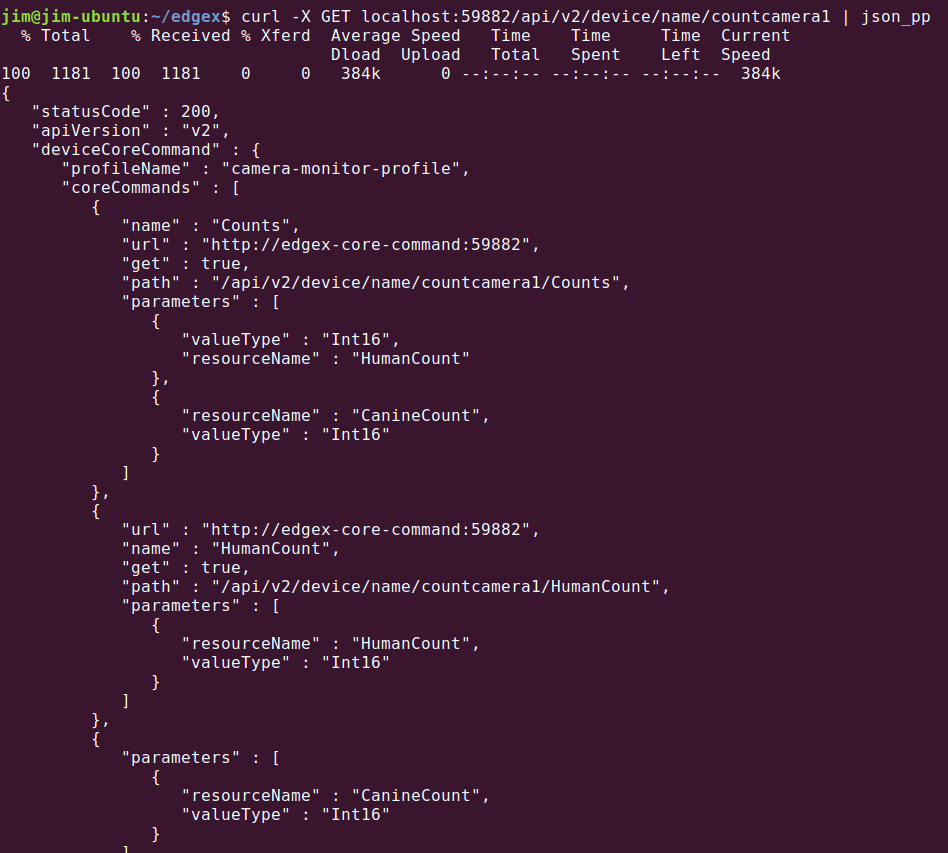

# Calling commands

Recall that the device profile (the `camera-monitor-profile` in this walkthrough) included a
number of commands to get/set (read or write) information from any device of that
type. Also recall that the device (the `countcamera1` in this walkthrough) was associated to
the device profile (again, the `camera-monitor-profile`) when the device was
provisioned.

See [core command API](../../api/core/Ch-APICoreCommand) for more details.

With the setup complete, you can ask the [core command micro
service](../microservices/core/command/Ch-Command.md) for the list of commands associated to the device (the
`countcamera1`).  The command micro service exposes the commands in a common, normalized
way that enables simplified communications with the devices for

- other micro services within EdgeX Foundry (for example, an edge analytics or rules engine micro service)
- other applications that may exist on the same host with EdgeX Foundry (for example, a management agent that needs to shutoff a sensor)
- any external system that needs to command those devices (for example, a cloud-based application that determined the need to modify the settings on a collection of devices)

### Walkthrough - Commands

Use either the Postman or Curl tab below to walkthrough getting the list of commands.

=== "Postman"

    Make a GET request to `http://localhost:59882/api/v2/device/name/countcamera1`.

    !!! Note
        Please note the change in port for the command request above.  We are no longer calling on core metadata in this part of the walkthrough.  The command micro service is at port 59882 by default.

    

=== "Curl"

    Make a curl GET request as shown below.

    ``` shell
    curl -X GET localhost:59882/api/v2/device/name/countcamera1 | json_pp
    ```

    !!! Note
        Please note the change in port for the command request above.  We are no longer calling on core metadata in this part of the walkthrough.  The command micro service is at port 59882 by default.

    

Explore all of the URLs returned as part of this response! These are the URLs that clients (internal or external to EdgeX) can call to trigger the various get/set (read and write) offerings on the Device. However, do take note that the host for the URLs is `edgex-core-command`.  This is the name of the host for core command inside Docker.  To exercise the URL outside of Docker, you would have to use the name of the system host (`localhost` if executing on the same box).

## Check the Events

While we're at it, check that no data has yet been shipped to core
data from the camera device. Since the device service and device in this demonstration are
wholly manually driven by you, no sensor data should yet have been
collected. You can test this theory by asking for the count of events in
core data.

### Walkthrough - Events

Use either the Postman or Curl tab below to walkthrough getting the list of events.

=== "Postman"

    Make a GET request to `http://localhost:59880/api/v2/event/count/device/name/countcamera1`.

=== "Curl"

    Make a curl GET request as shown below.

    ``` shell
    curl -X GET localhost:59880/api/v2/event/count/device/name/countcamera1
    ```

The response returned should indicate no events for the camera in core data.

``` json
{"apiVersion":"v2","statusCode":200,"Count":0}
```

## Execute a Command

While there is no real device or device service in this walkthrough,
EdgeX doesn't know that. Therefore, with all the configuration and
setup you have performed, you can ask EdgeX to set the scan depth or set
the snapshot duration to the camera, and EdgeX will dutifully try to
perform the task. Of course, since no device service or device exists,
as expected EdgeX will ultimately responds with an error. However,
through the log files, you can see a command made of the core command
micro service, attempts to call on the appropriate command of the
fictitious device service that manages our fictitious camera.

For example sake, let's launch a command to set the scan depth of
`countcamera1` (the name of the single human/dog counting camera device in
EdgeX right now). The first task to launch a request to set the scan
depth is to get the URL for the command to `set` or write a new scan
depth on the device. [Return to the results of the request](./Ch-WalkthroughCommands.md#walkthrough-commands) to get a list of the commands by the
device name above.

Locate and copy the URL and path for the `set` depth command. Below is a picture containing a slice of the JSON
returned by the GET request above and desired `set` Command URL
highlighted - yours will vary based on IDs.


### Walkthrough - Actuation Command

Use either the Postman or Curl tab below to walkthrough actuating the device.

=== "Postman"

    Make a PUT request to `http://localhost:59882/api/v2/device/name/countcamera1/ScanDepth` with the following body.

    ``` json
    {"depth":"9"}
    ```

    !!! Warning
        Notice that the URL above is a combination of both the command URL and path you found from your command list.

=== "Curl"

    Make a curl PUT request as shown below.

    ``` shell
    curl -X PUT -d '{"depth":"9"}' localhost:59882/api/v2/device/name/countcamera1/ScanDepth
    ```

    !!! Warning
        Notice that the URL above is a combination of both the command URL and path you found from your command list.

#### Check Command Service Log

Again, because no device service (or device) actually exists, core
command will respond with a `Failed to send a http request` error. However,
checking the logging output will prove that the core command micro service did receive the request and attempted to call on the
non-existent device service (at the address provided for the device service - defined earlier in this walkthrough) to issue the actuating command.  To see the core command service log issue the following Docker command :

``` shell
docker logs edgex-core-command
```
The last lines of the log entries should highlight the attempt to contact the non-existent device.

```
level=ERROR ts=2021-09-16T20:50:09.965368572Z app=core-command source=http.go:47 X-Correlation-ID=49cc97f5-1e84-4a46-9eb5-543ae8bd5284 msg="failed to send a http request -> Put \"camera-device-service:59990/api/v2/device/name/countcamera1/ScanDepth?\": unsupported protocol scheme \"camera-device-service\""
...
```

[<Back](Ch-WalkthroughProvision.md){: .md-button } [Next>](Ch-WalkthroughReading.md){: .md-button }