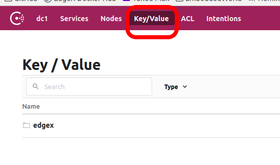

# Exporting your device data

Great, so the data sent by the camera device makes its way to core data.
How can that data be sent to an enterprise system or the Cloud? How can
that data be used by an edge analytics system (like a rules engine) to actuate on a device?

## Getting data to the rules engine

By default, data is already passed from the core data service to application services (app services) via Redis Pub/Sub messaging.  Alternately, the data can be supplied between the two via MQTT.  A preconfigured application service is provided with the EdgeX default Docker Compose files that gets this data and routes it to the [eKuiper rules engine](../microservices/support/eKuiper/Ch-eKuiper.md).  The application service is called `app-service-rules` (see below).  More specifically, it is an [app service configurable](../microservices/application/services/AppServiceConfigurable.md).

``` yaml
  app-service-rules:
    container_name: edgex-app-rules-engine
    depends_on:
    - consul
    - data
    environment:
      CLIENTS_CORE_COMMAND_HOST: edgex-core-command
      CLIENTS_CORE_DATA_HOST: edgex-core-data
      CLIENTS_CORE_METADATA_HOST: edgex-core-metadata
      CLIENTS_SUPPORT_NOTIFICATIONS_HOST: edgex-support-notifications
      CLIENTS_SUPPORT_SCHEDULER_HOST: edgex-support-scheduler
      DATABASE_HOST: edgex-redis
      EDGEX_PROFILE: rules-engine
      EDGEX_SECURITY_SECRET_STORE: "false"
      MESSAGEQUEUE_HOST: edgex-redis
      REGISTRY_HOST: edgex-core-consul
      SERVICE_HOST: edgex-app-rules-engine
      TRIGGER_EDGEXMESSAGEBUS_PUBLISHHOST_HOST: edgex-redis
      TRIGGER_EDGEXMESSAGEBUS_SUBSCRIBEHOST_HOST: edgex-redis
    hostname: edgex-app-rules-engine
    image: edgexfoundry/app-service-configurable:2.0.1
    networks:
      edgex-network: {}
    ports:
    - 127.0.0.1:59701:59701/tcp
    read_only: true
    security_opt:
    - no-new-privileges:true
    user: 2002:2001
```

### Seeing the data export

The log level of any EdgeX micro service is set to `INFO` by default.  If you tune the log level of the app-service-rules micro service to `DEBUG`, you can see `Event`s pass through the app service on the way to the rules engine.

#### Set the log level

To set the log level of any service, open the [Consul UI](../microservices/configuration/ConfigurationAndRegistry.md#web-user-interface) in a browser by visiting `http://[host]:8500`.  When the Consul UI opens, click on the Key/Value tab on the top of the screen.



On the Key/Value display page, click on `edgex` > `appservices` > `2.0` > `app-rules-engine` > `Writable` > `LogLevel`.  In the Value entry field that presents itself, replace `INFO` with `DEBUG` and hit the `Save` button.


#### View the service log

The log level change will be picked up by the application service.  In a terminal window, execute the Docker command below to view the service log.

``` shell
docker logs -f edgex-app-rules-engine
```

Now push another event/reading into core data as you did earlier (see [Send Event](./Ch-WalkthroughReading.md#walkthrough-send-event)).  You should see each new event/reading created by acknowledged by the app service.  With the right application service and rules engine configuration, the event/reading data is published to the rules engine topic where it can then be picked up and used by the rules engine service to trigger commands just as you did manually in this walkthrough.


## Exporting data to anywhere

You can create an additional application service to get the data to another application or service, REST endpoint, MQTT topic, cloud provider, and more.  See the [Getting Started guide](../getting-started/quick-start/index.md#exporting-data) on exporting data for more information on how to use another app service configurable to get EdgeX data to any client.


## Building your own solutions

Congratulations, you've made it all the way through the Walkthrough
tutorial!

[<Back](Ch-WalkthroughReading.md){: .md-button }

