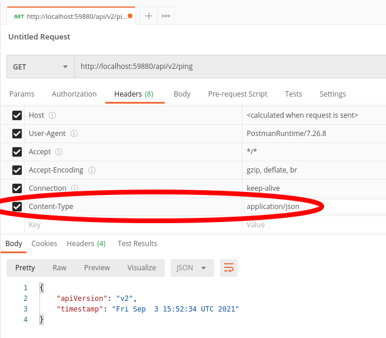

# Setup up your environment

## Install Docker, Docker Compose & EdgeX Foundry

To explore EdgeX and walk through it's APIs and how it works, you will need:

- Docker
- Docker Compose
- EdgeX Foundry (the base set of containers)

If you have not already done so, proceed to [Getting Started With Docker](../getting-started/Ch-GettingStartedUsers.md) for how to get these tools and run EdgeX Foundry.  If you have the tools and EdgeX already installed and running, you can proceed to the [Walkthrough Use Case](Ch-WalkthroughUseCase.md).

## Install Postman (optional)

You can follow this walkthrough making HTTP calls from the command-line
with a tool like `curl`, but it's easier if you use a graphical user interface tool
designed for exercising REST APIs. For that we like to use **Postman**. You
can download the [native Postman app](https://app.getpostman.com/) for
your operating system.

!!! Note
    Example `curl` commands will be provided with the walk through so that you can run this walkthrough without Postman.

!!! Alert
    It is assumed that for the purposes of this walk through demonstration

    -   all API micro services are running on `localhost`. If this is not
        the case, substitute your hostname for localhost.
    -   any POST call has the associated **CONTENT-TYPE=application/JSON**
        header associated to it unless explicitly stated otherwise.

    

[<Back](Ch-Walkthrough.md){: .md-button } [Next>](Ch-WalkthroughUseCase.md){: .md-button }

